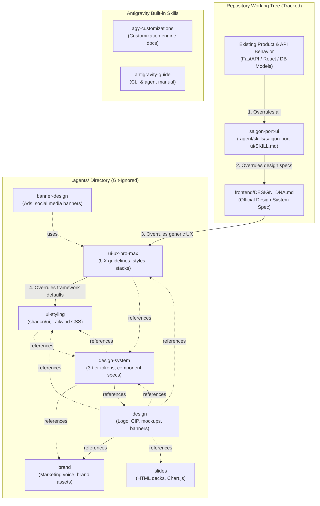

# Skill Dependency Graph & Authority Hierarchy

**Project:** Production Meter Reading — Cảng Sài Gòn  
**Repository:** `D:\Projects\production-meter-reading\production-meter-reading`  
**Audit Date:** 2026-09-23  
**Auditor:** Senior AI Agent Systems Engineer  

---

## 1. Architectural Overview

The skills ecosystem in this repository consists of two distinct clusters:
1. **Domain-Specific Cluster:** Centered on the Saigon Port operating context (`saigon-port-ui` in `.agent/` and `frontend/DESIGN_DNA.md`), governing business logic, maritime colors, Vietnamese operational copy, and field usability.
2. **Generic Design & Marketing Cluster:** Residing in `.agents/`, comprising a web of interconnected generic skills (`ui-ux-pro-max`, `ui-styling`, `design-system`, `design`, `brand`, `banner-design`, `slides`).

---

## 2. Dependency Graph Visualization



---

## 3. Formal Hierarchy of Authority

According to the explicit authority clause in `.agent/skills/saigon-port-ui/SKILL.md` (lines 15–27) and confirmed in `frontend/DESIGN_DNA.md`:

```text
Priority Order:
1. Existing product / API behavior in the repository
2. .agent/skills/saigon-port-ui/SKILL.md
3. frontend/DESIGN_DNA.md
4. Accessibility / Mobile usability standards (WCAG 2.1 AA/AAA)
5. Generic UI / frontend skills (.agents/skills/*)
6. Framework defaults
```

### 3.1 Conflict Resolution Invariant
When a generic skill (such as `ui-ux-pro-max`, `design`, or `ui-styling`) recommends an interaction pattern, color palette, or typography choice that differs from `saigon-port-ui` or `DESIGN_DNA.md`:
- **The Domain Rule ALWAYS Wins.**
- Example: `ui-ux-pro-max` contains SaaS dark-mode palettes and purple gradients; `saigon-port-ui` strictly mandates *Maritime Operational Minimalism* with porcelain/white backgrounds and navy primary accents. The domain rule prevails without exception.

---

## 4. Cross-Skill References & Interdependencies

Analysis of the text in all 8 `SKILL.md` files reveals extensive circular referencing within `.agents/skills/`:

| Skill ID | Referenced Skills | Referenced Project Files | Missing / External Dependencies |
| :--- | :--- | :--- | :--- |
| **`saigon-port-ui`** | None (Operates as top authority) | `frontend/DESIGN_DNA.md` | None |
| **`banner-design`** | `ui-ux-pro-max` | None | References non-installed skills: `frontend-design`, `ai-artist`, `ai-multimodal` |
| **`brand`** | `design` | None | None |
| **`design`** | `brand`, `design-system`, `slides`, `ui-styling`, `ui-ux-pro-max` | None | Relies on Gemini AI API for image/logo generation (optional tool) |
| **`design-system`** | `brand`, `design`, `slides`, `ui-styling` | None | None |
| **`slides`** | `design` | None | None |
| **`ui-styling`** | `brand`, `design`, `design-system` | None | None |
| **`ui-ux-pro-max`** | `brand`, `design`, `design-system` | `package.json` | Relies on 68 internal files in `data/` and `scripts/` |

---

## 5. Architectural Findings

1. **Tight Circularity in `.agents/skills/`:** The generic skills form a dense, circular cluster where `design`, `design-system`, `brand`, and `ui-styling` constantly point to one another. If an agent naively follows relative links, it risks falling into an endless loop of loading generic design advice.
2. **Clean Separation of the Domain Layer:** `saigon-port-ui` has zero incoming or outgoing dependencies to the `.agents/` cluster. It depends strictly on `frontend/DESIGN_DNA.md` and repository code.
3. **Dead-End References:** `banner-design` references three skills (`frontend-design`, `ai-artist`, `ai-multimodal`) that do not exist anywhere in the repository or in Antigravity's builtin directory.
