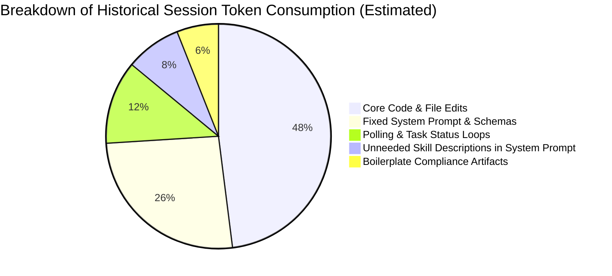

# Context Footprint and Token Overhead Estimation

**Project:** Production Meter Reading — Cảng Sài Gòn  
**Repository:** `D:\Projects\production-meter-reading\production-meter-reading`  
**Audit Date:** 2026-09-23  
**Auditor:** Senior AI Agent Systems Engineer & Developer Productivity Auditor  

---

## 1. Estimation Methodology & Accounting Standards

To avoid misleading claims or ungrounded reductions (such as external anecdotal claims of arbitrary "30% token cuts"), all figures in this audit follow rigorous, transparent estimation guidelines:
1. **Physical Ground Truth:** Exact byte counts and line counts are derived directly from the filesystem using Python UTF-8 scanners.
2. **Token Modeling Ratios:**
   - **English Prose & Source Code:** Estimated at **1 token ≈ 4 characters** (~3.5 bytes).
   - **Vietnamese Operational Copy (UTF-8 Diacritics):** Vietnamese accented text (e.g., `Đang đọc chỉ số...`, `Cảng Tân Thuận`) utilizes multi-byte UTF-8 encoding (2–3 bytes per diacritic character), yielding approximately **1 token ≈ 2.8 to 3.2 characters**.
3. **Epistemic Honesty:** Billed API token usage from external model providers includes proprietary tokenizer dictionaries (BPE/WordPiece) that are not exposed via client files. All token figures herein are clearly labeled as **Engineered Token Estimates (`est_tokens`)**, not provider invoices.
4. **Context Overhead Taxonomy:** Overhead is classified into four operational buckets:
   - **Fixed:** Instructions injected on every turn or loaded once unconditionally.
   - **Repeated:** Redundant re-injection of information already known in the session.
   - **Conditional:** Reference materials loaded only when specifically triggered by a task.
   - **Execution-Related:** Turns, tool calls, and logs generated by polling and waiting loops.

---

## 2. Quantitative Footprint by Category

### 2.1 Category 1: Fixed Overhead (Injected on Every Turn)

The Antigravity engine automatically injects the system prompt, runtime instructions, and registered skill metadata on **every model turn**.

| Component | Physical Size (Bytes / Chars) | Est. Tokens / Turn | Cumulative Impact (50-Turn Session) | Classification |
| :--- | :--- | :--- | :--- | :--- |
| **System Prompt `<skills>` Metadata** (Descriptions of 9 registered skills) | ~4,800 characters | ~1,200 tokens | **60,000 tokens** | **`POTENTIALLY_REDUNDANT`** (Contains 5 irrelevant marketing/creative skills) |
| **Base Agent Instructions & Tool Schemas** (Core platform capabilities) | ~14,000 characters | ~3,500 tokens | 175,000 tokens | **`REQUIRED_CONTEXT`** |
| **Subtotal Fixed per Turn** | **~18,800 characters** | **~4,700 tokens** | **235,000 tokens** | — |

*Analysis:* Of the ~1,200 tokens of skill descriptions injected every turn, approximately **65% (~780 tokens/turn)** belong to skills (`banner-design`, `brand`, `design`, `slides`, `generative_ui`) that have zero applicability to the industrial meter reading or GIS map codebases. Over a 50-turn session, this represents **~39,000 tokens of completely dormant overhead**.

---

### 2.2 Category 2: Repeated Overhead (Prompt Boilerplate & Artifacts)

Historical prompt templates and mandatory compliance checklists re-injected substantial duplicated context across turns and phases.

| Item / Mechanism | Physical Size | Est. Tokens / Event | Frequency in Workflow | Classification |
| :--- | :--- | :--- | :--- | :--- |
| **Mandatory Prompt Boilerplate** (*"In accordance with Section 0, inspect both directories recursively..."*) | ~1,500 characters | ~400 tokens | Injected in every phase prompt (observed in 15+ prompts) | **`DUPLICATED`** |
| **`SKILL_COMPLIANCE_REPORT.md` Generation** (Standardized boilerplate compliance table) | ~3,500 – 4,500 bytes | ~950 – 1,150 tokens | Generated 5 times across Map V2 phases | **`POTENTIALLY_REDUNDANT`** |
| **Duplicated Token Definitions** (`saigon-port-ui` L85-148 vs `DESIGN_DNA.md` L68-150) | ~3,200 bytes | ~850 tokens | Injected whenever both files are read | **`DUPLICATED`** |
| **Subtotal Repeated per Phase** | **~9,200 bytes** | **~2,400 tokens** | Per phase execution | — |

---

### 2.3 Category 3: Conditional Overhead (Skill Entry Points & References)

When an agent is instructed to read skills or consult documentation, the token footprint varies dramatically based on whether progressive disclosure is practiced.

| Skill / Resource | Physical Size | Est. Tokens if Loaded | Historical Read Frequency | Actual Token Utility | Classification |
| :--- | :--- | :--- | :--- | :--- | :--- |
| **`.agent/skills/saigon-port-ui/SKILL.md`** | 16,407 bytes / 350 lines | ~4,100 tokens | **18 times** | **High** (Directly governs domain UI & copy) | **`REQUIRED_CONTEXT`** |
| **`frontend/DESIGN_DNA.md`** | 18,952 bytes / 315 lines | ~4,700 tokens | **4 times** | **High** (Official design token spec) | **`REQUIRED_CONTEXT`** |
| **`.agents/skills/ui-ux-pro-max/SKILL.md`** | 28,032 bytes / 425 lines | ~7,000 tokens | **2 times** | **Medium** (General UX / WCAG reference) | **`POTENTIALLY_REDUNDANT`** |
| **`.agents/skills/ui-styling/SKILL.md`** | 10,045 bytes / 324 lines | ~2,510 tokens | **1 time** | **Low** (Generic Tailwind guidance) | **`POTENTIALLY_REDUNDANT`** |
| **`.agents/skills/design-system/SKILL.md`** | 6,875 bytes / 244 lines | ~1,720 tokens | **1 time** | **Low** (Superseded by `DESIGN_DNA.md`) | **`POTENTIALLY_REDUNDANT`** |
| **`.agents/skills/design/SKILL.md`** | 12,322 bytes / 313 lines | ~3,080 tokens | **0 times** | **Zero** (Marketing & logo design) | **`TASK_IRRELEVANT`** |
| **`.agents/skills/banner-design/SKILL.md`** | 8,326 bytes / 196 lines | ~2,080 tokens | **0 times** | **Zero** (Ad banners) | **`TASK_IRRELEVANT`** |
| **`.agents/skills/brand/SKILL.md`** | 2,939 bytes / 97 lines | ~735 tokens | **0 times** | **Zero** (PR messaging) | **`TASK_IRRELEVANT`** |
| **`.agents/skills/slides/SKILL.md`** | 1,137 bytes / 40 lines | ~285 tokens | **0 times** | **Zero** (Slide decks) | **`TASK_IRRELEVANT`** |
| **Supporting Data in `.agents/` (164 files)** | 4,160,000 bytes | ~1,040,000 tokens | **0 times (0%)** | **Zero** (Completely dormant) | **`TASK_IRRELEVANT`** |

*Critical Insight:* If an agent were to follow naive instructions to *"Read both skill directories completely"*, loading the entire `.agents/` directory would consume **over 1,000,000 tokens**, instantly blowing out the model's context window. Progressive disclosure prevented this disaster, but the presence of unneeded skills still taxes the system prompt.

---

### 2.4 Category 4: Execution-Related Overhead (Polling and Waiting Turns)

In past conversations (such as `890e696d` and `bc871c02`), agents repeatedly executed manual status polling because prompts lacked guidance on Antigravity's event-driven wake-up.

| Activity / Pattern | Mechanism | Tool Calls per Session | Est. Tokens Consumed | Classification |
| :--- | :--- | :--- | :--- | :--- |
| **Task Status Polling** | Calling `manage_task(action: 'status', TaskId: '...')` repeatedly | 35 – 51 calls | **12,000 – 18,000 tokens** | **`DUPLICATED`** |
| **PowerShell Sleep Commands** | Executing `Start-Sleep -Seconds 3; curl ...` via `run_command` | 5 – 10 calls | **2,500 – 4,000 tokens** | **`DUPLICATED`** |
| **Unnecessary Schedule Timers** | Setting `schedule` 5-second timers to check process outputs | 9 – 21 calls | **4,000 – 8,000 tokens** | **`DUPLICATED`** |
| **Subtotal Execution Waste per Session** | — | **50 – 80 calls** | **18,500 – 30,000 tokens** | — |

---

## 3. Comprehensive Summary: Where are Tokens Consumed?

Across a typical historical implementation phase (e.g., Phase 2 Animation, 180 total turns):



### High-Impact Efficiency Opportunities
1. **Eliminate Polling Loops:** By trusting Antigravity's automatic wake-up (`WAKE_UP_VERIFIED`), an immediate **15,000 to 25,000 tokens (and 30–50 model turns)** are saved per engineering session.
2. **Prune Unused System Prompt Skills:** Deregistering or moving the 5 irrelevant marketing skills out of `.agents/skills/` eliminates **~39,000 tokens** of fixed system prompt overhead per 50-turn session.
3. **Consolidate Domain Tokens:** Removing duplicate CSS definitions between `saigon-port-ui` and `DESIGN_DNA.md` saves **~1,500 tokens** per reading event.
4. **Eliminate Boilerplate Compliance Reports:** Replacing ceremonial multi-page compliance reports with targeted test-backed assertions saves **~1,000 tokens** per phase.

---

## 4. Progressive Disclosure Pipeline (Target Architecture)

```text
Step 1: Skill Discovery
   Agent checks system prompt metadata (<skills>)
   [Fixed Footprint: < 300 tokens for domain-relevant skills only]
         ↓
Step 2: Task Relevance Filter
   Is task UI/UX? → Check saigon-port-ui
   Is task Backend/DB? → No skill needed
         ↓
Step 3: Read Top-Level SKILL.md
   Agent executes view_file on relevant SKILL.md once
   [Footprint: ~4,000 tokens loaded on demand]
         ↓
Step 4: Deep Reference Resolution (Only if Ambiguity Exists)
   Inspect DESIGN_DNA.md or specific reference docs only if verifying tokens or edge cases
   [Footprint: 0 tokens unless explicitly required]
```
