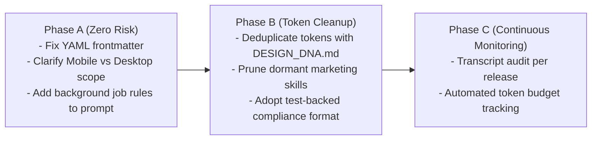

# Proposed Skill-Loading Policy & Agent Engineering Standard

**Project:** Production Meter Reading — Cảng Sài Gòn  
**Repository:** `D:\Projects\production-meter-reading\production-meter-reading`  
**Audit Date:** 2026-09-23  
**Status:** PROPOSAL ONLY (Not implemented in this audit phase)  

---

## 1. Core Principles of the Proposed Policy

1. **Safety & Architecture First:** Preserving Git safety, SQLite database integrity, API backwards compatibility, and WCAG visual QA takes absolute precedence over token reduction.
2. **Progressive Disclosure over Bulk Ingestion:** Agents must discover skill metadata first, verify task relevance second, load `SKILL.md` entry points third, and inspect heavy reference tables only when specifically needed.
3. **Evidence-Based Verification over Declarative Claims:** Compliance must be demonstrated through automated test results and visual screenshots, not boilerplate assertions.
4. **Event-Driven Execution over Polling:** Agents must leverage Antigravity's reactive task lifecycle rather than polling in loops.

---

## 2. Policy Components & Evaluation

### 2.1 Component 1: Task-Based Skill Selection Matrix
Agents must select and read skills strictly according to the functional domain of the assigned task:

| Functional Task Domain | Applicable Skills & Specs | Prohibited / Dormant Skills |
| :--- | :--- | :--- |
| **Mobile Meter Reading / Attendance / Home Hub** | `saigon-port-ui` (User Portal Scope), `frontend/DESIGN_DNA.md` | `banner-design`, `brand`, `slides`, `design` |
| **Desktop Operations Portal / Map V2 Digital Twin** | `saigon-port-ui` (Operations Scope), `frontend/DESIGN_DNA.md`, `ui-styling` | `banner-design`, `brand`, `slides` |
| **Backend API / SQLite / Database Migrations** | None (Inspect `backend/app/models.py`, `db.py`, `schemas.py`) | All UI and design skills |
| **Data Synchronization / Reconciliation Tests** | None (Inspect `tests/` and backend fixtures) | All UI and design skills |
| **Marketing Banners / Pitch Decks** (Non-engineering) | `banner-design`, `slides`, `brand` | `saigon-port-ui` |

- **Current Problem:** Past prompts commanded agents to inspect all skills in both directories for every task, regardless of whether the task touched Python SQLite models or React buttons.
- **Supporting Evidence:** Across 37 transcripts, backend and data analysis tasks (e.g., `890e696d`) still generated compliance boilerplate for UI skills.
- **Expected Benefit:** Eliminates 100% of irrelevant skill loading on backend/data tasks.
- **Validation:** Verify that backend engineering sessions do not invoke `view_file` on design skills.
- **Modifications Required:** Update prompt instructions; no code changes.

---

### 2.2 Component 2: Standardized Progressive Disclosure Protocol

```text
[ Incoming User Request ]
            │
            ▼
[ Step 1: Check System Prompt <skills> Metadata ]
            │
      Is there a direct match for task domain?
      ├─► NO  ──► Proceed directly to code inspection (Zero skill tokens loaded)
      │
      └─► YES ──► [ Step 2: Read Single SKILL.md Entry Point ]
                        │
                  Is further detail needed (e.g. specific token values)?
                  ├─► NO  ──► Proceed to Implementation
                  │
                  └─► YES ──► [ Step 3: Read Specific Document via Link ]
                                    (e.g., DESIGN_DNA.md)
```

- **Current Problem:** Instructions like *"read both directories recursively"* encourage dumping reference libraries into context.
- **Supporting Evidence:** `ui-ux-pro-max` contains 68 files (3.54 MB); loading it recursively would immediately exhaust the token window.
- **Expected Benefit:** Caps skill loading at ~4,000 tokens per session.
- **Validation:** Check tool call counts for `view_file` in transcripts.

---

### 2.3 Component 3: Standardized Background Job Lifecycle Rules

All prompts and project guidelines should embed the following four-rule execution contract:

```text
INVARIANT 1 (Synchronous Wait):
Always pass WaitMsBeforeAsync: 10000 for standard build, lint, or test commands.

INVARIANT 2 (Never Poll):
If a command transitions to a background task, DO NOT call manage_task(action: 'status') 
in a loop. DO NOT call schedule to check it.

INVARIANT 3 (Reactive Resume):
Stop calling tools to conclude your turn. Antigravity will automatically resume your turn 
with MESSAGE_PRIORITY_HIGH when the background process exits.

INVARIANT 4 (No Terminal Sleep):
Never execute Start-Sleep, sleep, or while-loops in shell commands to wait for processes.
```

- **Current Problem:** Agents ran 35–51 status polling checks per session, burning 15k–25k tokens.
- **Supporting Evidence:** Proven in Section 8 via transcripts and controlled audit execution.
- **Expected Benefit:** **Saves 15,000 to 25,000 tokens and 30–50 turns per session**.
- **Validation:** Ensure zero `manage_task(action: 'status')` loops appear in transcripts.

---

### 2.4 Component 4: Unified Scope-Aware Saigon Port UI Specification

Refactor `.agent/skills/saigon-port-ui/SKILL.md` to:
1. **Add YAML Frontmatter** for native Antigravity discovery.
2. **Disambiguate Scope:**
   - **Scope A: User Portal (Mobile):** Mandatory outdoor contrast; porcelain canvas; strict prohibition of neon, glow, dark mode default, and sci-fi motifs.
   - **Scope B: Operations Portal (Desktop & Map V2):** Technical Light is default; restrained Neon Digital Twin presentation mode (`stdDeviation="2.2"`) is an approved GIS overlay for electrical/water networks.
3. **Hyperlink to `DESIGN_DNA.md`** for derived CSS tokens rather than duplicating 70 lines of CSS.

- **Current Problem:** Universal anti-style prohibitions conflict with Map V2 Neon mode; CSS tokens are duplicated.
- **Supporting Evidence:** Documented in `06_DUPLICATION_AND_CONFLICTS.md` (CF-01, CF-03).
- **Expected Benefit:** Eliminates false compliance failures; establishes single source of truth for design tokens.
- **Validation:** Automated linting against `DESIGN_DNA.md`; visual regression tests.

---

### 2.5 Component 5: Test-Backed Compliance Verification Artifacts

Replace the ceremonial multi-page `SKILL_COMPLIANCE_REPORT.md` with an evidence-backed verification section inside `IMPLEMENTATION_REPORT.md`:

```markdown
## Skill Compliance & Automated Verification
- **Governing Skill:** `saigon-port-ui` (Operations Portal Scope)
- **Design Tokens:** Verified against `frontend/DESIGN_DNA.md` (Zero raw hex colors).
- **Accessibility:** WCAG 2.1 AA/AAA compliance verified via automated tests:
  - Click targets: `frontend/tests/mapV2UtilityPhase2_1InteractionHardening.test.ts` (All >= 44x44px).
  - Contrast: AAA text contrast (`#181818` on `#FCFCFC` = 17.38:1).
  - Reduced Motion: `@media (prefers-reduced-motion: reduce)` verified.
- **Evidence Screenshots:** Linked under `evidence/*.png`.
```

- **Current Problem:** 4 KB of unverified text boilerplate generated in every phase.
- **Supporting Evidence:** Demonstrated in `04_HISTORICAL_USAGE_EVIDENCE.md`.
- **Expected Benefit:** Saves ~1,000 output tokens per phase; ties compliance directly to passing test suites.
- **Validation:** Check that compliance reports link directly to test output logs.

---

## 3. Implementation Roadmap (For Future Phase)



> [!NOTE]
> All changes outlined in this roadmap are recommendations for subsequent phases. None have been applied to the working repository during this audit.
