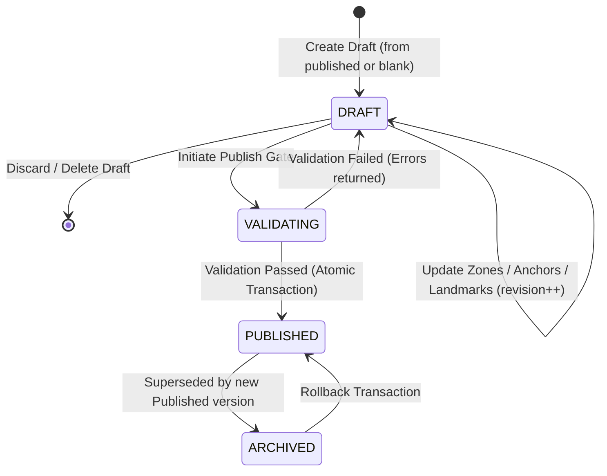

# V16 Map Configuration Versioning Lifecycle

## 1. Lifecycle State Machine

Each map configuration version (`MapVersion`) transitions through distinct lifecycle states:



### 1.1 State Definitions
- **`DRAFT`**: An isolated working version where administrators modify zone polygons, labels, operator anchors, and landmarks. There can be at most one active draft at a time.
- **`PUBLISHED`**: The authoritative operational version used by all standard users, real-time map views, route graph calculations, and reporting dashboards. Exactly one version is `PUBLISHED` at any given time.
- **`ARCHIVED`**: Previously published versions preserved for historical auditing, regression analysis, and one-click rollback.

---

## 2. Optimistic Concurrency Control (OCC)

To eliminate the risk of multiple administrators overwriting each other's spatial edits:

1. **Revision Counter**: Every `MapVersion` carries an integer `revision` (initialized at `1` upon creation).
2. **Conditional Updates**: Whenever a zone's geometry is modified via `PATCH /api/map-config/drafts/{id}/zones/{zone_id}`:
   ```json
   {
     "client_revision": 4,
     "polygon_canonical": [{ "x": 100, "y": 100 }, ...]
   }
   ```
3. **Conflict Detection**:
   - If `client_revision == server_revision`: The mutation is committed, and the server increments `revision` to `5`.
   - If `client_revision != server_revision`: The server immediately rejects the update with HTTP `409 Conflict`:
     ```json
     {
       "detail": "Revision mismatch: server is at revision 5, but client submitted 4. Please refresh."
     }
     ```
4. **Client-Side Handling**: The frontend Calibration workspace displays a prominent Amber warning badge (`Có xung đột phiên bản`) and prevents further local overwrites until the administrator syncs with the latest server state.

---

## 3. Atomic Publish & Rollback Transactions

### 3.1 Publish Transaction
1. **Validation Prerequisite**: Server runs `validate_map_version(draft_id)` covering simplicity, coordinate bounds, anchor containment, and meter containment. If validation produces errors, the transaction is blocked with HTTP `422 Unprocessable Content`.
2. **Atomic Promotion**: Inside a single database transaction:
   ```python
   # Archive current published version
   current_published = db.query(MapVersion).filter_by(status="PUBLISHED").first()
   if current_published:
       current_published.status = "ARCHIVED"
   
   # Promote draft
   draft.status = "PUBLISHED"
   draft.published_at = datetime.utcnow()
   draft.revision += 1
   
   # Write audit log
   create_audit_log(action="MAP_PUBLISHED", details={...})
   db.commit()
   ```

### 3.2 Rollback Transaction
When an administrator triggers a rollback to an archived version:
1. The target archived version is cloned into a new `PUBLISHED` version (preserving the original archive record intact).
2. The current active published version transitions to `ARCHIVED`.
3. An audit log entry `MAP_ROLLED_BACK` is written.
4. All meter route statuses are re-evaluated against the restored geometry.
