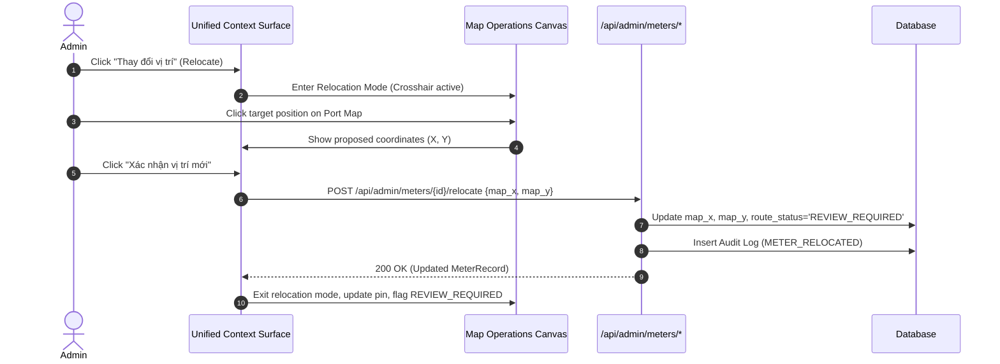

# V16 Administrative Meter Spatial Placement & CRUD

## 1. Scope & Capabilities

The V16 Meter Spatial CRUD subsystem equips administrators with authoritative management over physical meter locations, zone bindings, and operational lifecycle states.



---

## 2. Interactive Coordinate Relocation

1. **Precision Pointing**: Administrators trigger relocation from the meter context panel. The map cursor transforms into an amber crosshair.
2. **Canonical Mapping**: Click coordinates on the SVG canvas are converted from screen space into canonical pixel space (`1915 x 821`), completely independent of screen resolution, browser zoom, or viewport resizing.
3. **Cancellation & Restore**: If the administrator cancels relocation at any point before clicking "Xác nhận vị trí mới", the marker snaps back to its original persisted position with zero side effects.
4. **Immediate Route Review**: Confirming relocation updates the database and immediately marks `route_status = 'REVIEW_REQUIRED'`, halting automatic operator route animations until routes are audited.

---

## 3. Meter Lifecycle: Soft Delete vs Hard Delete

### 3.1 Soft Delete ("Ngừng sử dụng")
- **Standard Administrative Action**: Meters that are retired, temporarily taken offline for maintenance, or decommissioned are soft-deleted by setting `is_active = false`.
- **Spatial Preservation**: Coordinates (`map_x`, `map_y`), zone bindings (`presentation_zone_id`), and historical readings are fully preserved.
- **Reactivation**: Soft-deleted meters can be reactivated at any time with full spatial validation.

### 3.2 Hard Delete Protection
- **Relational Safeguard**: Before permitting a physical `DELETE FROM meters WHERE id = :id`, the backend checks for foreign key references in the `readings` table:
  ```python
  reading_count = db.query(Reading).filter(Reading.meter_id == meter_id).count()
  if reading_count > 0:
      raise HTTPException(
          status_code=409,
          detail=f"Không thể xóa đồng hồ đã có {reading_count} bản ghi chỉ số lịch sử. Hãy chuyển sang ngừng sử dụng (soft-delete)."
      )
  ```
- **Result**: Data integrity is strictly maintained; historical audit trails and billing readings cannot be orphaned.
