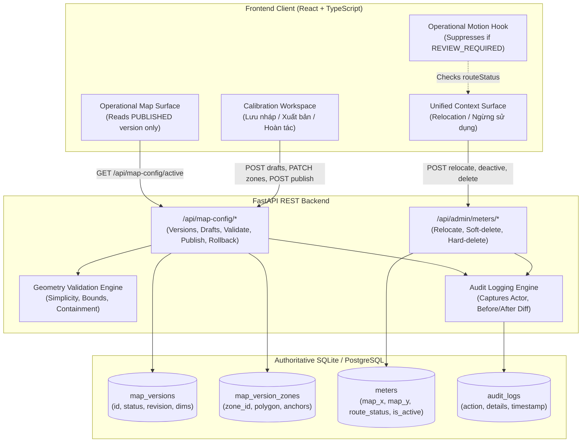

# V16 Persistent Spatial Administration CRUD Architecture

## 1. Executive Summary & Purpose

The V16 engineering initiative establishes an authoritative, relational, and versioned spatial administration foundation for the Tan Thuan Port digital twin system (`production-meter-reading`). Prior to V16, map presentation polygons, operator anchors, and meter assignments relied partly on static JSON baselines and client-local browser storage (`localStorage`). V16 elevates the spatial domain into an enterprise-grade persistent architecture with:

1. **Authoritative Relational Database Backend**: Fully normalized models for map versions (`map_versions`), zones (`map_version_zones`), meter spatial placement (`meters.presentation_zone_id`, `meters.route_status`), and immutable audit trails (`audit_logs`).
2. **Draft / Publish / Rollback Lifecycle**: Atomic multi-zone draft isolation preventing incomplete drafts from leaking into normal operational views, coupled with strict pre-publish geometry validation gates and single-transaction rollback.
3. **Optimistic Concurrency Control**: Revision tracking (`revision` counter) guarding concurrent administrative edits and returning HTTP 409 Conflict upon stale writes.
4. **Administrative Meter Spatial CRUD**: Interactive coordinate relocation, presentation zone reassignment, and soft-delete ("Ngừng sử dụng") with strict hard-delete blocking if historical reading records exist.
5. **Operational Route Integrity Hook**: Automatic transition of mutated meters to `route_status = 'REVIEW_REQUIRED'`, actively suppressing V15 operator route movement to prevent traversing stale corridors.
6. **Strict Spatial Freeze**: Preservation of the canonical port image coordinate system (`1915 x 821` pixels), exactly 6 presentation zones, and audit coordinates of the 12 canonical physical meters.

---

## 2. High-Level System Architecture

---

## 3. Core Architectural Subsystems

### 3.1 Map Versioning & Geometry Subsystem
- **Model Isolation**: Map versions are stamped as `DRAFT`, `PUBLISHED`, or `ARCHIVED`. At any given time, exactly one version holds the `PUBLISHED` state.
- **Atomic Promotion**: Publishing promotes the current draft to `PUBLISHED`, archives the prior published version, and increments the revision counter inside an atomic database transaction (`db.commit()` with rollback protection).
- **Runtime Invariant**: General operators and operational dispatch screens only consume the `PUBLISHED` version. Draft configurations in progress are completely invisible to regular users.

### 3.2 Meter Spatial Lifecycle Subsystem
- **Coordinate Authority**: `map_x` and `map_y` in the `meters` table store canonical pixel coordinates normalized against the standard `1915 x 821` port image.
- **Relational Zone Linking**: `presentation_zone_id` explicitly links each meter to one of the 6 canonical presentation zones (`pres-berth`, `pres-container-west`, `pres-container-center`, `pres-cfs-east`, `pres-technical`, `pres-gate`).
- **Administrative Relocation**: Interactive crosshair positioning recalculates canonical pixels and triggers immediate route integrity evaluation.

### 3.3 Safety & Concurrency Control
- **Revision Locking**: Every draft carries an integer `revision`. Mutation requests require passing the client's current revision. If the server revision has advanced, the request is rejected with HTTP 409 Conflict.
- **Deletion Safeguard**: If a meter has historical readings (`Reading` records in the database), hard deletion is rejected with HTTP 409 Conflict, requiring the administrator to perform a safe soft-delete ("Ngừng sử dụng").
- **Motion Safety Hook**: When meter coordinates change or a draft zone alters boundary geometries, affected meters are marked `REVIEW_REQUIRED`, immediately disabling operator route animation to prevent phantom corridor walking.
