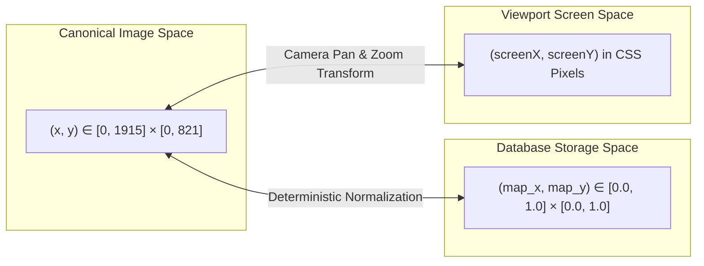

# V16A — Spatial Coordinate System & Mathematical Contract

## 1. Executive Summary

This document defines the authoritative coordinate contract for Tan Thuan Port operational map rendering, database persistence, and spatial geometry transformations.

---

## 2. Coordinate Spaces

The system recognizes exactly two coordinate reference frames:

### 2.1 Canonical Image Pixel Space (`tan-thuan-canonical-image-pixel-space-v1`)
- **Dimensions**: Strictly $1915 \times 821$ pixels ($W = 1915, H = 821$).
- **Origin $(0, 0)$**: Top-Left corner of the authoritative base raster asset (`tan-thuan-canonical-base.png`).
- **Units**: Integral or sub-pixel integer coordinates $[0, W] \times [0, H]$.
- **Usage**:
  - Presentation zone polygon vertices.
  - Label anchors and operator anchor waypoints.
  - Landmark coordinates.
  - Calibration editor canvas interactions.

### 2.2 Database Storage Space (Normalized Unit Interval)
- **Bounds**: Continuous unit square $[0.0, 1.0] \times [0.0, 1.0]$.
- **Origin $(0.0, 0.0)$**: Normalized Top-Left.
- **Precision**: 4 decimal places (e.g., `0.4496`, `0.2312`).
- **Usage**:
  - Meter positions persisted in `meters.map_x` and `meters.map_y`.

---

## 3. Projection & Transformation Equations

### 3.1 Normalized to Canonical
Given normalized database coordinates $(u, v) \in [0, 1]^2$ and active dimensions $(W, H)$:
$$x = \text{round}(u \times W)$$
$$y = \text{round}(v \times H)$$

### 3.2 Canonical to Normalized
Given canonical coordinates $(x, y) \in [0, W] \times [0, H]$:
$$u = \frac{x}{W}, \quad v = \frac{y}{H}$$
Precision is clamped to 4 decimal places:
$$u_{\text{stored}} = \text{round}(u \times 10^4) / 10^4$$
$$v_{\text{stored}} = \text{round}(v \times 10^4) / 10^4$$

### 3.3 Roundtrip Invariance
For all 12 canonical meters and calibrated landmark points, the roundtrip transformation satisfies:
$$|u - \text{norm}(x(u))| \le 10^{-4}$$
$$|x - \text{canon}(u(x))| \le 1.0\text{ px}$$

---

## 4. Polygon Centroid Formulation

For an $N$-vertex non-self-intersecting polygon $[(x_0, y_0), \dots, (x_{N-1}, y_{N-1})]$ with $(x_N, y_N) = (x_0, y_0)$, the signed area $A$ and centroid $(C_x, C_y)$ are calculated via Green's theorem:

$$A = \frac{1}{2} \sum_{i=0}^{N-1} (x_i y_{i+1} - x_{i+1} y_i)$$

$$C_x = \frac{1}{6A} \sum_{i=0}^{N-1} (x_i + x_{i+1}) (x_i y_{i+1} - x_{i+1} y_i)$$

$$C_y = \frac{1}{6A} \sum_{i=0}^{N-1} (y_i + y_{i+1}) (x_i y_{i+1} - x_{i+1} y_i)$$

If the signed area $|A| < 10^{-6}$ (degenerate polygon), the arithmetic mean of the vertices is used as a fallback:
$$C_x = \frac{1}{N} \sum_{i=0}^{N-1} x_i, \quad C_y = \frac{1}{N} \sum_{i=0}^{N-1} y_i$$

---

## 5. Viewport / Screen Coordinate Transform

To map from screen event coordinates $(S_x, S_y)$ during meter placement or drag-and-drop to canonical scene space:
Given viewport bounding client rect $(R_{\text{left}}, R_{\text{top}})$, camera zoom factor $Z$, and camera pan offsets $(P_x, P_y)$:

$$x_{\text{canon}} = \frac{S_x - R_{\text{left}} - P_x}{Z}$$
$$y_{\text{canon}} = \frac{S_y - R_{\text{top}} - P_y}{Z}$$

Normalized database coordinates are then derived dynamically:
$$u = \text{clamp}\left(\frac{x_{\text{canon}}}{W_{\text{active}}}, 0.0, 1.0\right)$$
$$v = \text{clamp}\left(\frac{y_{\text{canon}}}{H_{\text{active}}}, 0.0, 1.0\right)$$

This ensures that any future changes to canvas dimensions or active map versions will correctly compute meter placement without hardcoded resolution assumptions.
