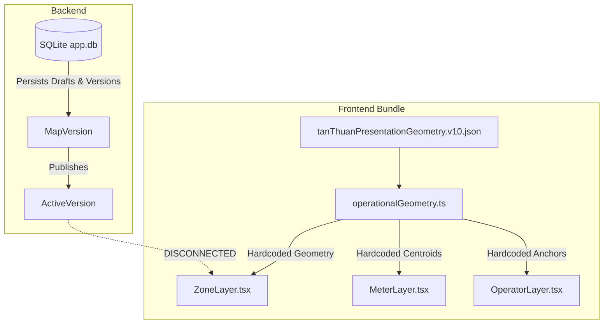
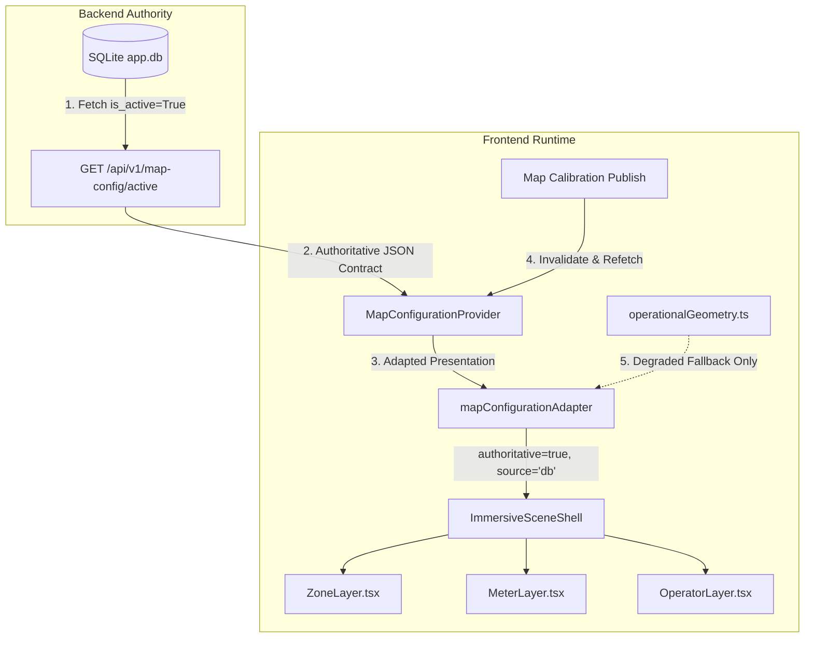

# V16A — Spatial Authority Stabilization Architecture

## 1. Architectural Mission & Executive Summary

Prior to Phase V16A, the application suffered from a fundamental dual-source-of-truth defect:
- **Backend**: Map calibration, versioning, validation, and publishing wrote real `MapVersion` and `MapVersionZone` records into SQLite (`app.db`).
- **Frontend**: The operational `ZoneLayer`, `MeterLayer`, and `OperatorLayer` imported bundled static TypeScript geometry (`SPATIAL_ZONE_PRESENTATIONS` from `operationalGeometry.ts`).

Consequently, when an administrator calibrated zones or published a new map version in the Map Calibration Workspace, the changes took effect in the backend database but remained invisible in the daily operational Map unless the frontend bundle was recompiled and redeployed.

**Phase V16A establishes the backend active published `MapVersion` as the single authoritative source of truth for the entire application runtime.**

---

## 2. Authority Flow Comparison

### Legacy Dual-Authority Flow (Deprecated)


### V16A Unified Spatial Authority Flow


---

## 3. The Active Map Configuration Contract

The canonical contract exposed by `GET /api/v1/map-config/active` and consumed by the frontend runtime:

```typescript
export interface ActiveMapZoneGeometry {
  id: string;
  mapVersionId?: string;
  zoneId: string;
  presentationId: string;
  businessZoneId: string;
  displayIndex: number;
  displayLabel: string;
  businessName: string;
  presentationColor: string;
  icon: 'ship' | 'container' | 'warehouse' | 'gear' | 'gate' | string;
  polygonCanonical: Array<{ x: number; y: number; landmarkId?: string }>;
  labelAnchorCanonical: { x: number; y: number };
  operatorAnchorCanonical: { x: number; y: number };
  landmarks?: ActiveMapLandmark[];
  revision: number;
}

export interface ActiveMapConfiguration {
  mapId: string;
  versionId: string;
  versionNumber: string;
  coordinateSystem: string;
  canonicalWidth: number;
  canonicalHeight: number;
  sourceAsset: string;
  sourceChecksum?: string | null;
  geometrySchemaVersion: string;
  status: string;
  revision: number;
  publishedAt?: string | null;
  zones: ActiveMapZoneGeometry[];
  landmarks: ActiveMapLandmark[];
  authoritative: boolean; // true for DB, false for fallback
  source: 'db' | 'fallback';
}
```

---

## 4. Backend Stabilization Details

1. **Schema Enrichment**:
   - `MapVersion.geometry_schema_version = Column(String(20), nullable=True, default="1.0")` added to `backend/app/models.py`.
   - Idempotent migration in `migrate_db()` ensuring table schema alteration and `"1.0"` backfilling for existing records.
2. **Deterministic Response Serialization**:
   - `zone_model_to_dto` populates `presentation_id` (fallback to `zone_id` if omitted).
   - `version_model_to_dto` populates `geometry_schema_version`.
   - `get_active_map_config` sets `source="db"` and `authoritative=True`, aggregating all zone landmarks into the top-level manifest.
3. **Publish & Rollback Enrichment**:
   - `publish_map_version` and `rollback_map_version` return enriched metadata including `version_id`, `version_number`, `canonical_width`, `canonical_height`, and `coordinate_system`.

---

## 5. Frontend Stabilization Details

1. **`MapConfigurationProvider` (`providers/MapConfigurationProvider.tsx`)**:
   - Fetches active map configuration on mount.
   - Caches active configuration in React state.
   - Provides `refetch()` for cache invalidation upon calibration publish/rollback.
   - Gracefully falls back to degraded static geometry on network failure, logging `[DEGRADED_MAP_CONFIGURATION]` and setting `authoritative: false`.
2. **`mapConfigurationAdapter` (`adapters/mapConfigurationAdapter.ts`)**:
   - Pure functional transformations converting database DTOs into `SpatialZonePresentation` objects.
   - Calculates centroids, SVG polygon paths, normalized coordinates, and anchor positions.
3. **Operational Layer Decoupling**:
   - `ZoneLayer.tsx`: Consumes `useMapConfiguration()` presentation zones; eliminated direct import of static `SPATIAL_ZONE_PRESENTATIONS`.
   - `MeterLayer.tsx`: Dynamically projects meter positions using active `canonicalWidth` and `canonicalHeight`.
   - `OperatorLayer.tsx`: Dynamically resolves operator anchor coordinates from active configuration.
   - `MapOperationsPage.tsx`: Wrapped in `MapConfigurationProvider`; triggers `mapConfig.refetch()` when a new map calibration version is published.
4. **Demotion of `operationalGeometry.ts`**:
   - `SPATIAL_ZONE_PRESENTATIONS` is marked as **DEGRADED FALLBACK ONLY**.
   - Direct imports in operational views are eliminated.

---

## 6. Future Asset Integration Boundary (V16B)

Phase V16A maintains a strict boundary:
- **No `assets` database tables created.**
- **No changes to `Meter` foreign keys or relationships.**
- Candidate asset data resides solely in `docs/domain/asset-discovery/`.
