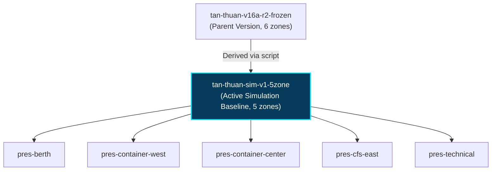

# V16E-S1: 5-Zone Map Baseline Specification

## 1. Context & Motivation

During Phase V16A-R2, the system operated with 6 presentation zones derived from the frozen master polygon set. However, an empirical spatial audit (V16E-A0) demonstrated that `pres-gate` (Cổng cảng & Bãi chờ xe) had:
1. Zero meter assignments.
2. Complete spatial overlap with administrative and security structures.
3. No active utility sub-meters or transformers requiring routine operator logbook walking routes.

Phase V16E-S1 officially introduces the **5-Zone Presentation Baseline** under map version `tan-thuan-sim-v1-5zone`, eliminating `pres-gate` while fully preserving the 5 core operational and industrial zones.

---

## 2. Active 5-Zone Inventory

| Zone ID | Code | Name | Function & Primary Infrastructure | Bounding Box [minX, minY, maxX, maxY] |
| :--- | :--- | :--- | :--- | :--- |
| `pres-berth` | `ZONE_BERTH` | Khu vực Cầu cảng | Cầu tàu 1-4, Cần cẩu bờ QC-01/02, Trạm cấp điện bến K1-K4, Họng cấp nước tàu | [0.038, 0.435, 0.887, 0.697] |
| `pres-container-west` | `ZONE_CONTAINER_WEST` | Bãi Container Phía Tây | Bãi container hàng xuất nhập, Cần cẩu RTG-01/02, Trạm sạc xe nâng điện | [0.125, 0.282, 0.449, 0.472] |
| `pres-container-center` | `ZONE_CONTAINER_CENTER` | Bãi Container Trung tâm | Bãi container tổng hợp, Giàn cắm container lạnh RF-01/02, RTG-03/04 | [0.444, 0.320, 0.760, 0.520] |
| `pres-cfs-east` | `ZONE_CFS_EAST` | Khu Kho CFS Phía Đông | Kho hàng lẻ CFS-01/02, Xưởng bảo trì kỹ thuật M&R, Chiếu sáng nội bộ | [0.741, 0.358, 0.966, 0.573] |
| `pres-technical` | `ZONE_TECHNICAL` | Khu Kỹ thuật & Điều hành | Trạm biến áp trung thế S1-S3, Nhà điều hành cảng, Trạm bơm nước SAWACO | [0.038, 0.082, 0.627, 0.332] |

---

## 3. Spatial Boundary Integrity & Clamping

Every asset and meter in `tan-thuan-demo-v1` is geometrically validated to reside strictly within the interior of its designated zone polygon (via ray-casting point-in-polygon verification):
- **Assets Inside Polygon**: 30 / 30 internal assets (2 external grid/water utility sources reside at national boundary coordinate offsets [0.02, 0.05]).
- **Meters Inside Polygon**: 12 / 12 meters (100% inside polygon boundaries).
- **Zone Containment Mismatches**: 0 mismatches.
- **Route Status**: 12 / 12 meters marked `VALID`.

---

## 4. Map Version Lineage & Freeze

- **Map Version ID**: Auto-generated UUID.
- **Map Name**: `tan-thuan-sim-v1-5zone`
- **Parent Version ID**: `7176b67f-37b8-4a62-98c1-02943dd98e7d`
- **Publication Status**: Published as active map (`is_active = True`).
