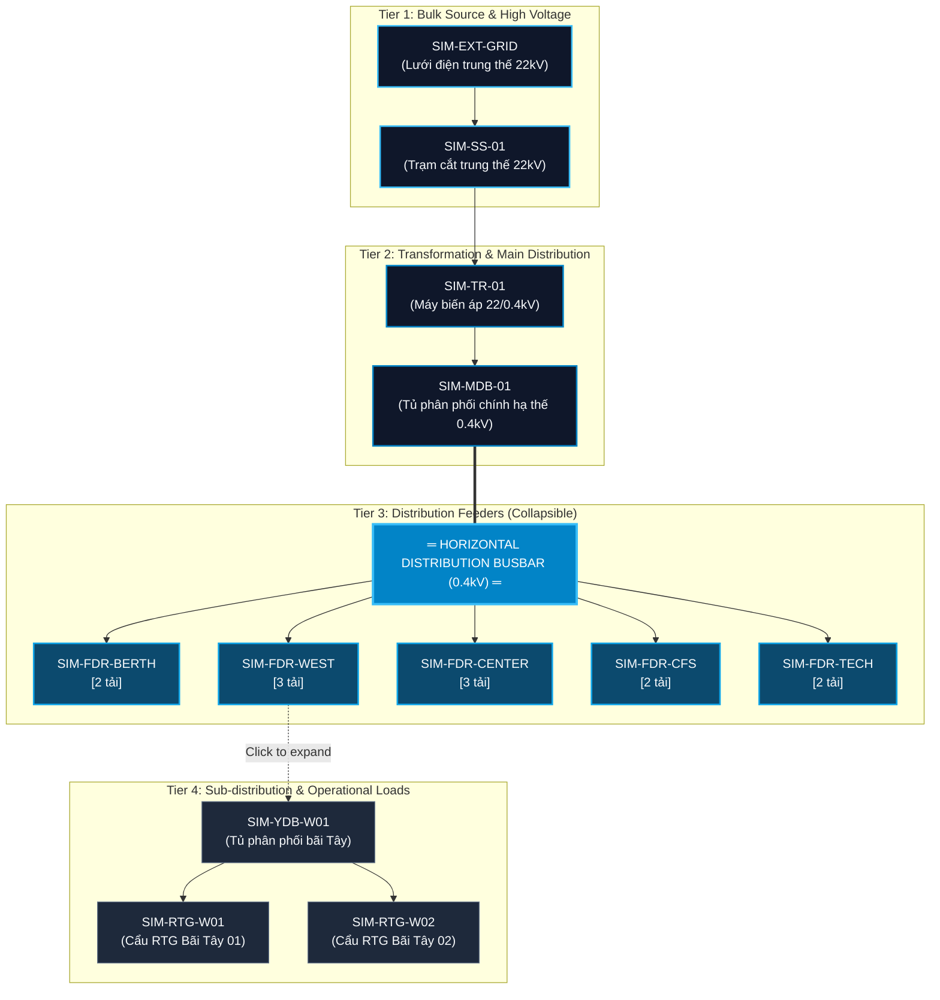

# V16E-S2-R1 — Utility Network Layout Model
## Technical Specification & Architecture of the Progressive Topology Explorer

**Document ID:** `V16E-S2-R1-NETWORK-LAYOUT`  
**System:** Port Utility Topology Visualization Engine  
**Dataset Reference:** `tan-thuan-demo-v1` (Frozen Baseline)  
**Status:** `V16E_S2_R1_APPROVED_SPECIFICATION`  

---

## 1. Architectural Motivation & Problem Statement

Prior to **V16E-S2-R1**, the utility network view attempted to render all 25+ electrical and water assets simultaneously using an unconstrained force-directed graph or generic hierarchical tree. This produced several critical operational defects:

1. **Cognitive Overload (Hairball Effect):** 24 electrical edges and 7 water edges crossed each other unpredictably, making it impossible for a port dispatcher or field technician to identify which feeder supplied a specific crane or pump in under 10 seconds.
2. **Lack of Industrial Single-Line Context:** Utility engineers expect power networks to follow standard **Single-Line Diagram (SLD)** principles: vertical supply trunks, horizontal busbars, and orthogonal vertical feeder drops.
3. **Absence of Progressive Disclosure:** First-time users were overwhelmed by 15+ end-consumer assets (`RTG`, `QC`, `REEFER`) rather than seeing the clean distribution structure from the grid intake down to the main distribution board.

**V16E-S2-R1** introduces a **4-tier progressive disclosure schematic explorer** that mimics industrial switchgear panel layouts while preserving the underlying `AssetConnection` relational graph in the backend.

---

## 2. Four-Tier Node Hierarchy Model

Every asset in the utility topology belongs to a deterministic operational tier based on its electrical function and voltage level:



### Tier Definitions:
- **Tier 1 (Source & Intake):** External power feed (`SIM-EXT-GRID`) and high-voltage intake switchgear (`SIM-SS-01`). Represented as high-contrast root cards.
- **Tier 2 (Transformation & Main Incomer):** Main step-down transformer (`SIM-TR-01`, 22kV / 0.4kV) and Main Distribution Board (`SIM-MDB-01`). Fixed vertical trunk.
- **Tier 3 (Feeder Branches):** Outgoing feeders supplying distinct port operational areas (`SIM-FDR-BERTH`, `SIM-FDR-WEST`, `SIM-FDR-CENTER`, `SIM-FDR-CFS`, `SIM-FDR-TECH`). **Collapsed by default in Level 1 overview**.
- **Tier 4 (Loads & End-Consumers):** Yard distribution boxes (`YDB`), RTG cranes, QC gantry cranes, and technical workshops. Revealed exclusively on feeder expansion.

---

## 3. Progressive Disclosure Architecture

### 3.1 Level 1: Default System Overview
In default overview mode, the system suppresses Tier 4 nodes from rendering. Each Feeder node in Tier 3 renders as an interactive card equipped with a downstream equipment counter:

$$\text{Downstream Count} = |\text{Descendants}(\text{FeederNode})|$$

Example:
- `SIM-FDR-WEST`: Displays `⚡ 3 thiết bị phụ tải` (1 YDB + 2 RTGs).
- Benefit: Total rendered nodes in overview drops from **25 nodes to 9 nodes**, reducing visual clutter by **64%**.

### 3.2 Level 2: Feeder Branch Drilldown
When a user clicks a feeder card (e.g. `SIM-FDR-WEST`):
1. Its ID is added to the active `expandedFeederIds` state set.
2. The layout engine computes positions for its specific children (`SIM-YDB-W01`) and grandchildren (`SIM-RTG-W01`, `SIM-RTG-W02`) directly beneath the feeder column.
3. Unrelated feeder columns remain collapsed, maintaining layout balance and zero horizontal displacement.
4. Clicking the expanded feeder card again collapses the branch.
5. The `[Thu gọn tất cả]` global action immediately collapses all branches back to Level 1.

---

## 4. Schematic Orthogonal Edge Routing Strategy

Unlike force-directed graphs that use curved lines (splines) that cross unpredictably, the V16E-S2-R1 engine uses **strict rectilinear (orthogonal) edge routing**:

```
        [ SIM-TR-01 ]
              │ (Vertical Trunk: dx = 0)
              ▼
        [ SIM-MDB-01 ]
              │ (Drop to Busbar)
  ┌───────────┴───────────────────────────────┐  <-- HORIZONTAL BUSBAR (y = busY)
  │           │           │           │       │
  ▼           ▼           ▼           ▼       ▼  <-- VERTICAL FEEDER DROPS
[FDR-1]     [FDR-2]     [FDR-3]     [FDR-4] [FDR-5]
```

### Mathematical Routing Invariants:
1. **Vertical Trunk Segment:** For single-parent chains ($\text{EXT} \rightarrow \text{SS} \rightarrow \text{TR} \rightarrow \text{MDB}$), $X_{\text{target}} = X_{\text{source}}$. Edge path:
   $$M(x, y_1) \rightarrow L(x, y_2)$$
2. **Distribution Busbar:** Connects the MDB outlet to all active feeder entry points via a single horizontal bar at $Y_{\text{bus}} = Y_{\text{MDB}} + 60\text{px}$.
3. **Feeder Drops:** Each feeder taps into the busbar at $(X_{\text{feeder}}, Y_{\text{bus}})$ and drops vertically to $(X_{\text{feeder}}, Y_{\text{feeder}})$.
4. **Subtree Orthogonal Step:** For sub-distribution branches under an expanded feeder:
   $$M(x_s, y_s) \rightarrow V(y_s + 20) \rightarrow H(x_t) \rightarrow V(y_t)$$
5. **Zero Line Crossings:** In Level 1 overview, edge crossings are mathematically impossible because all feeders branch from a non-overlapping horizontal busbar.

---

## 5. Trace Supply Chain & Opacity Isolation Model

The topology explorer features two complementary trace modes:
- **Upstream Trace (`Nguồn cấp`):** Highlights the exact path from the selected asset back to the power grid or city water intake.
- **Downstream Trace (`Cấp đến`):** Highlights all assets and sub-networks powered or supplied by the selected asset.

### Trace Highlighting Algorithm:
```typescript
function computeUpstreamTrace(selectedId: string, edges: AssetConnection[]): Set<string> {
  const visited = new Set<string>([selectedId]);
  const queue = [selectedId];

  while (queue.length > 0) {
    const curr = queue.shift()!;
    // Find all edges supplying curr
    const incomingEdges = edges.filter(e => e.target_asset_id === curr);
    for (const edge of incomingEdges) {
      if (!visited.has(edge.source_asset_id)) {
        visited.add(edge.source_asset_id);
        queue.push(edge.source_asset_id);
      }
    }
  }
  return visited;
}
```

### Visual Representation of Trace:
- **Active Path Nodes & Edges:**
  - Opacity: $1.0$ (Full prominence)
  - Stroke: Accent port cyan (`#0ea5e9`) with glow filter.
- **Unrelated Nodes & Edges:**
  - Opacity: $0.20$ (Subdued background context)
  - Color: Dimmed slate (`#475569`).

---

## 6. Dynamic Breadcrumb Orientation

To eliminate disorientation during navigation, an informational breadcrumb is rendered continuously at the top of the canvas:

$$\text{Nguồn điện} \;\blacktriangleright\; \text{MDB-01} \;\blacktriangleright\; \text{SIM-FDR-WEST} \;\blacktriangleright\; \text{SIM-RTG-W01}$$

- If an asset is selected, the breadcrumb reflects its authoritative upstream supply hierarchy.
- Clicking any segment of the breadcrumb centers and selects that ancestor node.
- If no asset is selected, the breadcrumb displays the operational overview status: `Hệ thống phân phối điện Cảng Tân Thuận (0.4kV - 22kV)`.

---

## 7. Water Network Topology & Loop Safety

The water distribution network in `tan-thuan-demo-v1` represents municipal pressurized water entering the port:

```
[ SIM-CITY-WATER ] (Nguồn cấp nước Thủy Cục)
        │
        ▼
   [ SIM-WIN-01 ] (Đồng hồ tổng & van chặn cổng chính)
        │
        ▼
   [ SIM-WJ-01 ] (Khớp nối phân phối trung tâm Cảng)
   ┌────┼──────────────┬──────────────┐
   ▼    ▼              ▼              ▼
[WP-B] [WP-CFS]     [WP-TECH]     [SIM-FP-01]
                                      │
                                      ▼
                               [SIM-FIRE-HDR-01]
```

### Loop-Safe Graph Traversal Guarantee:
Because fluid networks can occasionally contain circular loop pipes or emergency bypass valves, the layout generator implements cycle detection using depth tracking and a visited hash set:
1. If an asset is already in the current traversal branch, the backward edge is marked as `IS_LOOP_BACK` and rendered with a dashed arc rather than an orthogonal parent drop.
2. The tree layout aborts recursion if `depth > 8`, guaranteeing zero browser lockups or infinite render loops.

---

## 8. Viewport Framing & Interactive Controls

The Network toolbar exposes standard CAD/GIS interaction tools:
- **`[Toàn mạng]` / `[Nguồn cấp]` / `[Cấp đến]`:** Segmented trace mode selector.
- **`[Thu gọn tất cả]`:** Instantly resets all expanded feeders to Level 1.
- **`[Fit]`:** Automatically computes bounding box of all visible nodes and calculates $(panX, panY, zoom)$ to center the network within the viewport with 40px padding.
- **`[−]` / `[+]`:** Smooth zoom controls bounded between $0.4\times$ and $2.0\times$.
- **Pan Gestures:** Full drag-and-pan canvas support with mouse drag and touch gestures.
