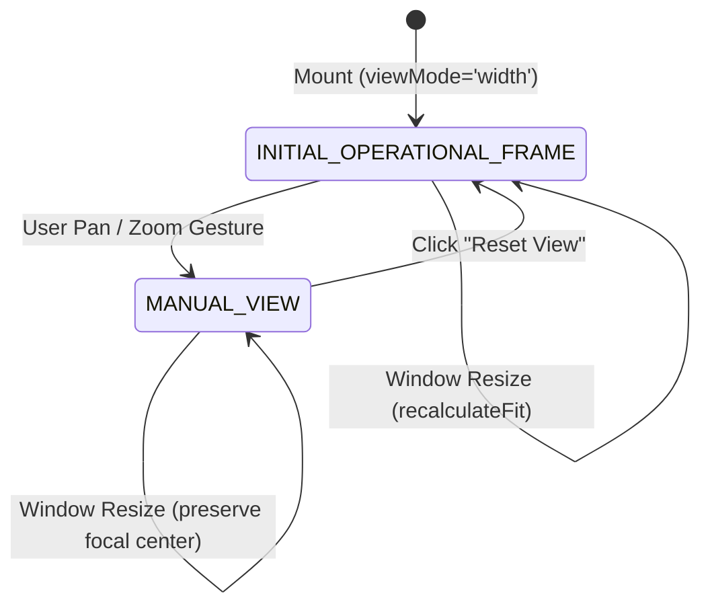

# Map V2 Camera Framing Design & Mathematical Specification

## 1. Executive Summary

This document specifies the responsive framing engine implemented for Map V2 (Saigon Port - Tan Thuan 1 GIS). The framing engine replaces the previous static top-aligned zoom calculation with a deterministic operational focus system (`INITIAL_OPERATIONAL_FRAME`) that guarantees immediate visual prominence of all core port facilities without requiring user manual panning on laptop and desktop displays.

---

## 2. Coordinate System & Canonical Geometry

Map V2 operates on a canonical vector/raster coordinate space:
- **Canonical Width ($W_{map}$)**: `1536px`
- **Canonical Height ($H_{map}$)**: `1024px`
- **Aspect Ratio**: $1.5:1$ (3:2)

### 2.1 Operational Zone Bounds Analysis

The port infrastructure occupies a distinct horizontal and vertical sub-region within the canonical map space:

| Operational Feature | ID / Type | Canonical Center $(X, Y)$ | Y Bounds $[Y_{min}, Y_{max}]$ |
|:---|:---|:---|:---|
| **Quay Berth 1-4** | `ZONE_QUAY` | $(793, 290)$ | $[210, 370]$ |
| **General Cargo Yard** | `ZONE_GENERAL` | $(665, 456)$ | $[360, 550]$ |
| **Container Yard** | `ZONE_CONTAINER` | $(1238, 381)$ | $[280, 480]$ |
| **Warehouse Kho 1** | `BLDG_KHO_1` | $(560, 520)$ | $[490, 560]$ |
| **Warehouse Kho 2** | `BLDG_KHO_2` | $(740, 530)$ | $[500, 570]$ |
| **Warehouse Kho 4** | `BLDG_KHO_4` | $(910, 510)$ | $[470, 560]$ |
| **Administrative Zone** | `ZONE_ADMIN` | $(914, 688)$ | $[640, 740]$ |
| **Gate A (Cổng A)** | `GATE_A` | $(1475, 570)$ | $[550, 590]$ |
| **Gate B (Cổng B)** | `GATE_B` | $(905, 725)$ | $[700, 755]$ |

### 2.2 Operational Framing Envelope

From the canonical geometry:
- **$Y_{top}$ (Quay waterfront boundary)**: `200px` (provides slight water context immediately north of berths)
- **$Y_{bottom}$ (Gate B & southern perimeter boundary)**: `770px` (safely encloses Gate B and Admin southern fence)
- **$H_{operational}$**: $770 - 200 = 570\text{px}$
- **Operational Vertical Center ($Y_{mid}$)**: $485\text{px}$

---

## 3. Mathematical Camera Algorithm

### 3.1 Mode Selection: `width` vs `contain`

Map V2 supports two primary fit modes:
1. **Fit to Width (`width`)** — *Default initial mode*:
   Fills 100% of the canvas horizontal width ($W_{canvas}$), scaling the map proportionally while framing the operational vertical envelope.
2. **Contain All (`contain`)**:
   Fits the entire canonical $1536 \times 1024$ raster within $W_{canvas} \times H_{canvas}$ with symmetric letterboxing.

### 3.2 Responsive Operational Framing Formula (`mode === 'width'`)

Given runtime canvas dimensions $W_{canvas}$ and $H_{canvas}$:

1. **Target Zoom**:
   $$\text{targetZoom} = \frac{W_{canvas}}{W_{map}} = \frac{W_{canvas}}{1536}$$

2. **Scaled Operational Height**:
   $$H_{scaled\_op} = H_{operational} \times \text{targetZoom} = 570 \times \text{targetZoom}$$

3. **Available Vertical Margin (Spare Canvas Height)**:
   $$\Delta H_{spare} = H_{canvas} - H_{scaled\_op}$$

4. **Dynamic River Context Padding Allocation**:
   To prevent excessive Saigon River water above the port while preserving aesthetic water context, river padding is allocated proportionally to spare height:
   $$P_{river} = \max\left(25, \min\left(85, \Delta H_{spare} \times 0.32\right)\right)$$
   - On compact viewports (e.g. 720p/768p where $\Delta H_{spare} \approx 230\text{px}$), $P_{river} \approx 74\text{px}$, leaving $\approx 160\text{px}$ of breathing room below Gate B.
   - On wide/tall viewports (e.g. 1440p where $\Delta H_{spare} \approx 450\text{px}$), $P_{river}$ caps smoothly at $85\text{px}$.

5. **Target Vertical Pan**:
   $$\text{targetPanY} = P_{river} - (Y_{top} \times \text{targetZoom}) = P_{river} - (200 \times \text{targetZoom})$$

6. **Boundary Clamping**:
   Ensure the map raster never detaches from the viewport edges:
   $$\text{minPanY} = H_{canvas} - (H_{map} \times \text{targetZoom}) = H_{canvas} - (1024 \times \text{targetZoom})$$
   $$\text{pan.y} = \min(0, \max(\text{minPanY}, \text{targetPanY}))$$
   $$\text{pan.x} = 0$$

---

## 4. Multi-Viewport Empirical Verification

Calculations verified against actual viewport captures:

| Viewport | Canvas Size | Target Zoom | $\text{Pan}_Y$ (Calculated) | $\text{Pan}_Y$ (Observed) | Gate B Screen Y | Canvas Bottom | Visibility Status |
|:---|:---|:---|:---|:---|:---|:---|:---|
| **1280 × 720** | $1200 \times 664$ | `0.78125` | `-86.27px` | `-86.27px` | `562px` | `720px` | 100% In View (+158px margin) |
| **1366 × 768** | $1286 \times 712$ | `0.83724` | `-92.32px` | `-92.32px` | `598px` | `768px` | 100% In View (+170px margin) |
| **1440 × 900** | $1360 \times 844$ | `0.88542` | `-62.67px` | `-62.67px` | `664px` | `900px` | 100% In View (+236px margin) |
| **1536 × 864** | $1456 \times 802$ | `0.94792` | `-105.84px` | `-105.84px` | `675px` | `864px` | 100% In View (+189px margin) |
| **1920 × 1080**| $1840 \times 1018$| `1.19792` | `-154.58px` | `-154.58px` | `815px` | `1080px`| 100% In View (+265px margin) |
| **2560 × 1440**| $2480 \times 1378$| `1.61458` | `-237.92px` | `-237.92px` | `1048px`| `1440px`| 100% In View (+392px margin) |

---

## 5. Architectural Separation of View States

### 5.1 `INITIAL_OPERATIONAL_FRAME` vs `MANUAL_VIEW`

1. **State Isolation**:
   `isManualViewRef` tracks whether user has interacted via wheel or mouse drag.
2. **Resize Protection**:
   Window resize events trigger `calculateFit` only when `!isManualViewRef.current`. When in `MANUAL_VIEW`, the existing camera zoom and pan are preserved.
3. **Deterministic Reset**:
   Clicking the toolbar "Đặt lại góc nhìn" (Reset View) button resets `isManualViewRef.current = false` and recomputes `calculateFit`, deterministically returning the camera to the exact initial operational framing.
