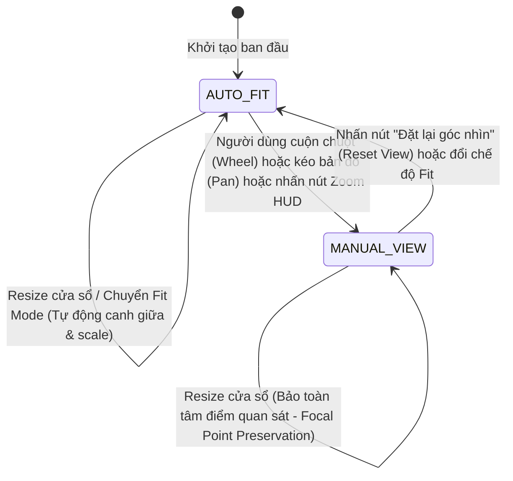

# 03 — Quản lý Khung nhìn & Trạng thái Camera (Viewport & Camera State)

> **Dự án**: Cảng Tân Thuận — Production Meter Reading & Operations Portal  
> **Phân hệ**: Bản đồ Kỹ thuật V2 (Map V2)  
> **Tệp nguồn chính**: [MapV2Canvas.tsx](file:///D:/Projects/production-meter-reading/production-meter-reading/frontend/src/components/map-v2/MapV2Canvas.tsx), [types.ts](file:///D:/Projects/production-meter-reading/production-meter-reading/frontend/src/components/map-v2/types.ts)

---

## 1. Máy trạng thái Camera (Camera State Machine)

Để giải quyết triệt để vấn đề mất tiêu điểm (focal point drift) khi người dùng co dãn cửa sổ trình duyệt hoặc đóng/mở panel kiểm tra hình học, hệ thống áp dụng máy trạng thái 2 cấp độ:



### Chi tiết trạng thái:
1. **`AUTO_FIT`**:
   - Camera tự động điều chỉnh tỷ lệ (`zoom`) và độ dời (`pan.x`, `pan.y`) dựa theo kích thước khả dụng của canvas và chế độ xem (`fit-all` hoặc `fit-width`).
   - Mọi biến động kích thước khung nhìn (`ResizeObserver`) đều tự động tính toán lại vị trí tối ưu để bản đồ nằm vừa vặn, chuẩn tâm.
2. **`MANUAL_VIEW`**:
   - Kích hoạt ngay khi người dùng chủ động tương tác: cuộn chuột zoom, kéo thả pan, hoặc bấm nút tăng/giảm tỷ lệ trên HUD điều khiển.
   - Khi kích thước canvas thay đổi (ví dụ: mở/đóng inspector dạng docked trên màn hình lớn), camera **không reset** tỷ lệ mà áp dụng thuật toán bảo toàn tiêu điểm.

---

## 2. Thuật toán Bảo toàn Tiêu điểm (Center Focal Point Preservation)

Khi canvas thay đổi kích thước từ $(W_{\text{prev}}, H_{\text{prev}})$ sang $(W_{\text{new}}, H_{\text{new}})$ trong trạng thái `MANUAL_VIEW`:

1. **Xác định tọa độ hình học bản đồ tại chính giữa màn hình trước khi resize**:
   $$\text{centerMapX} = \frac{\frac{W_{\text{prev}}}{2} - \text{pan}_{\text{prev}}.x}{\text{zoom}}$$
   $$\text{centerMapY} = \frac{\frac{H_{\text{prev}}}{2} - \text{pan}_{\text{prev}}.y}{\text{zoom}}$$

2. **Tính toán độ dịch chuyển mới để giữ nguyên tọa độ bản đồ đó ở chính giữa màn hình sau khi resize**:
   $$\text{pan}_{\text{new}}.x = \frac{W_{\text{new}}}{2} - \text{centerMapX} \times \text{zoom}$$
   $$\text{pan}_{\text{new}}.y = \frac{H_{\text{new}}}{2} - \text{centerMapY} \times \text{zoom}$$

```typescript
// Trích đoạn hiện thực trong MapV2Canvas.tsx:
if (cameraStateRef.current === 'MANUAL_VIEW') {
  if (prevCanvasSizeRef.current.width > 0 && prevCanvasSizeRef.current.height > 0) {
    const prevW = prevCanvasSizeRef.current.width;
    const prevH = prevCanvasSizeRef.current.height;
    const centerMapX = (prevW / 2 - currentPan.x) / currentZoom;
    const centerMapY = (prevH / 2 - currentPan.y) / currentZoom;

    const newPanX = width / 2 - centerMapX * currentZoom;
    const newPanY = height / 2 - centerMapY * currentZoom;

    setPan({ x: newPanX, y: newPanY });
  }
}
```

---

## 3. Khắc phục Hiện tượng Biến dạng & Co giật Khung nhìn

- **Không giật cục**: Khi người dùng chuyển đổi giữa chế độ *Vận hành* và *Kiểm tra kỹ thuật*, camera duy trì liên tục vị trí quan sát.
- **Tránh scale tụt dốc**: Trên màn hình $< 1380\text{px}$, Panel Kiểm tra chuyển sang dạng *Overlay Drawer*, không chiếm kích thước của `.map-v2-canvas-wrapper`, do đó kích thước canvas không thay đổi ($W_{\text{new}} = W_{\text{prev}}$), loại trừ hoàn toàn hiện tượng bản đồ bị co cụm lại khi mở bảng thuộc tính.
- **Bảo toàn giới hạn biên (Clamp)**: Tỷ lệ zoom bị giới hạn nghiêm ngặt trong khoảng $[0.35, 3.5]$ lần kích thước gốc để đảm bảo độ sắc nét của linework SVG và tránh tràn bộ nhớ raster của trình duyệt.
