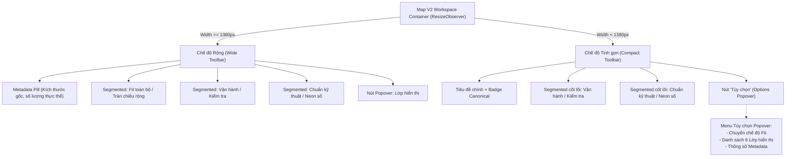

# 04 — Thanh Công cụ & Bảng Kiểm tra Thích ứng (Adaptive Toolbar & Inspector)

> **Dự án**: Cảng Tân Thuận — Production Meter Reading & Operations Portal  
> **Phân hệ**: Bản đồ Kỹ thuật V2 (Map V2)  
> **Tệp nguồn chính**: [MapV2Workspace.tsx](file:///D:/Projects/production-meter-reading/production-meter-reading/frontend/src/components/map-v2/MapV2Workspace.tsx), [MapV2InspectionPanel.tsx](file:///D:/Projects/production-meter-reading/production-meter-reading/frontend/src/components/map-v2/MapV2InspectionPanel.tsx), [MapV2Layers.tsx](file:///D:/Projects/production-meter-reading/production-meter-reading/frontend/src/components/map-v2/MapV2Layers.tsx), [MapV2Workspace.css](file:///D:/Projects/production-meter-reading/production-meter-reading/frontend/src/components/map-v2/MapV2Workspace.css)

---

## 1. Giải quyết Lỗi Gãy Dòng Thanh Tiêu đề (Single-Row Toolbar)

### Vấn đề trước cải tiến:
Trước khi tối ưu, khi khung làm việc thu hẹp dưới 1380px (đặc biệt trên màn hình 1280x720 và 1366x768), nhóm điều khiển gồm 6 khối nút bị dồn ép, khiến `flex-wrap` kích hoạt đẩy toàn bộ toolbar xuống dòng thứ hai. Chiều cao header tăng đột biến từ 62px lên 101px (+39px), lấn chiếm diện tích quan sát bản đồ.

### Kiến trúc thích ứng 2 tầng (Wide vs Compact):



### Kết quả đo lường:
- Chiều cao header cố định tuyệt đối ở **56px** trên 100% các độ phân giải (1280x720, 1366x768, 1536x864, 1920x1080, 2560x1440).
- Tiết kiệm 45px chiều dọc trên các laptop độ phân giải thấp.
- Phím `Escape` tự động đóng menu Popover tùy chọn khi đang mở.

---

## 2. Bảng Kiểm tra Hình học Thích ứng (Adaptive Inspector: Docked vs Drawer)

### Vấn đề trước cải tiến:
Panel kiểm tra (`MapV2InspectionPanel`) trước đây luôn được nhúng cố định dạng cột cạnh bản đồ với chiều rộng cứng 360px. Trên màn hình 1280px (sau khi trừ sidebar 80px), không gian canvas còn lại chỉ là 840px. Mở inspector làm diện tích canvas giảm 30%, bản đồ bị ép co giật và thu nhỏ tỷ lệ.

### Cơ chế trình bày thích ứng (`inspectorPresentation`):

| Thuộc tính | Khung nhìn Rộng ($\ge 1380\text{px}$) | Khung nhìn Hẹp ($< 1380\text{px}$) |
| :--- | :--- | :--- |
| **Hình thức** | **Docked Side Panel** (`.mode-docked`) | **Overlay Drawer** (`.mode-drawer`) |
| **Vị trí DOM** | Nằm trong luồng Flexbox của workspace | Nổi trên bề mặt bản đồ (`position: absolute; right: 0; z-index: 45`) |
| **Ảnh hưởng Canvas** | Canvas co lại nhường không gian cho bảng | Canvas **giữ nguyên 100%** kích thước, zoom không bị ảnh hưởng |
| **Lớp phủ nền** | Không có | Backdrop mờ nhẹ (`.map-v2-drawer-backdrop`, `z-index: 40`) |
| **Tương tác thoát** | Nhấn nút đóng (✕) hoặc phím `Escape` | Nhấn nút đóng (✕), click ra backdrop hoặc phím `Escape` |
| **Bề rộng** | 360px | 380px (giới hạn tối đa 90vw) |

```typescript
// Trích đoạn logic trong MapV2Workspace.tsx:
const isCompact = containerWidth > 0 && containerWidth < COMPACT_WORKSPACE_THRESHOLD;
const inspectorPresentation = isCompact ? 'drawer' : 'docked';

// Lắng nghe phím Escape để đóng Drawer/Popover an toàn:
useEffect(() => {
  const handleKeyDown = (e: KeyboardEvent) => {
    if (e.key === 'Escape') {
      if (isLayersOpen) setIsLayersOpen(false);
      if (isOptionsOpen) setIsOptionsOpen(false);
      if (isCompact && isInspectionOpen) setIsInspectionOpen(false);
    }
  };
  window.addEventListener('keydown', handleKeyDown);
  return () => window.removeEventListener('keydown', handleKeyDown);
}, [isLayersOpen, isOptionsOpen, isCompact, isInspectionOpen]);
```

---

## 3. Khả năng Tiếp cận & Trạng thái ARIA (Accessibility & ARIA)

1. **Menu Tùy chọn Popover**:
   - `aria-expanded={isOptionsOpen}`
   - `aria-haspopup="dialog"`
   - Tự động đóng khi người dùng click ra ngoài (`useRef` click-outside detection).
2. **Overlay Drawer**:
   - `role="dialog"`
   - `aria-label="Bảng kiểm tra hình học"`
   - Focus ring sắc nét (`:focus-visible`) với token chuẩn `--sp-focus-ring`.
3. **Thanh phân đoạn Segmented Controls**:
   - `role="radiogroup"` / `role="radio"` với `aria-checked` chuẩn mực.
