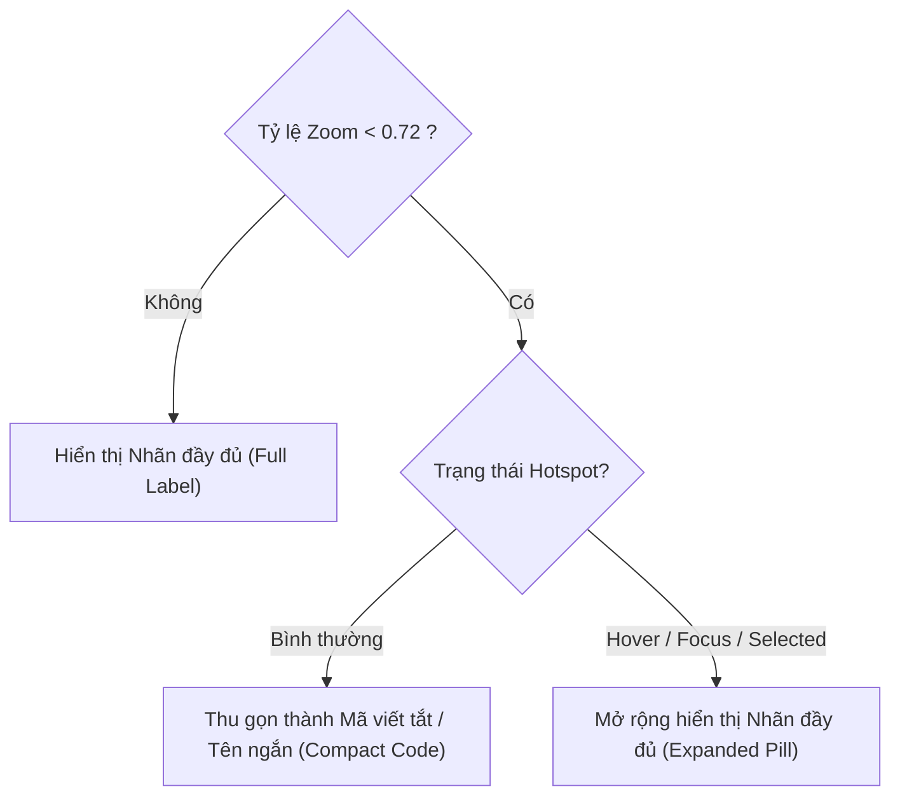

# 05 — Điểm neo Tương tác & Thẻ Thông tin Vận hành (Hotspot & Context Card)

> **Dự án**: Cảng Tân Thuận — Production Meter Reading & Operations Portal  
> **Phân hệ**: Bản đồ Kỹ thuật V2 (Map V2)  
> **Tệp nguồn chính**: [MapV2Canvas.tsx](file:///D:/Projects/production-meter-reading/production-meter-reading/frontend/src/components/map-v2/MapV2Canvas.tsx), [MapV2Workspace.tsx](file:///D:/Projects/production-meter-reading/production-meter-reading/frontend/src/components/map-v2/MapV2Workspace.tsx), [zoneAnchors.ts](file:///D:/Projects/production-meter-reading/production-meter-reading/frontend/src/components/map-v2/zoneAnchors.ts)

---

## 1. Điểm neo Phân khu & Cơ chế Thu gọn Nhãn (Hotspot Label Responsiveness)

### Vấn đề trước cải tiến:
Trên các màn hình nhỏ (1280x720 và 1366x768), tỷ lệ fit toàn bộ của bản đồ dao động từ 60% đến 65%. Ở mức thu nhỏ này, các nhãn đầy đủ như *"Kho hàng tổng hợp số 1"*, *"Bãi tập kết Container cảng"* có kích thước chữ lớn, gây hiện tượng chen chúc (crowding) và che lấp các tuyến đường nội bộ hoặc ranh giới giữa các kho liền kề.

### Giải pháp Thu gọn Thông minh (Zoom-Adaptive Collapsing):



1. **Ngưỡng kích hoạt**: `isCollapsed = zoom < 0.72 && !isHovered && !isSelected`.
2. **Từ điển tên rút gọn**:
   - `zone-bridge-quay` (Khu vực Cầu cảng) $\rightarrow$ `"CẦU CẢNG"`
   - `zone-general-yard` (Bãi hàng tổng hợp) $\rightarrow$ `"BÃI TỔNG HỢP"`
   - `zone-container-yard` (Bãi tập kết container) $\rightarrow$ `"BÃI CONT"`
   - `zone-warehouse-1` (Kho hàng 1) $\rightarrow$ `"KHO 1"`
   - `zone-warehouse-2` (Kho hàng 2) $\rightarrow$ `"KHO 2"`
   - `zone-warehouse-4` (Kho hàng 4) $\rightarrow$ `"KHO 4"`
   - `zone-admin-sub` (Khu hành chính & phụ trợ) $\rightarrow$ `"HÀNH CHÍNH"`
3. **Mở rộng tương tác**:
   - Khi người dùng rê chuột (`onMouseEnter`), đặt focus bằng phím `Tab` (`onFocus`), hoặc click chọn (`isSelected`), nhãn tự động bung ra dạng tên đầy đủ kèm icon nhận diện.

---

## 2. Thẻ Thông tin Gắn kết Không gian (Context Card Clamping & Positioning)

### Vấn đề trước cải tiến:
Thẻ thông tin vận hành (`.map-v2-operational-card`) ban đầu được neo cố định tại `bottom: 24px; left: 24px;`. Khi người dùng click chọn phân khu ở phía đông cảng (như Bãi container hoặc Kho 4), thẻ nằm ở góc đối diện hoàn toàn, làm mất liên kết thị giác giữa đối tượng được chọn và thông tin chi tiết.

### Thuật toán Định vị Không gian & Giới hạn Biên (Spatial Clamping):

Hệ thống tính toán tọa độ màn hình thực tế của điểm neo dựa trên ma trận chuyển đổi camera:
$$\text{screenX} = \text{pan.x} + \text{anchorX} \times \text{zoom}$$
$$\text{screenY} = \text{pan.y} + \text{anchorY} \times \text{zoom}$$

```typescript
// Trích đoạn thuật toán trong MapV2Workspace.tsx:
const CARD_WIDTH = 340;
const CARD_ESTIMATED_HEIGHT = 280;
const PADDING = 16;
const HUD_SAFE_ZONE_W = 220;
const HUD_SAFE_ZONE_H = 160;

// Đặt thẻ lệch 24px về phía trên bên phải của điểm neo
let targetX = screenPos.x + 24;
let targetY = screenPos.y - 40;

// Giới hạn trong khung nhìn canvas
const maxX = containerWidth - CARD_WIDTH - PADDING;
const maxY = containerHeight - CARD_ESTIMATED_HEIGHT - PADDING;

let clampedX = Math.max(PADDING, Math.min(targetX, maxX));
let clampedY = Math.max(PADDING, Math.min(targetY, maxY));

// Tránh đè lên HUD điều khiển zoom ở góc dưới bên phải
const inHudDangerZone = 
  clampedX > containerWidth - HUD_SAFE_ZONE_W - CARD_WIDTH &&
  clampedY > containerHeight - HUD_SAFE_ZONE_H - CARD_ESTIMATED_HEIGHT;

if (inHudDangerZone) {
  // Đẩy thẻ dịch sang trái hoặc nâng lên trên HUD
  clampedX = Math.min(clampedX, containerWidth - HUD_SAFE_ZONE_W - CARD_WIDTH - PADDING);
}
```

### Ưu điểm vượt trội:
- Thẻ luôn xuất hiện bên cạnh điểm neo phân khu, tạo cảm giác trực quan và gắn kết không gian.
- Không bao giờ bị trôi ra ngoài mép màn hình dù người dùng zoom lớn hay kéo bản đồ ra sát biên.
- Tự động tránh vùng HUD góc dưới bên phải (`+`, `-`, reset view), đảm bảo không cản trở thao tác điều khiển camera.

---

## 3. Khả năng Tiếp cận Toàn diện (Accessibility Compliance)

- **Thao tác Bàn phím hoàn chỉnh**: Các điểm neo (`hotspot`) được gán `tabIndex={0}`, `role="button"`, `aria-label="Phân khu [Tên khu]"` và `aria-pressed={isSelected}`.
- **Kích hoạt bằng phím**: Hỗ trợ đầy đủ phím `Enter` và `Space` để kích hoạt Zone Reveal tương đương click chuột.
- **Focus Ring nổi bật**: Vòng sáng viền màu cyan (`#00f0ff`) hoặc xanh cảng biển hiển thị rõ ràng khi focus bằng bàn phím.
