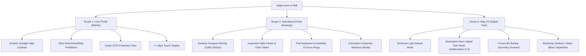

# Clarification of the Saigon Port UI Skill Scope

**Project:** Production Meter Reading — Cảng Sài Gòn  
**Repository:** `D:\Projects\production-meter-reading\production-meter-reading`  
**Governing Document:** `.agent/skills/saigon-port-ui/SKILL.md`  
**Reference Specification:** `frontend/DESIGN_DNA.md`  
**Date:** 2026-09-23  

---

## 1. Context and Problem Statement

In previous engineering phases, `.agent/skills/saigon-port-ui/SKILL.md` contained strict mobile-first visual instructions and broad anti-style prohibitions:
> *"Do not use: Giao diện cyberpunk HUD hoặc viền dạ quang neon/glow... Reject if purple/cyber/neon visual language."*

While these rules are essential for outdoor field meter reading under blinding wharf sunlight, they created severe ambiguity when applied to the desktop Operations Portal—specifically for the **Map V2 Digital Twin utility network overlay**, which features an approved **Neon Digital Twin presentation mode** (`stdDeviation="2.2"`).

This ambiguity led historical agents to either:
1. Threaten compliance failures against approved Map V2 feature code.
2. Generate boilerplate compliance waivers claiming adherence to contradictory standards.

---

## 2. Partitioned Scopes Architecture

To resolve this conflict without diluting brand identity or compromising outdoor safety, `.agent/skills/saigon-port-ui/SKILL.md` has been updated with three explicit, mutually non-interfering operational scopes:

---

## 3. Deep-Dive Specification by Scope

### 3.1 Scope 1: User Portal (Mobile-First Field Experience)
- **Primary Users:** Port electrical/water utility workers, crane operators, and shift technicians in the field.
- **Environmental Constraints:** High-glare outdoor sunlight, humid maritime wharf conditions, single-handed operation, protective glove use.
- **Core Ergonomic Rules:**
  - **Canvas Surface:** Porcelain background (`--sgp-corporate-porcelain: #FCFCFC`) and pure white card surfaces (`--sgp-corporate-white: #FFFFFF`).
  - **Touch Ergonomics:** Minimum touch target size of **48x48px**; primary CTA buttons fixed at **52–56px height** with a 12px border radius.
  - **Color Discipline:** Dominant Primary Navy (`#003875`) for headers and CTAs; Corporate Blue (`#415C94`) for segment controls and secondary tabs.
  - **Absolute Invariants:**
    - **NO neon, glow, or futuristic HUD overlays.**
    - **NO default dark mode.**
    - **NO decorative 3D models or animation loops.**
    - Linear OCR workflow must remain unblocked by radial menus or modals.

### 3.2 Scope 2: Operations Portal (Desktop-First Administrative Workspace)
- **Primary Users:** Wharf dispatchers, operations managers, billing auditors, and administrative supervisors.
- **Environmental Constraints:** Standard office lighting, multi-monitor or widescreen laptop viewports (1280px–1920px).
- **Core Ergonomic Rules:**
  - **Information Density:** Clean data tables with tabular lining numerals (`font-variant-numeric: tabular-nums lining-nums`), structured inspection split-panels, and sticky administrative action bars.
  - **Navigation:** Left sidebar or top navigation carrying corporate branding (`#003875`) with high-contrast text.
  - **Accessibility:** Visible keyboard focus indicator (`#0068FF`), ARIA roles on all interactive rows and filter chips.
  - **Visual Tone:** Professional, restrained corporate maritime aesthetic matching the Saigon Port brand identity.

### 3.3 Scope 3: Map V2 (GIS Infrastructure Digital Twin)
- **Primary Users:** Network dispatchers, technical engineers, and executive presentation audiences.
- **Approved Presentation Modes:**
  1. **Technical Light Mode (Default):** High-contrast daytime network overlay directly rendered on the canonical satellite/vector port canvas.
  2. **Neon Digital Twin Mode (Approved Technical Mode):** High-contrast nighttime / dark digital-twin presentation mode utilizing restrained SVG glow filter (`stdDeviation="2.2"`) for immediate visual tracing of electrical distribution busbars and water trunk lines.
- **Invariants:**
  - **Frozen Geometry:** Substation, feeder lines, and meter node coordinates are mathematically frozen in `utilityDemoLayout.ts` (Layout B2).
  - **Network Hierarchy:** Strict 3-tier topology: 22kV Substation -> Distribution Busbars / Feeder Lines -> Meter Inspection Points.
  - **Utility Distinction:** Unambiguous color separation: Electricity uses Amber (`#FFB703` / `#FCC959`), Water uses Blue (`#0068FF`).
  - **Simulation Disclosure:** Mandatory watermark badge (`demoOnly: true`) indicating simulated GIS layout without live SCADA connection.
  - **No Ornamental Chaos:** Zero particle effects, scanning lasers, or arbitrary decorative motion.

---

## 4. Preservation of Tokens and Safety Invariants

This scope clarification:
- **Did NOT introduce new colors:** All colors map strictly to the Approved Source Palette in `DESIGN_DNA.md`.
- **Did NOT alter CSS values:** Hex codes and RGB values in `frontend/src/index.css` and `DESIGN_DNA.md` remain 100% untouched.
- **Did NOT redesign any view:** Mobile Home Hub, Camera, Attendance, Admin Shell, and Map V2 retain identical UI structure and behavior.
