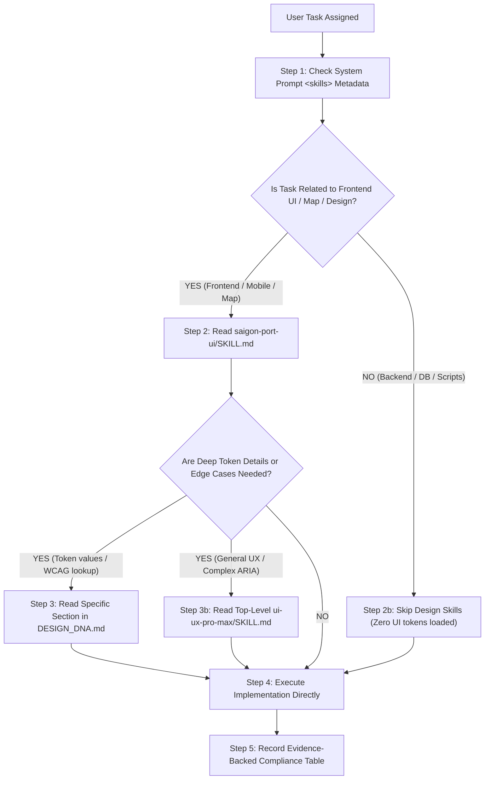

# Task-Based Skill Loading Policy & Context Governance

**Project:** Production Meter Reading — Cảng Sài Gòn  
**Repository:** `D:\Projects\production-meter-reading\production-meter-reading`  
**Governing Standard:** `AGENTS.md` (Project Root)  
**Date:** 2026-09-23  

---

## 1. Problem Statement: The Blanket Recursive Loading Anti-Pattern

In previous Map V2 development phases, prompt templates instructed AI agents to:
```text
In accordance with Section 0 requirements, both skill directories must be inspected 
as distinct and independent instruction sources:
- D:\Projects\production-meter-reading\production-meter-reading\.agents
- D:\Projects\production-meter-reading\production-meter-reading\.agent
Neither directory may be modified.
Generate a SKILL_COMPLIANCE_REPORT.md certifying adherence to all skills.
```

### Pathological Consequences:
1. **Severe Token Waste:** Reading all 8 `SKILL.md` entry points unconditionally consumes **~22,000 tokens** per turn before any code is inspected.
2. **Context Exhaustion Hazard:** If an agent literally obeyed *"inspect both directories recursively"*, the 164 supporting files (CSV tables, JSON fixtures, Python scripts) in `.agents/skills/ui-ux-pro-max/data/` would inject **over 1,000,000 tokens**, instantly blowing out the model's context window.
3. **Phantom Compliance:** Unable to read everything, agents generated ceremonial boilerplate reports certifying compliance with skills (`banner-design`, `brand`, `slides`, `design`) that were completely irrelevant to the codebase.

---

## 2. The Task-Based Progressive Disclosure Sequence

The blanket recursive loading pattern is formally replaced by a 5-step **Task-Based Progressive Disclosure Protocol**:



---

## 3. Task Domain Selection Matrix

Agents must strictly align skill loading with the functional boundaries of their assigned tasks:

| Functional Task Domain | Active Skills & Authoritative Specs | Explicitly Prohibited / Dormant Skills | Rationale |
| :--- | :--- | :--- | :--- |
| **Mobile User Portal** (Meter Reading, Camera, Attendance, Home Hub) | `.agent/skills/saigon-port-ui/SKILL.md` (User Portal Scope), `frontend/DESIGN_DNA.md` | `banner-design`, `brand`, `design`, `slides`, `ui-styling` | Field reading is governed by Saigon Port maritime minimalism and outdoor high-contrast rules. |
| **Operations Portal & Map V2** (Desktop Admin, GIS Overlay) | `.agent/skills/saigon-port-ui/SKILL.md` (Operations & Map V2 Scope), `frontend/DESIGN_DNA.md` | `banner-design`, `brand`, `design`, `slides` | Desktop operations and GIS digital twin require technical density and frozen B2 geometry. |
| **Backend API, SQLite, Schemas, Reconciliation** | None (Inspect `backend/app/models.py`, `schemas.py`, `db.py`) | All UI, design, and styling skills | Backend business logic must not be cluttered with frontend CSS or typography instructions. |
| **General UX Edge Cases** (Complex keyboarding, hit bounds) | Top-level `.agents/skills/ui-ux-pro-max/SKILL.md` only | `.agents/skills/ui-ux-pro-max/data/*` (Entire 3.5MB database) | Top-level principles suffice; CSV stack datasets provide zero engineering value. |
| **Marketing Banners & Presentations** (Out-of-scope non-engineering) | `banner-design`, `brand`, `slides` | `saigon-port-ui` | Specialized creative skills only activate when explicitly requested by user. |

---

## 4. Quantitative Context Impact: Baseline vs. Optimized

| Metric / Scenario | Historical Baseline (Blanket Loading) | Optimized Policy (Progressive Disclosure) | Savings / Impact |
| :--- | :--- | :--- | :--- |
| **Skills Read on Mobile UI Task** | 4 to 6 skills (~16,000 tokens) | 1 skill + 1 canonical spec (~5,500 tokens) | **~10,500 tokens saved** |
| **Skills Read on Backend API Task** | 3 to 4 skills (~12,000 tokens) | **0 skills (0 tokens)** | **100% elimination of irrelevant tokens** |
| **Risk of Recursive Directory Dump** | High (Potential 1,000,000 token context blowout) | **Zero (Dumping explicitly banned in `AGENTS.md`)** | **Guaranteed context safety** |
| **Compliance Boilerplate Output** | ~4,500 bytes (~1,200 tokens per phase) | Concise table (~200 tokens) | **~1,000 output tokens saved per phase** |

---

## 5. Skill Authority Hierarchy

To prevent generic AI skills from overriding established project requirements, the following authority hierarchy is enforced across all engineering sessions:

1. **Existing product and API behavior in the repository:** Working production code and verified database contracts are supreme.
2. **`saigon-port-ui`:** Primary authority on visual direction, domain terminology, and operational ergonomics.
3. **`frontend/DESIGN_DNA.md`:** Authoritative single source of truth for CSS tokens, palette provenance, and WCAG contrast validation.
4. **Accessibility & mobile usability standards:** WCAG 2.1 AA/AAA contrast and 48x48px touch targets.
5. **Generic UI/frontend skills (`ui-ux-pro-max`, `ui-styling`):** Advisory only; cannot override Saigon Port rules.
6. **Framework defaults:** React, Tailwind, and Vite default styles.
