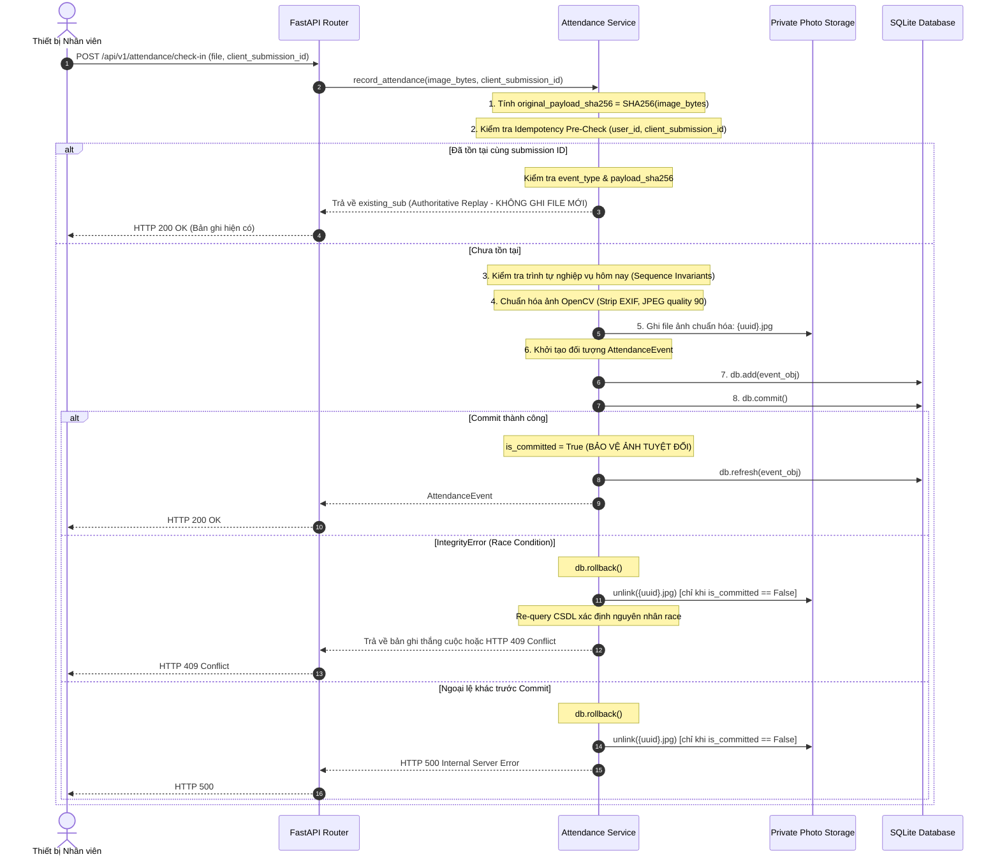

# 03. Vòng Đời Giao Dịch CSDL & Quản Lý File Ảnh Chấm Công
**Tài liệu:** Transaction and Photo Lifecycle  
**Dự án:** local `production-meter-reading`  
**Giai đoạn:** Attendance Idempotency & Persistence Hardening  
**Trạng thái:** IMPLEMENTED & TESTED  

---

## 1. Trình Tự Giao Dịch Chính Xác (Exact Transaction Order)



---

## 2. Ranh Giới Thất Bại & Cơ Chế Thu Hồi

### 2.1. Quy Tắc Bất Khả Xâm Phạm Sau Commit (Post-Commit Invariant)
Trước đây, mã nguồn đặt lệnh `unlink()` trong khối `except Exception` chung mà không theo dõi trạng thái giao dịch. Nếu `db.commit()` đã hoàn tất trên đĩa nhưng các thao tác sau đó (như `db.refresh()`, serialize JSON, hoặc đường truyền mạng bị đứt) ném ngoại lệ, khối `except` sẽ xóa file ảnh của bản ghi CSDL đã cam kết!

**Giải pháp đã cài đặt:**
Sử dụng cờ boolean rõ ràng:
```python
is_committed = False
try:
    db.add(event_obj)
    db.commit()
    is_committed = True  # Đánh dấu đã cam kết vào CSDL
    db.refresh(event_obj)
    return event_obj
except Exception:
    db.rollback()
    # CHỈ XÓA ẢNH NẾU TRANSACTION CHƯA COMMIT!
    if not is_committed and persisted_file_path.exists():
        persisted_file_path.unlink()
    if is_committed:
        return event_obj  # Bảo toàn bản ghi và ảnh
    raise
```

### 2.2. Xử Lý Tên File & Ngăn Ngừa Directory Traversal
- Tên file được sinh hoàn toàn ngẫu nhiên bằng `f"{uuid.uuid4()}.jpg"`.
- Không sử dụng tên file do client cung cấp để lưu trên đĩa.
- Thư mục lưu trữ được chỉ định rõ ràng qua cấu hình (`data/attendance_photos/`).
- Mọi thao tác dọn dẹp đều dùng đường dẫn tuyệt đối đã giải quyết (`Path.resolve()`), không đi theo symlink ra ngoài thư mục an toàn.

---

## 3. Tiện Ích Thu Hồi Khi Tiến Trình Bị Đột Tử (Crash Recovery & GC)

Nếu tiến trình server bị mất điện đột ngột (Power Loss / SIGKILL) đúng vào khoảnh khắc sau khi file vừa ghi xuống đĩa nhưng trước khi gọi commit, Python exception handler sẽ không được thực thi. File ảnh này sẽ nằm lại trên đĩa cứng như một file mồ côi.

Để giải quyết vấn đề này mà không gây rủi ro xóa nhầm dữ liệu đang xử lý, module [`backend/app/attendance_gc.py`](file:///D:/Projects/production-meter-reading/production-meter-reading/backend/app/attendance_gc.py) được cung cấp với các tiêu chuẩn an toàn:

1. **Mặc định Dry-Run:** Tiện ích luôn chạy ở chế độ kiểm toán (`dry_run=True`), chỉ in báo cáo và không xóa bất kỳ file nào trừ khi có cờ `--apply`.
2. **Đối soát Danh mục Có Thẩm quyền:** Chỉ so khớp với cột `photo_key` trong bảng `attendance_events`. File nào có trong CSDL tuyệt đối không bao giờ bị xóa.
3. **Vùng Đệm Thời Gian (Grace Period):** Các file có thời gian chỉnh sửa (`st_mtime`) dưới ngưỡng an toàn (mặc định 60 phút) được xem là "In-flight" và được bảo vệ hoàn toàn, tránh xóa nhầm ảnh của các yêu cầu đang gửi dở dang.
4. **Báo Cáo Kiểm Toán Có Thể Rà Soát (Auditable Report):** Xuất cấu trúc JSON chi tiết số lượng file quét, file hợp lệ, file đang xử lý và danh sách các file mồ côi.
