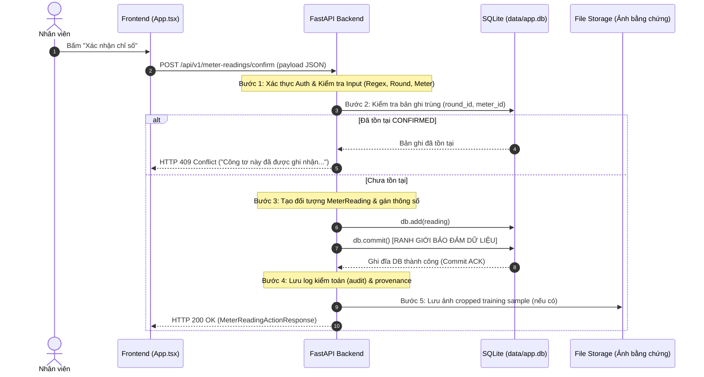

# BÁO CÁO 04 — KIỂM TOÁN VÙNG GIAO DỊCH VÀ ĐIỂM LƯU CHỈ SỐ (TRANSACTION AUDIT)

**Thời điểm kiểm toán:** 2026-09-21T14:10+07:00  
**Đối tượng kiểm toán:** Hàm `confirm_meter_reading()` trong `backend/app/meter_logbook.py`  
**Mục tiêu:** Xác định chính xác ranh giới giao dịch (transaction boundary), các điểm đứt gãy kết nối và nguyên nhân phát sinh trạng thái bất định (OUTCOME_UNKNOWN / 409).

---

## 1. Vòng đời Xử lý Giao dịch Lưu Chỉ số (Transaction Lifecycle)

Trong hàm `confirm_meter_reading()`, chuỗi các thao tác diễn ra theo thứ tự nghiêm ngặt sau:

---

## 2. Vùng Lỗ hổng Trạng thái Bất định (The Vulnerability Window)

Ranh giới bảo đảm dữ liệu của SQLite nằm ở lệnh `db.commit()` (Bước 3). Sau thời điểm này:
- Bản ghi chỉ số công tơ đã **chính thức nằm trong cơ sở dữ liệu**.
- Tuy nhiên, client **chưa nhận được phản hồi HTTP 200 OK** vì backend còn phải:
  1. Ghi log kiểm toán và provenance.
  2. Ghi file ảnh vào đĩa cứng (`data/evidence/`).
  3. Đóng gói payload JSON và gửi gói tin qua giao thức HTTP/TCP.

### Kịch bản phát sinh lỗi thực tế:
- **Kịch bản A (Rớt mạng sau commit):** Nhân viên đang ở ngoài cầu cảng/trạm điện, sóng 4G/WiFi bị gián đoạn đúng lúc backend vừa `db.commit()`. Trình duyệt báo `Failed to fetch` hoặc `Network Error`. Frontend chuyển sang trạng thái `OUTCOME_UNKNOWN`.
- **Kịch bản B (Double-submit / Retry):** Sau khi thấy mạng chập chờn, nhân viên bấm "Thử gửi lại". Yêu cầu thứ hai gửi lên backend, backend thực hiện Bước 2 và phát hiện chỉ số đã được lưu ở yêu cầu thứ nhất. Backend trả về `HTTP 409 Conflict`.
- **Kịch bản C (Timeout):** Gateway hoặc reverse proxy timeout (HTTP 504) trong khi backend vẫn hoàn thành việc commit.

### Hệ quả nếu không có Đối soát (Reconciliation):
Trước khi có cơ chế đối soát:
- Khi nhận `HTTP 409`, frontend bắt buộc chuyển sang `REJECTED`, thông báo công tơ đã được ghi nhận. Nhân viên hoang mang không biết chỉ số mình vừa đọc đã vào hệ thống hay do người khác ghi đè.
- Khi gặp sự cố mạng, nhân viên không có cách nào để biết chắc chắn dữ liệu đã vào máy chủ hay chưa mà không cần gọi điện hỏi admin.

---

## 3. Ranh giới Khuyến nghị và Giải pháp

1. **Tuyệt đối không tự động coi HTTP 409 là thành công (Never auto-default 409 to success):**
   Nếu công tơ bị nhân viên khác ghi một chỉ số hoàn toàn khác, việc tự động báo thành công sẽ gây sai lệch số liệu vận hành nghiêm trọng.
2. **Cung cấp API Đối soát Độc lập (Authoritative Reconciliation):**
   Frontend phải có khả năng truy vấn trạng thái thực tế của công tơ trong lượt ghi:
   - Nếu máy chủ đã có bản ghi VÀ giá trị chỉ số trùng khớp với giá trị người dùng vừa xác nhận -> Chuyển trạng thái sang `CONFIRMED_BY_SERVER` an toàn.
   - Nếu giá trị chỉ số trên máy chủ khác -> Thông báo xung đột dữ liệu trung thực.
   - Nếu máy chủ chưa có bản ghi -> Cho phép gửi lại an toàn.
