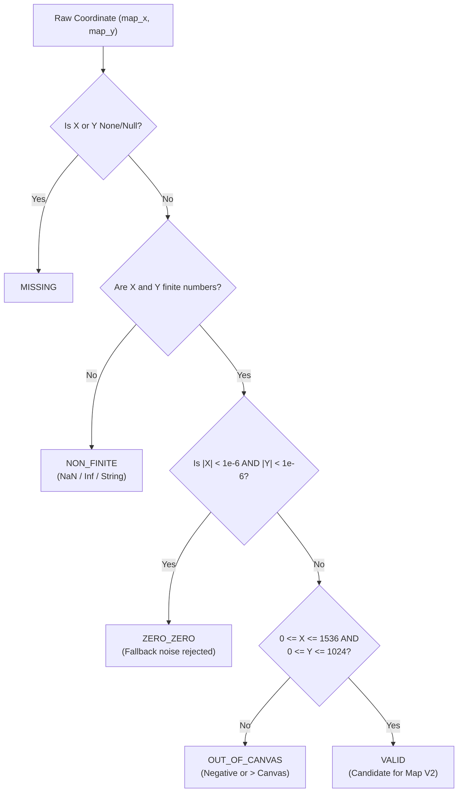

# 04 — Coordinate Validation & Spatial Integrity Contract

**Scope:** Mathematical rules, bounds constraints, and invariant rejection policies for spatial coordinates in Saigon Port Map V2.

---

## 1. Canonical Coordinate Space Definition

- **Spatial Dimension:** $1536 \times 1024\text{ pixels}$
- **Horizontal Bounds:** $0.0 \le X \le 1536.0$
- **Vertical Bounds:** $0.0 \le Y \le 1024.0$
- **Coordinate Origin:** Top-left corner $(0, 0)$
- **Positive Directions:** $X$ increases towards East (right); $Y$ increases towards South (down)
- **Unit of Measurement:** Pure image pixel units (`image-pixels`)
- **GPS/GIS Disclaimers:** Not real-world WGS84 GPS latitude/longitude; zero GPS claims permitted.

---

## 2. Spatial State Classification Taxonomy

Every meter in the system MUST map to exactly one of the five canonical spatial states:

### State Definitions
1. **`VALID`**: Finite numeric coordinates residing strictly inside $[0, 1536] \times [0, 1024]$ and strictly not $(0, 0)$.
2. **`MISSING`**: `map_x` or `map_y` is `None` / `NULL`.
3. **`ZERO_ZERO`**: Pair is $(0, 0)$ or $|x| < 1e-6 \land |y| < 1e-6$. Treated as uninitialized fallback noise.
4. **`NON_FINITE`**: Coordinates are `NaN`, positive/negative `Infinity`, or malformed non-numeric strings.
5. **`OUT_OF_CANVAS`**: Coordinates fall outside the canvas bounds ($x < 0 \lor y < 0 \lor x > 1536 \lor y > 1024$).

---

## 3. Point-in-Polygon (PIP) Verification Contract

Point-in-polygon verification uses the standard Jordan curve theorem (Ray-Casting Algorithm):

$$\text{Ray}(P, \vec{u}) \cap \partial \text{Polygon}$$

For a test point $P(x, y)$ and polygon vertices $V_0, V_1, \dots, V_{n-1}$:
- A horizontal ray is cast from $(x, y)$ to $(+\infty, y)$.
- For each edge $(V_i, V_j)$ where $j = (i + 1) \pmod n$:
  $$\text{intersect} \iff (y_i > y \ne y_j > y) \land \left(x < \frac{(x_j - x_i)(y - y_i)}{y_j - y_i} + x_i\right)$$
- If the number of edge crossings is odd, the point is strictly inside.

### Containment Output Taxonomy
1. **`INSIDE_ASSIGNED_ZONE`**: Point falls inside the polygon(s) matching the meter's assigned zone.
2. **`OUTSIDE_ASSIGNED_ZONE`**: Point has valid coordinates, but does not fall inside its assigned zone polygon.
3. **`ZONE_UNMAPPED`**: Meter has valid coordinates, but no zone assigned in the database.
4. **`NO_COORDINATES`**: Meter has `MISSING`, `ZERO_ZERO`, `NON_FINITE`, or `OUT_OF_CANVAS`.

---

## 4. Strict Rejection Policies

1. **Zero Guessing / Manufacturing**: If a physical meter's location is unknown, it MUST remain `map_x: null, map_y: null`. Never place meters at $(0, 0)$, $(768, 512)$, or zone centroids as placeholders.
2. **Missing Coordinate Toast Notification**: As established in Phase A, meters without valid coordinates are fully searchable via `Ctrl+K` and inspectable in tabular lists, but trigger a clear toast: `"Chưa xác định vị trí trên Map V2"`.
