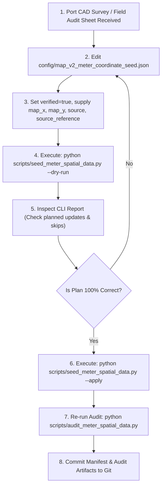

# 06 — Safe Seeding Workflow & Operational Guide

**Tool:** `scripts/seed_meter_spatial_data.py`  
**Execution Environment:** Python 3.11/3.12 with SQLite  

---

## 1. Operational Philosophy

The Saigon Port safe seeder is engineered with four safety invariants:
1. **Default Dry-Run**: Invoking without arguments defaults to `--dry-run`. Zero database writes occur unless `--apply` is explicitly passed.
2. **Single Atomic Transaction**: Updates are executed within an immediate SQLite transaction (`BEGIN IMMEDIATE`). If any record fails validation, the entire transaction rolls back cleanly.
3. **Idempotency**: Running `--apply` multiple times on identical data produces identical database state (`0 updated, N unchanged`).
4. **Non-Destructive Scoping**: Updates only `map_x`, `map_y`, and `updated_at`. Unrelated fields (`name`, `location`, `zone_id`, `utility_type`, `is_active`, `lifecycle_status`, readings) remain strictly untouched.

---

## 2. Command Line Interface (CLI)

```bash
# 1. Preview changes (Default Dry-Run)
python scripts/seed_meter_spatial_data.py --dry-run

# 2. Execute and commit changes atomically
python scripts/seed_meter_spatial_data.py --apply

# 3. Specify custom manifest or database
python scripts/seed_meter_spatial_data.py --manifest path/to/manifest.json --db-path path/to/database.db --apply

# 4. Export execution report to JSON log file
python scripts/seed_meter_spatial_data.py --apply --log-file seed_log.json
```

---

## 3. Workflow Steps for Port Engineers



---

## 4. Error Handling & Rollback Scenarios

| Failure Case | Tool Behavior | Database Outcome |
| :--- | :--- | :--- |
| **Malformed JSON in Manifest** | Aborts before database connection | Zero database interaction |
| **Meter code missing from DB** | Strict mode aborts with `SeedingValidationError` | Automatic transaction rollback |
| **Verified record has null/NaN** | Aborts during record validation | Automatic transaction rollback |
| **Verified record has $(0, 0)$** | Aborts with `(0, 0) fallback noise rejected` | Automatic transaction rollback |
| **Verified record out of canvas** | Aborts with `out of canvas bounds` | Automatic transaction rollback |
| **Database file locked / busy** | SQLite raises operational error | Automatic transaction rollback |
