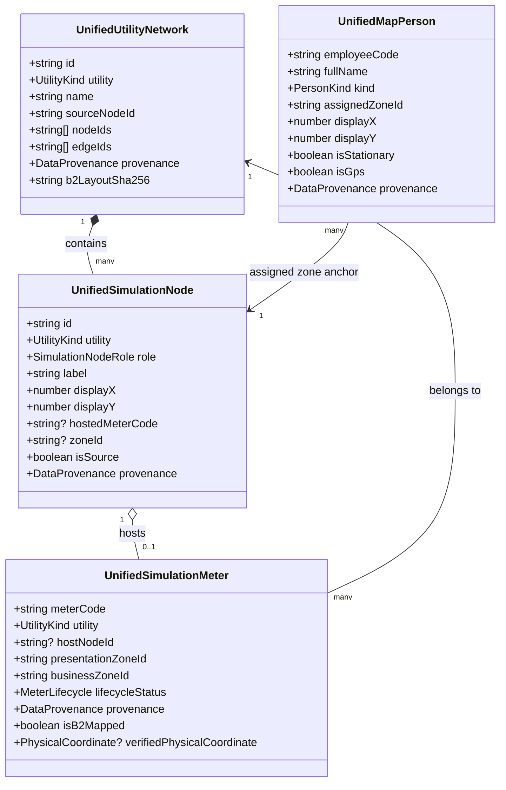

# 02 — Unified Simulation Domain Model

## 1. Domain Entities & Hierarchy

The Unified Simulation Domain establishes a cohesive, strongly-typed model connecting the physical port topography to operational and telemetry layers.

## 2. Relationships & Invariants

1. **Bijective Host-to-Meter Mapping**: Every active simulation meter (`SIM-EM-001..008`, `SIM-WM-001..004`) maps to exactly one host node (`SIM-EM-HOST-1..8`, `SIM-WM-HOST-1..4`), and each host node maps back to its unique meter.
2. **Network Root Invariance**: Each utility network has exactly one upstream source node (`SIM-EXT-GRID` for Electricity, `SIM-CITY-WATER` for Water).
3. **Zone Containment**: Every meter and host node deterministically resolves to both a presentation zone (`ZONE_QUAY`, `ZONE_CONTAINER`, `ZONE_GENERAL`, etc.) and a business zone (`zone-berth`, `zone-container`, etc.).
4. **Graph-Driven Path Resolution**: Resolving the path from a meter to its source traverses the frozen B2 edge graph upward without cycles or orphaned branches.
