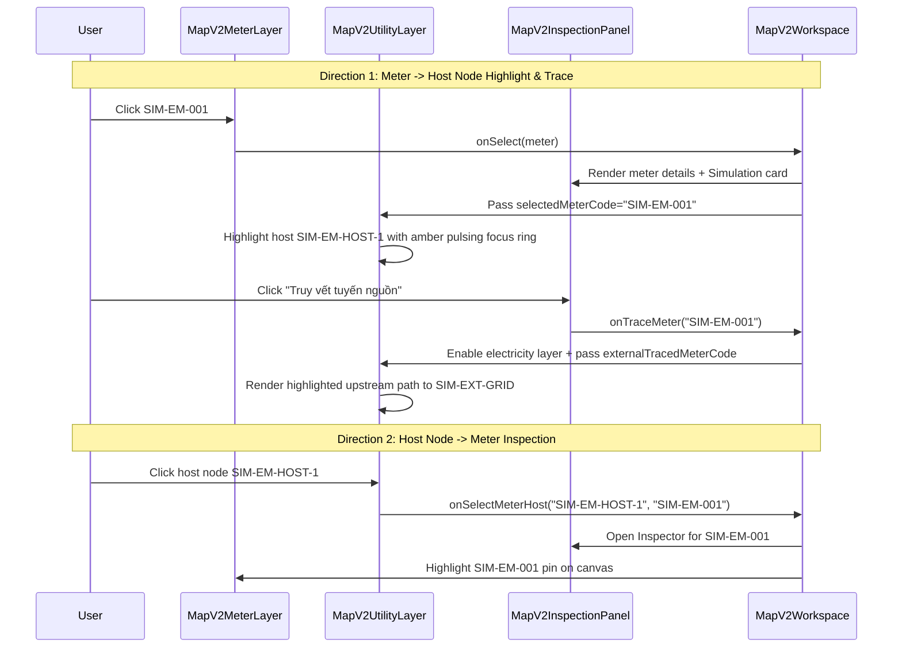

# 08 — Cross-Layer Selection & Inspection

## 1. Bidirectional Interaction Flow

The Unified Simulation Infrastructure bridges the physical meters and the utility network via a seamless bidirectional interaction loop:

## 2. Inspector Disclosure Card

When a simulation meter is selected, `MapV2InspectionPanel` injects an operational simulation metadata card:
- **Hạ tầng mạng**: `SIM-ELECTRICITY-B2` (Điện hạ thế) or `SIM-WATER-B2` (Cấp nước sạch)
- **Điểm đấu nối (Host Node)**: e.g. `SIM-EM-HOST-1`
- **Khu vực kỹ thuật**: e.g. `Cầu cảng chính (ZONE_QUAY)`
- **Nguồn dữ liệu**: `Mô phỏng B2 (Chưa khảo sát thực địa)`
- **Hành động**: Button `Truy vết tuyến nguồn` (Traces upstream network to feeder substation / booster pump).

When a legacy meter (`CT-001..012`) is selected:
- Displays `Dữ liệu kế thừa (Đã ngừng hoạt động)`
- Informs the operator that the meter is preserved for historical baseline comparisons and has no active connection to the B2 distribution network.
