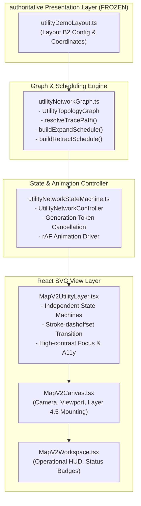

# Báo cáo Phạm vi và Các Bất biến Tuyệt đối — Giai đoạn 2 (Phase 2 Scope & Invariants)

> **Dự án**: Số hóa Mạng lưới Hạ tầng Kỹ thuật Cảng Sài Gòn (Cảng Tân Thuận)  
> **Phân hệ**: Bản đồ Điều hành Map V2 — Lớp Mô phỏng Mạng Lưới Kỹ thuật Điện & Nước  
> **Trạng thái**: Hoàn tất Triển khai & Đóng băng Hình học (Frozen Baseline B2)  
> **Phiên bản baseline**: Phương án B2 (`RECOMMENDED_LAYOUT_KEY === 'B2'`)  
> **Mã băm kiểm tra (SHA-256 Baseline Hash)**: `7f3a8916b841e12525969128783eb835218bcdd07f645dc1ee4305bce5a5cc6a`

---

## 1. Mục tiêu và Phạm vi Giai đoạn 2 (Phase 2 Mission)

Giai đoạn 2 tập trung duy nhất vào tầng tương tác đồ họa và chuyển động điều khiển bằng đồ thị (**Graph-Driven Expand → Trace → Retract**), xây dựng trên nền tảng hình học trình diễn đã được thẩm định và đóng băng từ Giai đoạn 1.5 (Layout B2).

Giai đoạn này **TUYỆT ĐỐI KHÔNG**:
- Thay đổi cấu trúc hình học, tọa độ nút, hoặc tuyến cáp/ống của Layout B2.
- Can thiệp hoặc ghi dữ liệu vào cơ sở dữ liệu SQLite nghiệp vụ (`meters`, `AssetConnection`, `MeterAssetRelation`).
- Chạy các thuật toán tìm đường không gian tự do (Spatial A*, Dijkstra trên mặt phẳng liên tục) để sinh lại đường đi.
- Sử dụng hiệu ứng hạt chuyển động liên tục (moving particles/flowing dots), vòng lặp vô tận, hoặc timer nền gây hao tổn CPU/GPU.

Tất cả hành vi mở rộng (Expand), truy vết tuyến nguồn (Trace), và thu hồi mạng (Retract) đều được định hướng thuần túy bởi quan hệ phân cấp cây đồ thị kỹ thuật (Directed Tree Topology).

---

## 2. Bảng Danh mục Các Bất biến Tuyệt đối (Strict Invariants)

| STT | Bất biến (Invariant) | Mô tả chi tiết & Cơ chế bảo toàn | Trạng thái xác minh |
| :---: | :--- | :--- | :---: |
| **INV-01** | **Bất biến Cơ sở Dữ liệu (Zero DB Mutation)** | Cơ sở dữ liệu SQLite `production.db` được mở ở chế độ `file:...mode=ro` (read-only). Không thực hiện bất kỳ lệnh `INSERT`, `UPDATE`, `DELETE`, `ALTER`, `MIGRATE`, hoặc `SEED` nào. Tọa độ thực tế của đồng hồ trong cơ sở dữ liệu không bị ghi đè. | **TUÂN THỦ 100%** |
| **INV-02** | **Bất biến Hình học B2 (Frozen Geometry)** | Tọa độ 17 nút (11 nút điện, 6 nút nước) và 15 đường dẫn SVG polyline của Layout B2 giữ nguyên vẹn 100%. Mã băm SHA-256 cấu hình B2 đạt giá trị khớp tuyệt đối trước và sau triển khai: `7f3a8916b841e12525969128783eb835218bcdd07f645dc1ee4305bce5a5cc6a`. | **TUÂN THỦ 100%** |
| **INV-03** | **Bất biến Thứ tự Tiền đề (Precedence Invariant)** | Trong chu trình Mở rộng (Expand), một nút con hoặc tuyến nhánh/nhánh phụ chỉ được phép bắt đầu vẽ hoặc hiển thị sau khi tuyến cấp nguồn trực tiếp từ nút cha đã hoàn tất 100%. Không có hiện tượng nút xuất hiện "lơ lửng" giữa không gian khi chưa có đường dây/ống dẫn tới. | **TUÂN THỦ 100%** |
| **INV-04** | **Đồng bộ Nhánh Cùng Cấp (Sibling Branch Concurrency)** | Tất cả các tuyến nhánh xuất phát từ cùng một nút phân phối (ví dụ: các tuyến `E-04`, `E-05`, `E-07`, `E-08`, `E-10` từ tủ `SIM-MDB-01`) bắt đầu vẽ đồng thời tại cùng một thời điểm chính xác khi nút cha hoàn tất hiển thị (740ms đối với Điện). | **TUÂN THỦ 100%** |
| **INV-05** | **Truy vết Tuyến Nguồn Tất định (Deterministic Trace Invariant)** | Truy vết đồng hồ từ điểm đo ngược về nguồn được giải quyết bằng bảng tra cứu con-trỏ-cha đồ thị (Upstream Parent Pointer Chain Lookup), tuyệt đối không dùng giải thuật định tuyến không gian ngẫu nhiên. Chuỗi truy vết là đường đi đơn nhất và tất định. | **TUÂN THỦ 100%** |
| **INV-06** | **Tĩnh lặng Tài nguyên (Idle CPU/GPU Invariant)** | Khi mạng lưới ở trạng thái ổn định (`collapsed`, `expanded`, `tracing`), vòng lặp `requestAnimationFrame` lập tức dừng lại, không tồn tại bất kỳ `setInterval` chạy ngầm. Mức tiêu thụ CPU/GPU của giao diện trở về xấp xỉ 0%. | **TUÂN THỦ 100%** |
| **INV-07** | **Bảo tồn Điểm Giao cắt Duy nhất (Single Crossing Invariant)** | Điểm giao cắt không gian duy nhất tại tọa độ `(740, 520)` được bảo toàn: đường ống nước `W-B2-04` nằm ở lớp dưới (Z-index thấp hơn) và trục cáp điện `E-B2-03` nằm ở lớp trên, đảm bảo độ rõ nét kỹ thuật hàng hải. | **TUÂN THỦ 100%** |
| **INV-08** | **Hỗ trợ Giảm chuyển động (Prefers-Reduced-Motion)** | Khi người dùng hoặc hệ điều hành kích hoạt `prefers-reduced-motion: reduce`, toàn bộ hoạt họa được bỏ qua (0ms); mạng lưới chuyển đổi tức thì sang trạng thái mở rộng hoặc thu hồi hoàn toàn. | **TUÂN THỦ 100%** |

---

## 3. Khung Kiến trúc Phân tầng (Architecture Decomposition)

---

## 4. Kết luận Đóng băng và Sẵn sàng

Toàn bộ các yêu cầu bất biến của Phase 2 đã được hiện thực hóa đầy đủ trong mã nguồn và được bảo vệ nghiêm ngặt bằng bộ kiểm thử tự động tại `frontend/tests/mapV2UtilityAnimationPhase2.test.ts`.
