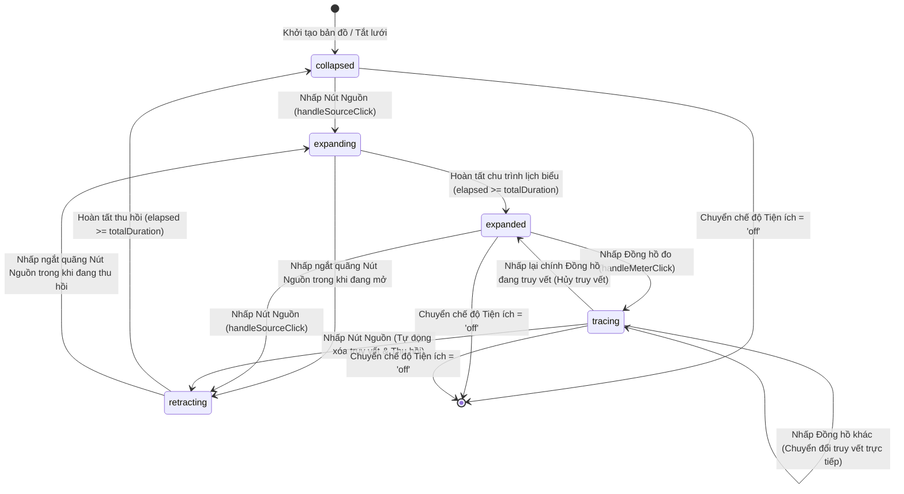

# Thiết kế Máy trạng thái Mạng lưới — Giai đoạn 2 (Network State Machine Specification)

> **Phân hệ**: Quản lý Vòng đời & Tương tác Mạng Lưới Kỹ thuật Map V2  
> **Tệp mã nguồn chính**: `frontend/src/components/map-v2/utilityNetworkStateMachine.ts`  
> **Mô hình**: Máy trạng thái Hữu hạn Đơn nhất cho từng Tiện ích (Independent Deterministic FSM)

---

## 1. Các Trạng thái Chính thức (Formal States)

Mỗi mạng lưới kỹ thuật (Điện `ELECTRICITY` và Nước `WATER`) sở hữu một máy trạng thái độc lập được định nghĩa qua kiểu dữ liệu phân biệt (Discriminated Union):

```typescript
export type NetworkPhase = 'collapsed' | 'expanding' | 'expanded' | 'tracing' | 'retracting';
```

1. **`collapsed` (Thu gọn ban đầu)**:
   - Chỉ hiển thị duy nhất nút nguồn (`SIM-EXT-GRID` cho Điện, `SIM-CITY-WATER` cho Nước).
   - Nút nguồn mang hiệu ứng viền kim cương đứt đoạn (subtle dashed border indicator) và huy hiệu gợi ý tương tác `▶ MỞ MẠNG`.
   - Toàn bộ tuyến cáp/ống và các nút thứ cấp, phân phối, trạm biến áp, cụm van, đồng hồ đo đều ẩn hoàn toàn.

2. **`expanding` (Đang mở rộng)**:
   - Được kích hoạt khi người dùng nhấp vào nút nguồn ở trạng thái `collapsed`.
   - Vòng lặp `requestAnimationFrame` điều khiển vẽ các tuyến theo độ sâu đồ thị bằng kỹ thuật `stroke-dashoffset`.
   - Các nút thành phần chỉ hiển thị khi tuyến cấp nguồn trực tiếp hoàn thành 100%.

3. **`expanded` (Đã mở rộng toàn diện)**:
   - Toàn bộ đồ thị (nút và cạnh) hiển thị đầy đủ 100%.
   - Vòng lặp hoạt họa dừng hẳn (Idle CPU/GPU).
   - Huy hiệu nút nguồn chuyển sang trạng thái sẵn sàng thu hồi `▼ THU HỒI`.
   - Tất cả các nút đồng hồ đo (`isMeter: true`) sẵn sàng tiếp nhận nhấp chuột để truy vết.

4. **`tracing` (Đang truy vết tuyến nguồn)**:
   - Kích hoạt khi người dùng nhấp vào một đồng hồ đo bất kỳ trong trạng thái `expanded` hoặc `tracing`.
   - Tuyến nguồn từ đồng hồ đo ngược về nguồn trung tâm được làm nổi bật với độ mờ 100%, độ dày nét tăng +25%, cùng quầng hào quang (halo) và huy hiệu `TRUY VẾT: SIM-EM-xxx`.
   - Các nút và tuyến không liên quan bị giảm độ mờ (Dimming) xuống 22% (đối với cạnh) và 35% (đối với nút).

5. **`retracting` (Đang thu hồi)**:
   - Kích hoạt khi người dùng nhấp vào nút nguồn ở trạng thái `expanded` hoặc `tracing`.
   - Hoạt họa diễn ra theo chiều nghịch đồ thị: các đầu nhánh/đồng hồ đo thu hồi trước, tiếp đến các tuyến nhánh, tuyến phân phối, và cuối cùng là tuyến thân.
   - Nút nguồn trung tâm luôn được giữ lại nguyên vị trí.

---

## 2. Sơ đồ Chuyển trạng thái (State Transition Diagram)



---

## 3. Bảng Chuyển đổi và Điều kiện Kích hoạt (Transition Table)

| Trạng thái hiện tại | Sự kiện kích hoạt (Event) | Điều kiện kiểm tra (Guard) | Trạng thái tiếp theo | Hành động thực thi (Action) |
| :--- | :--- | :--- | :--- | :--- |
| `collapsed` | `CLICK_SOURCE` | `phase === 'collapsed'` | `expanding` | Tăng `currentGen++`, tính lịch `buildExpandSchedule()`, khởi chạy rAF |
| `expanding` | `ANIMATION_COMPLETE` | `elapsed >= totalDurationMs` | `expanded` | Hủy rAF, đặt `phase = 'expanded'`, cập nhật toàn bộ nút/cạnh hiển thị |
| `expanding` | `CLICK_SOURCE` | Người dùng nhấp nhanh nguồn | `retracting` | Tăng `currentGen++` (hủy rAF hiện tại), tính lịch `buildRetractSchedule()`, chạy rAF nghịch |
| `expanded` | `CLICK_METER` | `node.isMeter === true` | `tracing` | Tra cứu ngược cây `resolveTracePath()`, đặt `tracedNodeIds`, làm mờ các nhánh còn lại |
| `expanded` | `CLICK_SOURCE` | `phase === 'expanded'` | `retracting` | Tăng `currentGen++`, chạy rAF thu hồi nghịch theo độ sâu |
| `tracing` | `CLICK_METER` (cùng mã) | `tracedNodeId === nodeId` | `expanded` | Đặt `tracedNodeId = null`, khôi phục 100% độ sáng cho toàn mạng |
| `tracing` | `CLICK_METER` (mã khác)| `tracedNodeId !== nodeId` | `tracing` | Cập nhật `resolveTracePath()` sang mã mới tức thì, không cần thu hồi |
| `tracing` | `CLICK_SOURCE` | `phase === 'tracing'` | `retracting` | Xóa trạng thái truy vết, lập tức bắt đầu chu trình thu hồi toàn mạng |
| Bất kỳ trạng thái | `MODE_CHANGE` | `utilityMode` chuyển đổi | `collapsed` | Hủy rAF, reset biến trạng thái về `createInitialNetworkState` |

---

## 4. Cơ chế Mã thông báo Thế hệ (Generation Token Cancellation)

Để loại trừ triệt để tình trạng cạnh tranh tiến trình (Race Condition) khi người dùng nhấp chuột dồn dập (rapid clicking) hoặc chuyển đổi nhanh giữa các nút, hệ thống triển khai cơ chế số nguyên đơn điệu tăng `currentGen`:

```typescript
public cancel(): void {
  if (this.currentRafId !== null) {
    cancelAnimationFrame(this.currentRafId);
    this.currentRafId = null;
  }
  this.currentGen++; // Vô hiệu hóa tất cả các frame rAF đang chờ xử lý
}
```

Mỗi chu trình mở rộng hoặc thu hồi đều ghi nhận giá trị `const tokenGen = this.currentGen`. Trong từng khung hình của hàm `tick(now)`:
```typescript
if (this.currentGen !== tokenGen) return; // Bỏ qua ngay lập tức nếu đã bị ngắt quãng
```
Nhờ đó, không bao giờ xuất hiện khung hình rác (ghost frames) hoặc các phần tử mạng bị hiển thị sai lệch khi tương tác ngắt quãng xảy ra.
