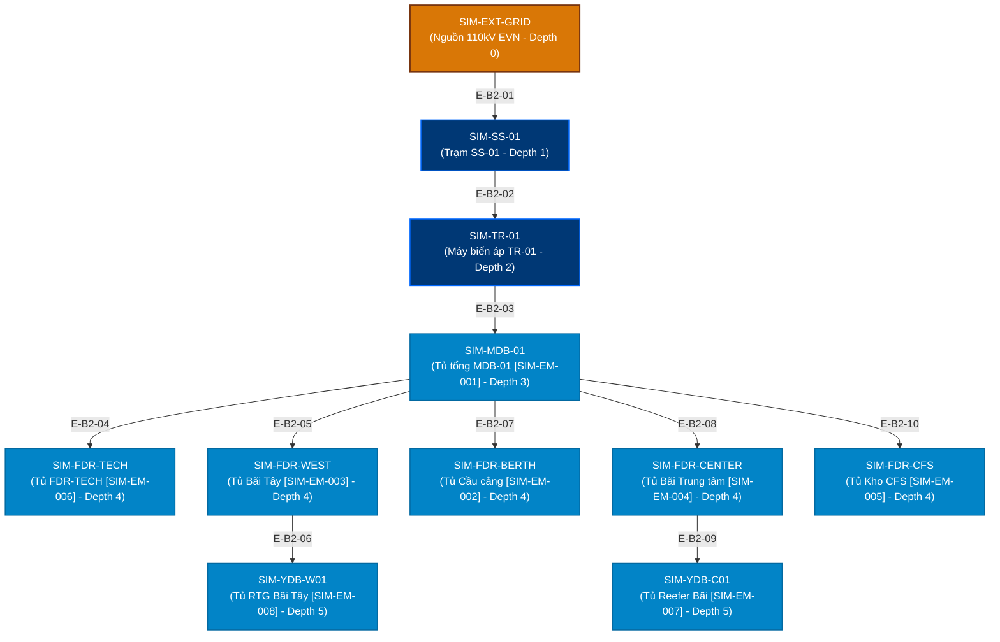
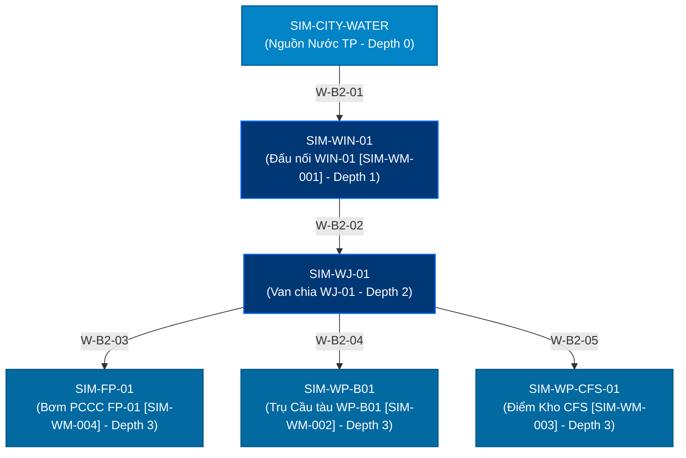

# Mô hình Đồ thị Độ sâu và Quan hệ Phụ thuộc — Giai đoạn 2 (Graph Depth & Dependency Model)

> **Phân hệ**: Cấu trúc Đồ thị Định hướng & Cây Phân cấp Kỹ thuật  
> **Tệp mã nguồn chính**: `frontend/src/components/map-v2/utilityNetworkGraph.ts`  
> **Lớp dữ liệu cơ sở**: `frontend/src/components/map-v2/utilityDemoLayout.ts` (Layout B2)

---

## 1. Cấu trúc Cây Đồ thị Kỹ thuật Điện (Electricity Directed Tree)

Mạng lưới điện bao gồm **11 nút** và **10 cạnh**, phân cấp theo 6 tầng độ sâu (Depth 0 đến Depth 5):

### Bảng Phân bổ Độ sâu & Quan hệ Nút Điện:

| ID Nút | Tên hiển thị | Vai trò | Đồng hồ gắn | Độ sâu (Depth) | Nút Cha (Parent) | Cạnh cấp nguồn |
| :--- | :--- | :--- | :---: | :---: | :--- | :--- |
| `SIM-EXT-GRID` | Lưới 110kV EVN | Nguồn chính | — | **0** | *Không có (Root)* | — |
| `SIM-SS-01` | Trạm SS-01 | Phân phối | — | **1** | `SIM-EXT-GRID` | `E-B2-01` |
| `SIM-TR-01` | Máy biến áp TR-01 | Phân phối | — | **2** | `SIM-SS-01` | `E-B2-02` |
| `SIM-MDB-01` | Tủ tổng MDB-01 | Phân phối | `SIM-EM-001` | **3** | `SIM-TR-01` | `E-B2-03` |
| `SIM-FDR-TECH` | Tủ FDR-TECH | Nhánh | `SIM-EM-006` | **4** | `SIM-MDB-01` | `E-B2-04` |
| `SIM-FDR-WEST` | Tủ Bãi Tây | Nhánh | `SIM-EM-003` | **4** | `SIM-MDB-01` | `E-B2-05` |
| `SIM-FDR-BERTH` | Tủ Cầu cảng | Nhánh | `SIM-EM-002` | **4** | `SIM-MDB-01` | `E-B2-07` |
| `SIM-FDR-CENTER`| Tủ Bãi Trung tâm | Nhánh | `SIM-EM-004` | **4** | `SIM-MDB-01` | `E-B2-08` |
| `SIM-FDR-CFS` | Tủ Kho CFS | Nhánh | `SIM-EM-005` | **4** | `SIM-MDB-01` | `E-B2-10` |
| `SIM-YDB-W01` | Tủ RTG Bãi Tây | Nhánh phụ (Spur)| `SIM-EM-008` | **5** | `SIM-FDR-WEST` | `E-B2-06` |
| `SIM-YDB-C01` | Tủ Reefer Bãi | Nhánh phụ (Spur)| `SIM-EM-007` | **5** | `SIM-FDR-CENTER`| `E-B2-09` |

---

## 2. Cấu trúc Cây Đồ thị Kỹ thuật Nước (Water Directed Tree)

Mạng lưới cấp nước bao gồm **6 nút** và **5 cạnh**, phân cấp theo 4 tầng độ sâu (Depth 0 đến Depth 3):

### Bảng Phân bổ Độ sâu & Quan hệ Nút Nước:

| ID Nút | Tên hiển thị | Vai trò | Đồng hồ gắn | Độ sâu (Depth) | Nút Cha (Parent) | Cạnh cấp nguồn |
| :--- | :--- | :--- | :---: | :---: | :--- | :--- |
| `SIM-CITY-WATER` | Nguồn cấp nước TP | Nguồn chính | — | **0** | *Không có (Root)* | — |
| `SIM-WIN-01` | Điểm đấu nối WIN-01 | Phân phối | `SIM-WM-001` | **1** | `SIM-CITY-WATER` | `W-B2-01` |
| `SIM-WJ-01` | Cụm van chia WJ-01 | Phân phối | — | **2** | `SIM-WIN-01` | `W-B2-02` |
| `SIM-FP-01` | Trạm bơm PCCC FP-01| Nhánh | `SIM-WM-004` | **3** | `SIM-WJ-01` | `W-B2-03` |
| `SIM-WP-B01` | Trụ nước Cầu tàu | Nhánh | `SIM-WM-002` | **3** | `SIM-WJ-01` | `W-B2-04` |
| `SIM-WP-CFS-01` | Nước Kho CFS | Nhánh | `SIM-WM-003` | **3** | `SIM-WJ-01` | `W-B2-05` |

---

## 3. Quy tắc Ràng buộc Tiền đề (Precedence Rule)

1. **Khởi đầu cạnh**: Một cạnh $E_{uv}$ nối từ nút cha $u$ tới nút con $v$ chỉ có thể bắt đầu hoạt họa tại thời điểm $t_{start}(E_{uv}) = t_{reveal}(u)$.
2. **Hiển thị nút**: Nút con $v$ chỉ được phép hiển thị tại thời điểm $t_{reveal}(v) = t_{start}(E_{uv}) + d(E_{uv})$, trong đó $d(E_{uv})$ là thời gian vẽ của cạnh.
3. **Đồng bộ song song**: Nếu một nút cha $u$ có nhiều nút con $v_1, v_2, ..., v_k$, tất cả các cạnh xuất phát $E_{uv_1}, ..., E_{uv_k}$ đều bắt đầu vẽ đồng thời tại cùng một mili-giây $t_{reveal}(u)$.
