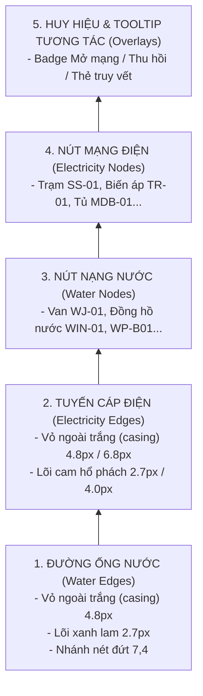

# Mô hình Trạng thái Chế độ Đồng Thời (BOTH Mode State Model)

> **Phân hệ**: Tích hợp Đồng thời Lưới Điện & Cấp Nước trên Cùng Bản đồ  
> **Tệp mã nguồn**: `frontend/src/components/map-v2/MapV2UtilityLayer.tsx`  
> **Điểm giao cắt duy nhất**: Tọa độ hình học $(740, 520)$ giữa ống nước `W-B2-04` và cáp điện `E-B2-03`

---

## 1. Kiến trúc Hai Máy Trạng thái Độc lập (Dual Independent FSMs)

Khi người dùng chọn chế độ hiển thị kết hợp `utilityMode === 'both'`, hệ thống không ghép hai mạng thành một máy trạng thái khổng lồ phức tạp, mà vận hành **hai máy trạng thái song song, độc lập hoàn toàn**:

```typescript
// Hai biến trạng thái riêng biệt được điều khiển bởi 2 controller độc lập
const [elecState, setElecState] = useState<UtilityNetworkState>(...);
const [waterState, setWaterState] = useState<UtilityNetworkState>(...);
```

### Ma trận Trạng thái Kết hợp (State Combination Matrix):

| Trạng thái Điện (`elecState`) | Trạng thái Nước (`waterState`) | Trực quan trên Bản đồ Map V2 |
| :---: | :---: | :--- |
| `collapsed` | `collapsed` | Cả 2 nút nguồn (`SIM-EXT-GRID` & `SIM-CITY-WATER`) hiển thị viền đứt đoạn gợi ý mở mạng |
| `expanding` | `collapsed` | Mạng điện đang lan tỏa, mạng nước vẫn giữ nguyên nút nguồn |
| `expanded` | `collapsed` | Mạng điện hiển thị 100%, mạng nước thu gọn |
| `expanded` | `expanding` | Mạng điện ổn định, mạng nước đang vẽ các nhánh |
| **`expanded`** | **`expanded`** | **Cả hai mạng hiển thị đồng thời đầy đủ 17 nút và 15 cạnh** |
| `tracing` (`SIM-EM-xxx`) | `expanded` | Tuyến điện được truy vết rực rỡ; mạng nước duy trì 100% (hoặc tách biệt) |
| `expanded` | `tracing` (`SIM-WM-xxx`) | Tuyến nước được truy vết rực rỡ; mạng điện duy trì ổn định |
| `retracting` | `expanded` | Mạng điện đang thu hồi về nguồn, mạng nước không bị ảnh hưởng |

---

## 2. Thứ tự Lớp Vẽ Z-Order Tuyệt đối (Strict SVG Layer Ordering)

Để đảm bảo quy chuẩn bản vẽ kỹ thuật hàng hải và tránh hiện tượng các phần tử chồng lấn gây nhòe nét, Z-Order trong thẻ `<svg>` được cấu trúc cố định theo thứ tự từ dưới lên trên:



### Bảo toàn Điểm Giao cắt Duy nhất tại $(740, 520)$:
- Tuyến nước `W-B2-04` chạy ngang từ $(800, 520)$ sang $(705, 520)$, cắt trực giao qua trục cáp điện $X=740$.
- Nhờ thứ tự Z-order trên, **đoạn cáp điện trục chính `E-B2-03` luôn nằm đè lên trên đường ống nước `W-B2-04`**. Lớp vỏ đệm trắng (white casing) của cáp điện tạo đường biên ngăn cách thị giác tự nhiên, giúp người xem nhận diện ngay lập tức sự tách biệt giữa hai hệ thống hạ tầng mà không bị rối mắt.

---

## 3. Chính sách Giảm tải Nhãn Nhìn (Label Density & Decluttering Policy)

Trong chế độ đơn lẻ (`electricity` hoặc `water`), nhãn mã hiệu đồng hồ có thể hiển thị đầy đủ. Tuy nhiên, trong chế độ kết hợp `BOTH`:
- **Chính sách Mặc định**: Nhãn mã hiệu đồng hồ được **ẩn theo mặc định** để tránh che khuất các công trình mặt bằng cảng, các cổng kiểm soát và vùng quay tàu.
- **Cơ chế Kích hoạt Nhãn**: Nhãn đồng hồ chỉ hiển thị khi:
  1. Người dùng di chuột (`hover`) hoặc chuyển tiêu điểm bàn phím (`focus`) vào nút đồng hồ đó.
  2. Đồng hồ đó là đối tượng mục tiêu đang được truy vết (`isTargetMeter === true`).
- Chính sách này tuân thủ chuẩn thiết kế tối giản hàng hải (Saigon Port Minimalist UI), vừa đáp ứng mật độ thông tin cao vừa giữ bản đồ thông thoáng.
