# 03. Phân tích Các Phương án Bố cục & Đánh đổi Kỹ thuật (Layout Strategies & Trade-Offs)

Nhằm tìm ra giải pháp hình học tối ưu cho Bản đồ V2, 3 phương án kiến trúc không gian khác nhau đã được thiết kế và tính toán định lượng trên lưới tọa độ $1536 \times 1024$.

---

## 1. Chi tiết 3 Phương án Bố cục

```mermaid
flowchart TD
    subgraph PA_A["Phương án A: Tuyến Hành lang Bao quanh (Perimeter/Road)"]
        A1["Nguồn Cổng Bãi"] --> A2["Men theo đường ranh phía Nam"]
        A2 --> A3["Tẽ nhánh bám viền tường ranh & kho"]
    end

    subgraph PA_B["Phương án B: Trục Xương sống Trung tâm (Central Backbone - Khuyến nghị)"]
        B1["Nguồn Cổng Bãi"] --> B2["Trục kỹ thuật trung tâm X=750 (Điện) / X=790 (Nước)"]
        B2 --> B3["Phân nhánh ngang trực giao sang Tây (Bãi tổng hợp), Đông (Container) & Bắc (Cầu cảng)"]
    end

    subgraph PA_C["Phương án C: Phân phối Cụm Phân khu (Zone-Based)"]
        C1["Nguồn Cổng Bãi"] --> C2["Tủ tổng MDB-01 làm Hub trung tâm"]
        C2 --> C3["Tia nan hoa trực tiếp đến từng phân khu độc lập"]
    end
```

---

## 2. Bảng Ma trận So sánh Định lượng & Đánh đổi (Quantitative Comparison Matrix)

Dữ liệu đo đạc trực tiếp từ cấu hình hình học tại `utility_layout_metrics.json`:

| Tiêu chí Đánh giá | Phương án A (Perimeter) | Phương án B (Central Backbone ★) | Phương án C (Zone-Based) | Nhận định Chuyên gia |
| :--- | :---: | :---: | :---: | :--- |
| **Tổng chiều dài tuyến (px)** | $4,380\text{ px}$ | **$3,925\text{ px}$** | $4,110\text{ px}$ | **Phương án B tiết kiệm 455 px** chiều dài tuyến so với A, giảm độ rối trực quan. |
| **Số điểm bẻ góc (Bends)** | 16 điểm | **11 điểm** | 14 điểm | Phương án B có ít góc ngoặt nhất, các đường đi dứt khoát, thanh thoát. |
| **Va chạm kho hàng (Kho 1, 2, 4)** | **0** | **0** | **0** | Cả 3 phương án đều đạt chuẩn né 100% thân kho. |
| **Va chạm điểm nóng (Zone Anchors)** | **0** | **0** | **0** | Không cắt qua vùng đệm tương tác bán kính 30px của các Hotspot. |
| **Va chạm cổng cảng (Gate A, B)** | **0** | **0** | **0** | Giữ khoảng cách an toàn $> 25\text{ px}$ so với vị trí cổng. |
| **Giao cắt cùng loại (Điện-Điện, Nước-Nước)** | **0** | **0** | **0** | Đồ thị hình cây (Tree hierarchy) không tự cắt chính mình. |
| **Giao cắt chéo (Điện cắt Nước)** | 4 điểm | **3 điểm (Vuông góc)** | 4 điểm | Phương án B chỉ có 3 điểm giao chéo tại các hành lang kỹ thuật xác định. |
| **Tính đối xứng & Cân bằng thị giác** | Trung bình (Lệch viền) | **Rất cao (Trục đối xứng)** | Trung bình (Nan hoa rải rác) | Phương án B tôn vinh cấu trúc không gian cảng. |
| **Độ sẵn sàng cho Animation Phase 2** | Khá | **Xuất sắc (Trục chính $\to$ Nhánh)** | Khá (Lan tỏa đồng loạt) | Trục chính tạo nhịp sóng lan tỏa (Propagation Wave) cực kỳ ấn tượng. |

---

## 3. Lý do Lựa chọn Phương án B (Central Backbone) làm Khuyến nghị Chính thức

1. **Khớp nối hoàn hảo với cấu trúc không gian Cảng Tân Thuận:**
   - Cảng Tân Thuận có trục giao thông chính đi từ Cổng 2 (phía Nam) đâm thẳng lên Cầu cảng (phía Bắc).
   - Phương án B tận dụng dải đất kỹ thuật giữa Bãi hàng tổng hợp (phía Tây) và Bãi container (phía Đông) để đặt trục xương sống đôi ($X=750$ cho Tuyến Điện và $X=790$ cho Tuyến Nước).
2. **Hình học trực giao (Orthogonal Routing):**
   - Các tuyến rẽ sang hai bên đều vuông góc $90^\circ$, tạo cảm giác bản đồ kỹ thuật công nghiệp chuẩn mực (Maritime Engineering Cadastral), đúng với tinh thần của kỹ năng `saigon-port-ui`.
3. **Nền tảng lý tưởng cho Phase 2 (Animation Wave):**
   - Khi triển khai hiệu ứng bung tuyến (Expand), xung điện từ nguồn `SIM-EXT-GRID` và dòng nước từ `SIM-CITY-WATER` sẽ phóng thẳng theo trục đứng trước, sau đó từ trục chính tẽ sang hai bên cánh bãi và vươn lên cầu tàu. Luồng năng lượng di chuyển có trật tự thị giác rõ ràng, không bị hỗn loạn.
