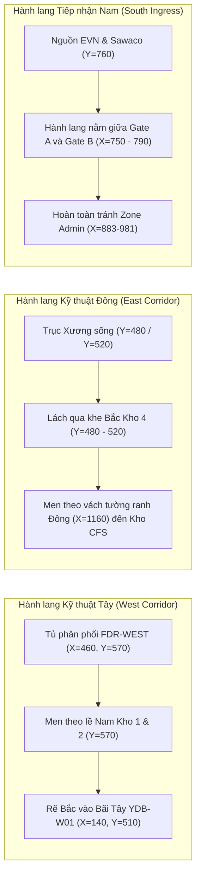

# 05. Thiết kế Hành lang Né Chướng ngại vật (Obstacle Avoidance & Corridor Design)

Bản đồ kỹ thuật Cảng Tân Thuận chứa nhiều cấu trúc kiến trúc cố định và điểm tương tác nghiệp vụ. Việc dẫn tuyến hạ tầng phải tuân thủ nghiêm ngặt quy tắc **không bao giờ xuyên cắt trực tiếp qua các vùng cấm**.

---

## 1. Bản đồ Vùng Chướng ngại vật Cố định (Obstacle Inventory)

| Tên Thực thể | Loại Thực thể | Giới hạn Tọa độ $(X, Y)$ | Tọa độ Bán kính An toàn |
| :--- | :--- | :--- | :--- |
| **BLDG_KHO_1** | Nhà kho 1 | $X \in [199, 290], Y \in [407, 545]$ | Vùng cấm hình chữ nhật |
| **BLDG_KHO_2** | Nhà kho 2 | $X \in [330, 433], Y \in [407, 550]$ | Vùng cấm hình chữ nhật |
| **BLDG_KHO_4** | Nhà kho 4 | $X \in [893, 1117], Y \in [540, 657]$ | Vùng cấm hình chữ nhật |
| **ZONE_ADMIN** | Tòa nhà Văn phòng Cảng | $X \in [883, 981], Y \in [660, 721]$ | Vùng cấm hình chữ nhật |
| **GATE_A** | Cổng A (Cổng xuất hàng) | $(668, 725)$ | Bán kính đệm an toàn $> 25\text{ px}$ |
| **GATE_B** | Cổng B (Cổng xe chính) | $(874, 725)$ | Bán kính đệm an toàn $> 25\text{ px}$ |
| **7 Zone Anchors** | Điểm nóng Hotspot phân khu | Các tâm điểm tương tác | Bán kính đệm an toàn $> 30\text{ px}$ |

---

## 2. Thiết kế 3 Hành lang Kỹ thuật An toàn (Safe Corridors)

---

## 3. Chi tiết Giải pháp Né Chướng ngại vật

### 1. Hành lang Tây (Né Kho 1 và Kho 2):
- Nếu kẻ đường thẳng từ Tủ tổng `SIM-MDB-01` ($X=750, Y=570$) đến Tủ Bãi Tây `SIM-YDB-W01` ($X=140, Y=510$), đường nối sẽ cắt ngang qua toàn bộ lòng Kho 1 và Kho 2.
- **Giải pháp:** Tuyến được hạ thấp xuống cao độ $Y=570$ (chạy dọc theo mép đường nội bộ phía Nam các kho), đi ngang qua tọa độ $X=140$, sau đó mới bẻ góc $90^\circ$ hướng lên phía Bắc đến tọa độ $Y=510$. Va chạm thân kho: **0**.

### 2. Hành lang Đông (Né Kho 4 & Khu Văn phòng Admin):
- Kho 4 ($X \in [893, 1117], Y \in [540, 657]$) và Tòa nhà Admin ($X \in [883, 981], Y \in [660, 721]$) chiếm trọn khu vực phía Nam Bãi Container.
- **Giải pháp Tuyến Điện:** Đi từ Trục trung tâm rẽ ngang ở cao độ $Y=480$ (khe thông thoáng phía trên nóc Kho 4), đến $X=1160$ men dọc hành lang tường ranh phía Đông cảng rồi mới hạ xuống Tủ Kho CFS `SIM-FDR-CFS` ($Y=560$).
- **Giải pháp Tuyến Nước:** Cụm van chia nước `SIM-WJ-01` xuất tuyến rẽ qua $X=860$, luồn lách qua khe hẹp phía trên Kho 4 ở $Y=520$ trước khi nhập vào trục tường đông tại $X=1160$ đến điểm nước `SIM-WP-CFS-01` ($Y=620$).

### 3. Vùng Đệm Hotspot Tương tác:
- Các điểm nóng trung tâm của 7 phân khu (Zone Anchors) đều có bán kính tương tác trực quan. Toàn bộ các nút và đoạn tuyến trong Phương án B đều cách tâm các điểm nóng tối thiểu $35\text{ px}$, bảo đảm người vận hành có thể rê chuột và bấm chọn phân khu mà không bị các đường hạ tầng che khuất nhãn hay làm sai lệch thao tác.
