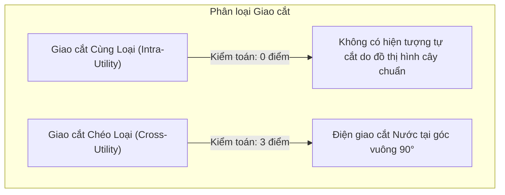
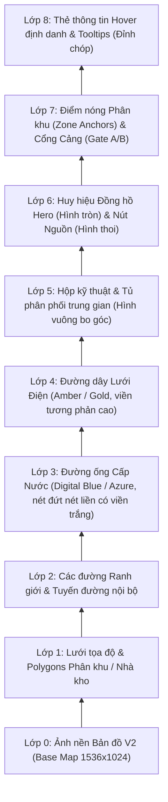

# 06. Phân tích Điểm Giao cắt & Thứ tự Lớp Hiển thị (Crossing Analysis & Z-Ordering)

Trong kỹ thuật biểu diễn bản đồ GIS hạ tầng đa mạng (Multi-Utility Overlay), việc xử lý các giao điểm giữa các hệ thống đường ống và đường dây là yếu tố cốt lõi quyết định tính chuyên nghiệp và khả năng đọc của bản đồ.

---

## 1. Phân tích Các Điểm Giao cắt (Crossing Analysis)

### Chi tiết 3 Điểm Giao cắt Trực giao trong Phương án B (Khuyến nghị):
1. **Giao điểm 1 $(760, 630)$:**
   - **Tuyến giao:** Tuyến nước nhánh cấp trạm PCCC (`W-03`, đoạn ngang từ $X=790$ sang $X=760$) giao với Trục điện trung tâm (`E-02`).
   - **Góc giao:** Đúng $90^\circ$ vuông góc.
2. **Giao điểm 2 $(750, 630)$:**
   - **Tuyến giao:** Trục kỹ thuật điện đứng ($X=750$) giao với nhánh dẫn hướng nước ngang ($Y=630$).
   - **Góc giao:** Đúng $90^\circ$ vuông góc.
3. **Giao điểm 3 $(790, 480)$:**
   - **Tuyến giao:** Tuyến điện nhánh đi Bãi Container (`E-08`, đoạn ngang ở $Y=480$ từ $X=750$ sang $X=960$) cắt qua Trục nước đứng cấp Cầu cảng (`W-04`, chạy dọc $X=790$).
   - **Góc giao:** Đúng $90^\circ$ vuông góc.

**Đặc điểm an toàn kỹ thuật:**
- Không có bất kỳ đoạn nào chạy đè collinear (trùng tim tuyến). Trục điện ($X=750$) và Trục nước ($X=790$) cách nhau một khoảng an toàn cố định là $40\text{ px}$, tương đương một hành lang cách ly kỹ thuật thực địa.

---

## 2. Thứ tự Lớp Hiển thị Chiều sâu (Z-Ordering Hierarchy)

Để tránh hiện tượng che khuất hoặc khó tương tác, cấu trúc SVG được phân tầng theo thứ tự từ dưới lên trên:

---

## 3. Kỹ thuật Đổ bóng & Đường viền Đệm (Halo / Stroke Casing)

Để đường vẽ mạng lưới nổi bật rõ ràng trên cả nền bản đồ ảnh thực tế (Light/Technical) lẫn nền tối (Neon Digital Twin):
1. **Lớp viền đệm đáy (Stroke Casing):**
   - Mỗi đoạn tuyến SVG được vẽ bởi 2 đường `path`:
     - Đường dưới: Có bề rộng `strokeWidth = coreWidth + 2.5px`, màu trắng `#FFFFFF` (hoặc `#050f24` ở chế độ Neon), độ mờ $85\%$.
     - Đường trên: Bề rộng chuẩn của mạng (`3.6px` cho trục chính, `2.4px` cho nhánh phụ), mang màu nhận diện chuyên ngành.
   - Nhờ lớp viền đệm đáy, đường ống nước và dây điện không bao giờ bị hòa lẫn vào màu xám của mặt đường hay màu xanh của bãi container.
