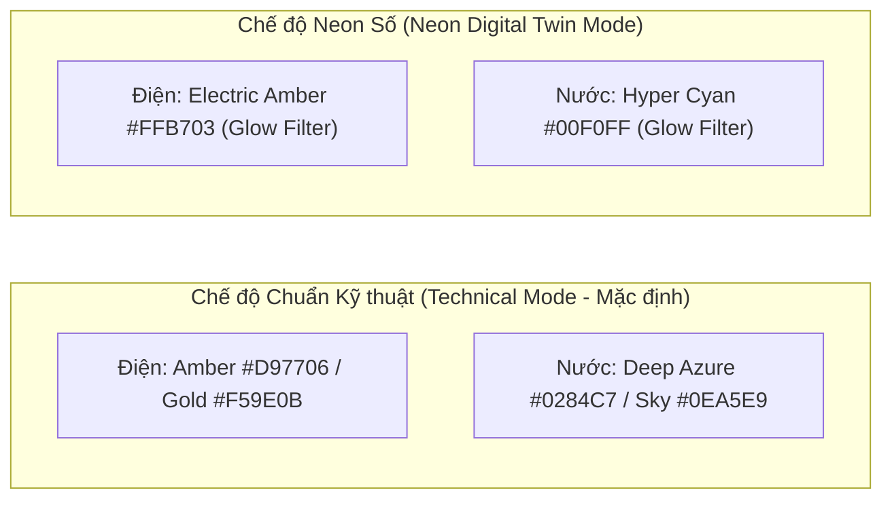
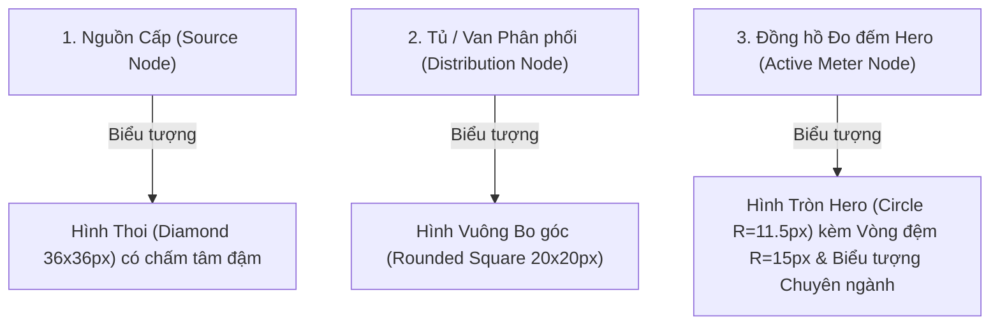

# 07. Thứ bậc Thị giác & Quy chuẩn Trang phục Bản đồ (Visual Hierarchy & Dresscode)

Thiết kế lớp mạng hạ tầng trên Bản đồ V2 tuân thủ chặt chẽ triết lý thiết kế **Maritime Operational Minimalism** (Tối giản Vận hành Hàng hải) theo quy chuẩn kỹ năng `saigon-port-ui`.

---

## 1. Bảng Mã Màu Chuyên ngành Chuẩn (Palette Specifications)

### Bảng Token Chi tiết:
| Hạng mục | Chế độ Chuẩn Kỹ thuật (Technical) | Chế độ Neon Số (Digital Twin) | Mục đích Thị giác |
| :--- | :--- | :--- | :--- |
| **Trục chính Điện (Trunk)** | `#D97706` (Hổ phách đậm, nét liền 3.6px) | `#FFB703` (Vàng hổ phách sáng) | Tạo điểm tựa vững chắc cho nguồn tải |
| **Nhánh rẽ Điện (Branch)** | `#F59E0B` (Vàng cam, nét liền 2.4px) | `#FFC72C` (Vàng tươi) | Phân biệt cấp bậc nhánh phụ tải |
| **Trục chính Nước (Trunk)**| `#0284C7` (Xanh biển đậm, nét liền 3.6px) | `#00F0FF` (Cyan phát quang) | Thể hiện ống cấp nước áp lực cao |
| **Nhánh rẽ Nước (Branch)** | `#0EA5E9` (Xanh da trời, nét đứt 2.4px) | `#38BDF8` (Cyan nhạt nét đứt) | Thể hiện ống nhánh cấp nội bộ |
| **Viền đệm tương phản (Halo)**| `#FFFFFF` (Độ mờ 85%, dày +2.5px) | `#050f24` (Độ mờ 90%) | Chống nuốt nét trên nền ảnh vệ tinh |

---

## 2. Ngôn ngữ Hình học của Các Nút (Geometric Node Semantics)

Để người xem phân biệt vai trò thiết bị ngay từ cái nhìn đầu tiên mà không cần đọc chữ:

### Chi tiết Huy hiệu Đồng hồ Hero (Hero Meter Badge):
- **Đồng hồ Điện:** Nền trắng (hoặc Dark Navy trong Neon), viền hổ phách, bên trong chứa biểu tượng **Tia sét (Lightning Bolt)** dập nổi sắc nét, phía dưới có bảng tên mang mã đồng hồ (ví dụ: `SIM-EM-001`).
- **Đồng hồ Nước:** Nền trắng, viền xanh biển, bên trong chứa biểu tượng **Giọt nước (Water Droplet)** uốn lượn mềm mại, phía dưới có bảng tên mang mã đồng hồ (ví dụ: `SIM-WM-001`).

---

## 3. Quy chuẩn Font chữ & Nhãn Định danh (Typography & Labeling)

- **Font chữ:** Toàn bộ văn bản hiển thị sử dụng họ phông `Be Vietnam Pro`, chuẩn hóa độ phân giải hiển thị cho tiếng Việt có dấu.
- **Kích thước chữ:**
  - Nhãn mã nguồn/tủ: `9.5px`, `fontWeight: 700`.
  - Nhãn mã đồng hồ: `9.0px`, `fontWeight: 700`, căn giữa trong thẻ pill trắng bo góc $3.5\text{ px}$.
  - Nhãn phân cấp: `8.5px`, `fontWeight: 600`.
- **Tương tác Rê chuột (Hover Identity Tooltip):**
  - Khi rê chuột vào bất kỳ nút nào, một thẻ tooltip nổi bật màu Navy đậm (`#003875`, hoặc `#050f24` ở Neon) xuất hiện cách đỉnh nút $34\text{ px}$ với độ bóng sâu (`drop-shadow`).
  - Dòng 1: Mã đồng hồ & Tên thiết bị rõ ràng (ví dụ: `SIM-EM-001 • Tủ tổng MDB-01`).
  - Dòng 2: Cảnh báo `[MÔ PHỎNG] Mã thiết bị • Cấp bậc n`.
  - Tooltip có thuộc tính `pointer-events: none` bảo đảm không cản trở thao tác click chuột.
