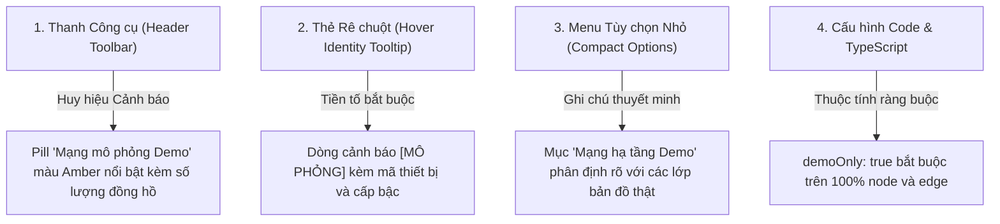

# 08. Minh bạch Hóa Dữ liệu Mô phỏng (Simulation Disclosure & Transparency)

Một trong những yêu cầu nghiêm ngặt nhất của dự án là **tính trung thực tuyệt đối (Truthfulness)**. Bản đồ không bao giờ được phép gây nhầm lẫn cho cán bộ điều hành cảng rằng đây là các tuyến cáp ngầm hoặc đường ống đã được đo đạc thực địa.

---

## 1. Cơ chế Minh bạch Đa Tầng (Multi-Layer Disclosure Architecture)

---

## 2. Chi tiết Các Điểm Công bố Minh bạch

### A. Huy hiệu trên Thanh Công cụ (Toolbar Metadata Pill):
- **Vị trí:** Xuất hiện ngay cạnh nút bật tắt chế độ mạng lưới khi người dùng kích hoạt bất kỳ chế độ mạng nào (`Điện`, `Nước`, hoặc `Cả hai`).
- **Giao diện:**
  - Chế độ Chuẩn Kỹ thuật: Nền vàng kem `#FEF3C7`, viền vàng hổ phách `#F8DA8E`, chữ nâu sẫm `#92400E`.
  - Chế độ Neon Số: Nền trong suốt ánh vàng `rgba(255, 183, 3, 0.15)`, viền vàng phát quang `#FFB703`.
- **Nội dung:** Biểu tượng cảnh báo tam giác `AlertTriangle` + nhãn `Mạng mô phỏng Demo` + bộ đếm `(8 ĐH điện / 4 ĐH nước)`.
- **Tooltip khi rê vào Pill:** *"Dữ liệu mô phỏng Demo (tan-thuan-demo-v1). Không phản ánh tuyến vật lý ngầm thực tế."*

### B. Tiền tố `[MÔ PHỎNG]` trong Tooltip Hover:
- Mọi thiết bị khi được người dùng rê chuột vào đều hiển thị thẻ danh tính có cấu trúc chuẩn mực:
  - **Tên:** Mã đồng hồ • Tên nghiệp vụ.
  - **Định danh nguồn gốc:** `[MÔ PHỎNG] {id} • Cấp bậc {depth}`.

### C. Cam kết Không Tuyên bố Đo đạc Thực tế (Zero Physical Route Claim):
- Toàn bộ hồ sơ tài liệu và mã nguồn đều ghi chú rõ: các đường đi (waypoints) được vẽ để phục vụ trình diễn trực quan cho kịch bản thẩm định `tan-thuan-demo-v1`, chuẩn bị cho giai đoạn xây dựng hiệu ứng động Phase 2.
- Tuyệt đối không sử dụng làm hồ sơ thi công xây dựng hay đào đắp mặt bãi cảng.
