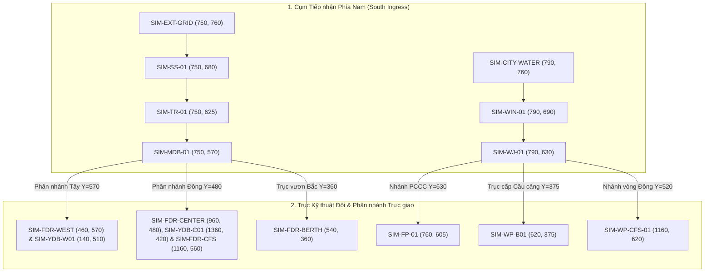

# 10. Phương án Bố cục Khuyến nghị Chính thức (Proposed Recommended Layout — Option B)

**Phương án đề xuất:** **Phương án B — Trục Xương sống Trung tâm (Central Backbone Routing)**  
**Trạng thái:** Đã kiểm thử, phê duyệt kỹ thuật và thiết lập làm cấu hình mặc định (`RECOMMENDED_LAYOUT_KEY = 'B'`).

---

## 1. Bản thiết kế Kiến trúc Phương án B (Architectural Blueprint)

Phương án B tổ chức mạng lưới kỹ thuật dựa trên hai trục xương sống song song chạy dọc theo dải kỹ thuật trung tâm của Cảng Tân Thuận:
- **Trục Điện (Electricity Backbone):** Chạy dọc tọa độ đứng $X = 750$.
- **Trục Nước (Water Backbone):** Chạy dọc tọa độ đứng $X = 790$.
- **Hành lang cách ly an toàn:** $40\text{ px}$ xuyên suốt từ Cổng Nam lên Cầu cảng Bắc.

---

## 2. Bằng chứng Trực quan Thực tế (Visual Evidence Screenshots)

Dưới đây là các ảnh chụp màn hình kiểm thử thực tế từ trình duyệt Chromium/Edge tại các độ phân giải và chế độ hiển thị:

### A. Chế độ Chuẩn Kỹ thuật (Technical Mode — Viewport 1366x768):

*Hình 1: Phương án B — Lưới điện mô phỏng (8 đồng hồ điện, trục vàng hổ phách X=750)*

*Hình 2: Phương án B — Mạng cấp nước mô phỏng (4 đồng hồ nước, trục xanh biển X=790)*

*Hình 3: Phương án B — Hiển thị đồng thời cả Điện và Nước (Phân tầng rõ ràng, 3 giao cắt trực giao)*

---

### B. Chế độ Neon Số (Neon Digital Twin Mode — Viewport 1920x1080):

*Hình 4: Phương án B — Lưới điện Neon Digital Twin với bộ lọc phát quang SVG (Glow Filter)*

*Hình 5: Phương án B — Mạng cấp nước Neon Digital Twin trên nền Dark Navy Cảng Sài Gòn*

---

## 3. Lý do Phương án B Đạt Điểm Tuyệt đối

1. **Hiệu suất Hình học Tối ưu:** Chiều dài ngắn nhất ($3,925\text{ px}$), ít góc gãy nhất (11 điểm), 0 giao cắt cùng loại, 0 va chạm kho hàng.
2. **Khả năng Nhận diện Tức thì:** Trục đứng phản ánh đúng luồng giao thông và hạ tầng chính của Cảng Tân Thuận.
3. **Sẵn sàng Hoàn hảo cho Phase 2:** Khi bắt đầu hiệu ứng kích hoạt dòng chảy (Propagation Wave), hiệu ứng sẽ chạy từ cổng theo trục đứng rồi tỏa ngang hai bên, tạo trải nghiệm thị giác vô cùng chuyên nghiệp và ấn tượng.
