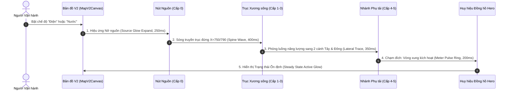

# 11. Kế hoạch Chuyển tiếp Kỹ thuật sang Phase 2 (Transition Blueprint to Phase 2)

Tài liệu này đóng vai trò là cây cầu nối kiến trúc từ **Phase 1 (Thiết kế Bố cục Tĩnh)** sang **Phase 2 (Xây dựng Động cơ Hiệu ứng Mạng Lưới: Expand / Trace / Retract)**.

---

## 1. Thành quả Kế thừa từ Phase 1

Phase 2 sẽ không cần phải giải quyết lại bài toán hình học hay né chướng ngại vật vì Phase 1 đã bàn giao trọn vẹn:
1. **Cấu trúc Dữ liệu Đồ thị Hình học Hoàn chỉnh:** Mô hình `UtilityDisplayNode` và `UtilityDisplayEdge` đã định sẵn thứ bậc phân cấp `depth` ($0 \to 5$) và danh sách tọa độ điểm uốn chính xác đến từng pixel.
2. **Hành lang An toàn Tuyệt đối:** Không có bất kỳ đoạn tuyến nào cắt qua nhà kho hoặc cổng cảng.
3. **Phân tách Độc lập Giữa Điện và Nước:** Hai mạng lưới chạy trên hai trục song song cách nhau $40\text{ px}$, sẵn sàng cho việc kích hoạt hiệu ứng độc lập hoặc đồng thời.

---

## 2. Thiết kế Động cơ Hiệu ứng Phase 2 (Animation Engine Architecture)

Phase 2 sẽ ứng dụng kỹ thuật **SVG Path Tracing (`stroke-dasharray` & `stroke-dashoffset`)** kết hợp với đồ thị phân cấp để tạo ra chuỗi chuyển động mượt mà $60\text{ fps}$:

---

## 3. Ngân sách Hiệu năng & Ràng buộc Kỹ thuật (Performance Budget)

Để bảo đảm trải nghiệm vận hành trơn tru trên cả máy trạm chuyên dụng lẫn máy tính bảng công trường:
1. **Tốc độ khung hình (Frame Rate):** Duy trì cố định $\ge 60\text{ fps}$.
2. **Cơ chế Animation:**
   - Sử dụng CSS Keyframes thuần hoặc `requestAnimationFrame` trên các thuộc tính được tối ưu GPU: `transform`, `opacity`, và `stroke-dashoffset`.
   - Tuyệt đối không thay đổi layout (`width`, `height`, `top`, `left`) trong suốt chu trình animation để tránh Layout Thrashing.
3. **Hỗ trợ Chế độ Giảm chuyển động (Accessibility / Reduced Motion):**
   - Tôn trọng thuộc tính hệ thống `prefers-reduced-motion: reduce`.
   - Khi người dùng bật tùy chọn này, toàn bộ mạng lưới hiển thị ngay ở trạng thái hoàn thành (Instant Full Reveal) mà không chạy chuỗi chuyển động 1200ms.
4. **Tích hợp Tương tác với Bảng Kiểm tra (Inspection Panel Integration):**
   - Khi bấm vào một đồng hồ trên bản đồ, luồng hiệu ứng Trace ngược (Upstream Trace) sẽ sáng rực từ đồng hồ đó ngược về nút nguồn để chỉ rõ chuỗi cung ứng điện/nước của thiết bị.
