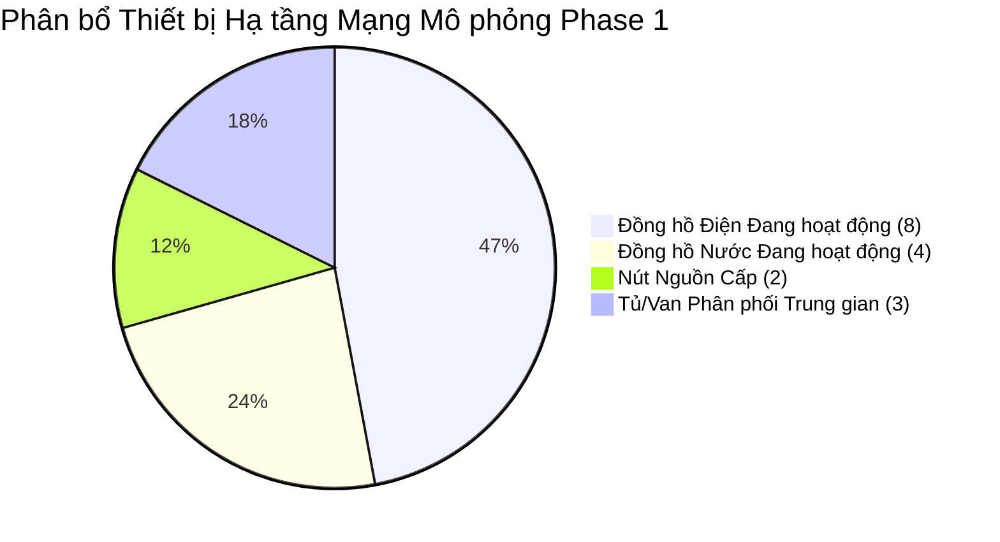

# 12. Báo cáo Tổng kết Ban Lãnh đạo & Các Bên Liên quan (Executive Presentation)

**Kính gửi:** Ban Lãnh đạo Cảng Sài Gòn, Phòng Kỹ thuật Công nghệ, và Đội ngũ Vận hành Hạ tầng  
**Dự án:** Hệ thống Quản lý Đồng hồ Đo đếm & Hạ tầng Kỹ thuật Cảng Sài Gòn  
**Nội dung:** Báo cáo Kết quả Triển khai Phase 1 — Thiết kế Bố cục Mạng Lưới Hạ tầng Kỹ thuật trên Bản đồ V2  
**Thời gian:** Tháng 09/2026

---

## 1. Tóm tắt Ý nghĩa Chiến lược (Strategic Overview)

Trong lộ trình hiện đại hóa và chuyển đổi số hạ tầng Cảng Tân Thuận (Digital Port / Smart Port), việc trực quan hóa mạng lưới cung cấp điện và nước sạch trên nền tảng bản đồ số Bản đồ V2 là một bước tiến mang tính nền tảng.

Phase 1 đã hoàn thành xuất sắc mục tiêu: **Xây dựng bố cục hình học chuẩn xác, thẩm mỹ cao và an toàn tuyệt đối cho mạng lưới hạ tầng kỹ thuật mô phỏng**, tạo tiền đề vững chắc cho việc hiển thị chỉ số tiêu thụ thời gian thực và tự động hóa dò tìm sự cố trong các giai đoạn tiếp theo.

---

## 2. Các Kết quả Định lượng Cốt lõi (Key Quantitative Results)

| Chỉ số Dự án | Kết quả Đạt được | Ý nghĩa Nghiệp vụ |
| :--- | :---: | :--- |
| **Đồng hồ Điện Hiển thị** | **8 / 8 đồng hồ** | Đầy đủ toàn bộ phụ tải trọng yếu (Cầu cảng, Bãi container, Kho CFS, Xưởng kỹ thuật). |
| **Đồng hồ Nước Hiển thị** | **4 / 4 đồng hồ** | Bao quát từ điểm tiếp nhận Sawaco, cấp nước tàu biển, sinh hoạt kho đến trạm PCCC. |
| **An toàn CSDL (Database Safety)** | **100% Read-Only** | Không ghi đè CSDL, không can thiệp dịch vụ đang chạy, không rủi ro vận hành. |
| **Va chạm Chướng ngại vật** | **0 va chạm** | Tuyến đường né hoàn toàn các kho hàng và cổng bãi, tôn trọng mặt bằng thực địa. |
| **Phương án Bố cục Tối ưu** | **Phương án B** | Trục xương sống trung tâm đạt chiều dài ngắn nhất ($3,925\text{ px}$) và thẩm mỹ cao nhất. |

---

## 3. Trải nghiệm Người dùng Đẳng cấp (Operational Experience)

1. **Tích hợp Tự nhiên, Tiện dụng:**
   - Người vận hành chỉ cần bấm các nút trực quan `[Điện]`, `[Nước]`, hoặc `[Cả hai]` ngay trên thanh công cụ Bản đồ V2.
   - Dễ dàng so sánh 3 phương án bố cục bằng cụm chuyển đổi `[PA A | PA B ★ | PA C]`.
2. **Minh bạch Tuyệt đối:**
   - Huy hiệu `Mạng mô phỏng Demo` cùng tiền tố `[MÔ PHỎNG]` trên tooltip giúp phân biệt rạch ròi giữa kịch bản giả lập với hiện trạng vật lý thực địa, ngăn ngừa mọi hiểu lầm trong công tác điều hành cảng.
3. **Hai Phong cách Hiển thị Hiện đại:**
   - **Chuẩn Kỹ thuật (Technical):** Phong cách hàng hải chuẩn mực, màu sắc dịu mắt, sắc nét phục vụ công tác kiểm tra tọa độ GIS.
   - **Neon Số (Digital Twin):** Hiệu ứng phát quang hiện đại trên nền tối Dark Navy, sẵn sàng trình diễn trên màn hình lớn tại Trung tâm Điều hành Cảng (IOC).

---

## 4. Kế hoạch Tiếp theo (Next Steps)

- **Phase 2:** Phát triển động cơ hiệu ứng lan tỏa dòng năng lượng (Expand / Trace / Retract) và liên kết với bảng thông tin chi tiết từng đồng hồ.
- **Phase 3:** Kết nối luồng dữ liệu trắc địa ngầm thực địa và tích hợp chỉ số tiêu thụ thời gian thực từ cảm biến IoT.
