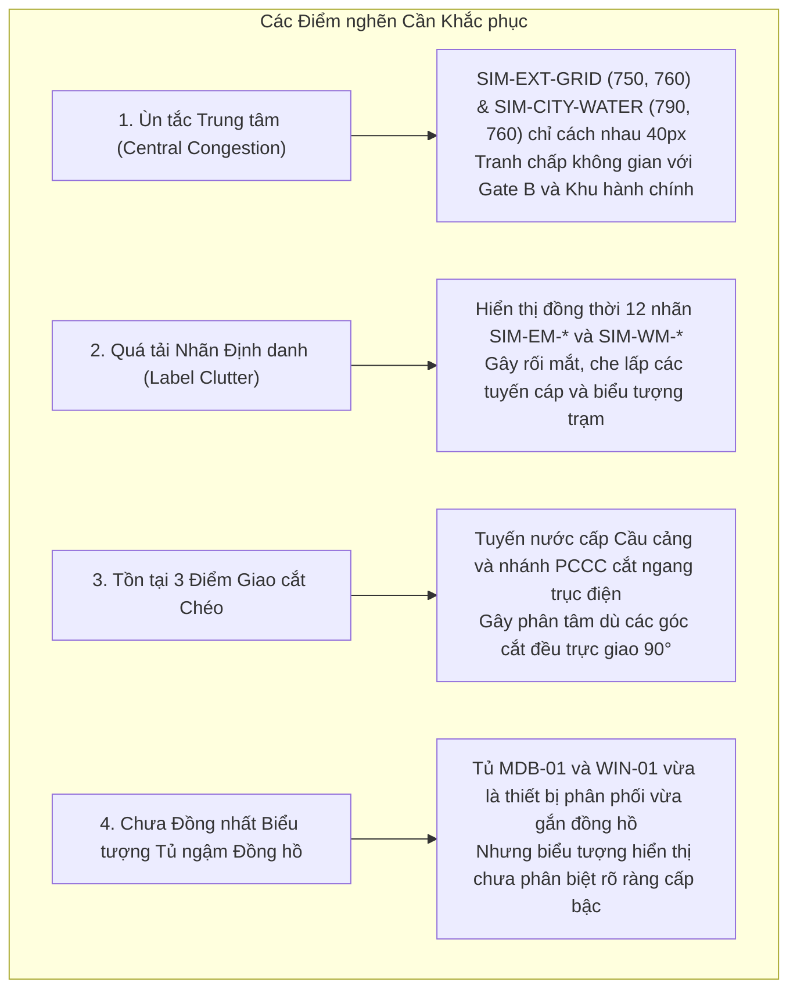

# 01. Đánh giá Hiện trạng Phương án B (Baseline Review — Layout B)

Tài liệu này tổng hợp phân tích hiện trạng của **Phương án B (Trục xương sống Trung tâm - Central Backbone Routing)** được đề xuất trong Giai đoạn 1, đồng thời chỉ ra các điểm nghẽn thị giác và giới hạn kỹ thuật được ghi nhận trong quá trình vận hành thực tế ở chế độ kết hợp cả Điện và Nước (`utilityMode = 'both'`).

---

## 1. Tóm tắt Kiến trúc Phương án B (Giai đoạn 1)

Phương án B ban đầu được xây dựng với nguyên lý hai trục xương sống song song:
- **Trục Điện:** Chạy dọc tọa độ đứng $X = 750$.
- **Trục Nước:** Chạy dọc tọa độ đứng $X = 790$.
- **Khoảng cách song song:** $40\text{ px}$.

### Bảng Chỉ số Hình học Cơ sở (Baseline Metrics):
- **Tổng chiều dài tuyến:** $3,925\text{ px}$ (Điện: $2,735\text{ px}$, Nước: $1,190\text{ px}$).
- **Tổng số góc bẻ (bends):** 11 góc (Điện: 6, Nước: 5).
- **Giao cắt cùng loại (same-utility):** $0$ điểm.
- **Giao cắt chéo loại (cross-utility):** 3 điểm (tại $(750, 375)$ và $(790, 480)$).
- **Va chạm đa giác kho hàng / phân khu:** $0$ điểm.
- **Khoảng cách hai nút nguồn:** $40.0\text{ px}$ (`SIM-EXT-GRID` $[750, 760]$ và `SIM-CITY-WATER` $[790, 760]$).

---

## 2. Các Vấn đề Người dùng Ghi nhận (Observed Issues)

Khi quan sát trên màn hình máy trạm tiêu chuẩn $1366 \times 768$ ở chế độ hiển thị đồng thời cả Điện và Nước (`utilityMode = 'both'`), các hạn chế thị giác sau đã bộc lộ:

### Chi tiết các điểm nghẽn:
1. **Ùn tắc khu vực tiếp nhận phía Nam:**
   - Hai nút nguồn `SIM-EXT-GRID` và `SIM-CITY-WATER` cùng nằm trên cao độ $Y=760$, chỉ cách nhau đúng $40\text{ px}$. Vùng tiếp nhận này tạo cảm giác một khối chật chội ngay lối vào Cảng, cạnh tranh tầm nhìn với Cổng B ($[874, 725]$) và Phân khu Hành chính.
2. **Quá tải thông tin thẻ nhãn (Label Overload):**
   - Trong chế độ đơn lẻ (`electricity` hoặc `water`), số lượng thẻ nhãn là 8 hoặc 4, màn hình rất thoáng. Nhưng khi bật chế độ `both`, tổng cộng 12 thẻ nhãn đồng hồ điện nước hiển thị cùng lúc tạo nên "rừng chữ", lấn át bản đồ nền và đường ranh phân khu.
3. **Phân cấp tuyến chưa tối ưu:**
   - Tất cả các tuyến (từ đường trục chính từ nguồn đến các nhánh phụ ra đồng hồ trạm) đều có độ dày nét tương đương hoặc chênh lệch không đáng kể ($3.6\text{ px}$ vs $2.4\text{ px}$), chưa tạo được chiều sâu phân cấp 3 tầng (Trunk / Branch / Spur).
4. **Nhánh cấp nước Cầu cảng cắt ngang hai lần:**
   - Tuyến nước `W-B-04` chạy dọc $X=790$ lên đến $Y=375$ rồi mới rẽ Tây, dẫn đến việc phải cắt qua các nhánh điện rẽ Đông tại $Y=480$ và trục điện Bắc tại $Y=375$.

---

## 3. Kết luận Đánh giá

Phương án B là một nền tảng xuất sắc về mặt cấu trúc đồ thị hình cây trực giao, nhưng cần một đợt tinh chỉnh chuyên sâu (**Refinement Pass**) để trở thành **Phương án B2**. Phương án B2 sẽ kế thừa toàn bộ cấu trúc logic đã được thẩm định của B, đồng thời giải tỏa triệt để áp lực thị giác để đạt độ chín muồi cao nhất trước khi bước vào Giai đoạn 2 (Hoạt họa Lan truyền / Expand - Trace - Retract).
