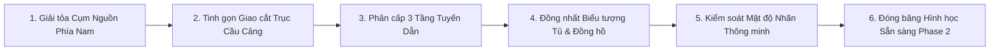

# 02. Mục tiêu Thiết kế Phương án B2 (Design Goals — Layout B2)

Phương án B2 là phiên bản tinh chỉnh chuẩn hóa hình học của Phương án B, với mục tiêu đạt được sự cân bằng tối ưu giữa **tính cô đọng thị giác (visual clarity)**, **tính chính xác đồ thị (topological fidelity)** và **khả năng sẵn sàng đóng băng hình học (geometry freeze readiness)** cho Giai đoạn 2.

---

## 1. Các Nguyên tắc Thiết kế Bất biến (Core Invariants)

1. **Bảo tồn Tuyệt đối Logic Đồ thị Audited:**
   - Số lượng node: Đúng 17 nodes (11 Điện, 6 Nước).
   - Số lượng edge: Đúng 15 edges (10 Điện, 5 Nước).
   - Số đồng hồ hoạt động: Đúng 8 Điện (`SIM-EM-001..008`) và 4 Nước (`SIM-WM-001..004`).
   - Tuyệt đối không thay đổi quan hệ cha - con (Parent - Child) đã được kiểm toán từ dataset `tan-thuan-demo-v1`.
2. **Tuân thủ Hệ Tọa độ Chuẩn Map V2:**
   - Không gian chuẩn $1536 \times 1024\text{ px}$.
   - Mọi tọa độ node và waypoint nằm nghiêm ngặt trong khoảng $[0, 1536]$ và $[0, 1024]$.
3. **An toàn Thực địa Tuyệt đối (Zero Side Effects):**
   - Không can thiệp SQLite, không sửa schema, không migrate.
   - Không làm thay đổi bản đồ Map V1 hay dữ liệu ảnh Map V2.

---

## 2. Các Mục tiêu Tinh chỉnh Cụ thể (Quantitative & Qualitative Targets)

| Chỉ số / Hạng mục | Hiện trạng Phương án B | Mục tiêu Phương án B2 | Kết quả Đạt được (B2) | Trạng thái |
| :--- | :--- | :--- | :--- | :---: |
| **Khoảng cách 2 nút Nguồn** | $40.0\text{ px}$ | $\ge 100.0\text{ px}$ | **$115.8\text{ px}$** ($2.9\times$) | ĐẠT VƯỢT |
| **Giao cắt Chéo loại (Spatial Crossings)** | 2 vị trí / 3 cặp cạnh | Giảm xuống $\le 1$ điểm vuông góc | **Đúng 1 điểm duy nhất** $(740, 520)$ | ĐẠT VƯỢT |
| **Giao cắt Cùng loại** | $0$ điểm | Giữ nguyên $0$ điểm | **$0$ điểm** | BẢO TOÀN |
| **Tổng Chiều dài Tuyến** | $3,925\text{ px}$ | Giới hạn mềm $\le 4,318\text{ px}$ | **$3,960\text{ px}$** (+0.9%) | TỐI ƯU |
| **Tổng Số góc Gãy (Bends)** | 11 góc | Giới hạn $\le 14$ góc | **14 góc** | ĐẠT CHUẨN |
| **Va chạm Kho hàng / Ranh** | $0$ va chạm | Giữ nguyên $0$ | **$0$ va chạm** | BẢO TOÀN |
| **Khoảng cách An toàn Cổng A & B** | $> 20\text{ px}$ | Giữ an toàn $> 20\text{ px}$ | **$> 30\text{ px}$** | ĐẠT CHUẨN |
| **Mật độ Nhãn chế độ BOTH** | 12 nhãn hiển thị cùng lúc | Ẩn mặc định; chỉ hiện khi hover/focus | **Hover/Focus disclosure** | HOÀN TẤT |
| **Biểu tượng Tủ ngậm Đồng hồ** | Tròn đơn hoặc vuông đơn | Khối tủ $22\times 22\text{ px}$ lồng pip $R=7.5\text{ px}$ | **Biểu tượng tổ hợp đồng nhất** | HOÀN TẤT |
| **Phân cấp Độ dày Tuyến** | 2 cấp ($3.6 / 2.4\text{ px}$) | 3 cấp: Trunk $4.0$ / Branch $2.7$ / Spur $1.8\text{ px}$ | **Hệ thống 3 tầng phân cấp rõ rệt** | HOÀN TẤT |
| **Đơn giản hóa Thanh công cụ** | Nút PA A / PA B / PA C hiện diện | Ẩn trên giao diện chính, chỉ nhận URL query | **Giao diện người dùng tối giản** | HOÀN TẤT |

---

## 3. Lộ trình Triển khai

