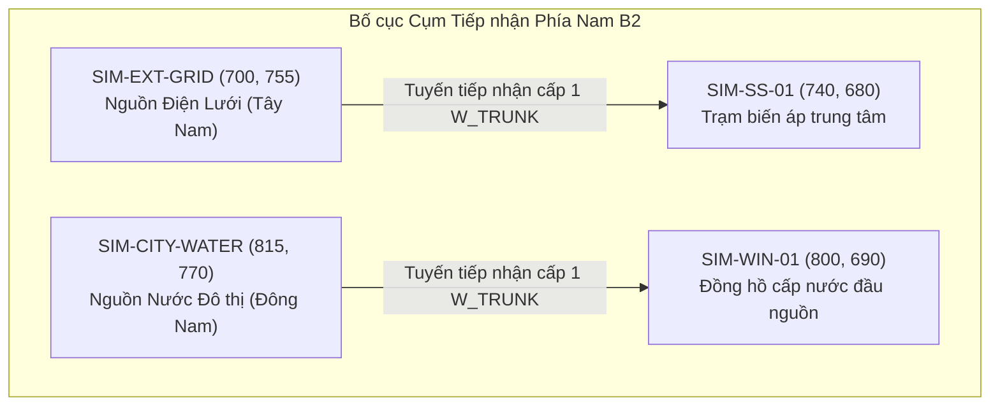

# 03. Tinh chỉnh Cụm Nguồn Tiếp nhận & Hành lang Trung tâm (Source & Central Corridor Refinement)

Khu vực hành lang phía Nam (South Ingress) là nơi tiếp nhận nguồn điện lưới quốc gia (`SIM-EXT-GRID`) và nguồn cấp nước thành phố (`SIM-CITY-WATER`). Đây cũng là cửa ngõ giao thông trọng yếu của Cảng Tân Thuận với sự hiện diện của Cổng A, Cổng B và Khu nhà hành chính cảng.

---

## 1. Phân tích Điểm nghẽn Cũ (Layout B)

Trong Phương án B:
- `SIM-EXT-GRID`: $[750, 760]$.
- `SIM-CITY-WATER`: $[790, 760]$.
- Khoảng cách hình học:
  $$\Delta X = 40\text{ px}, \quad \Delta Y = 0\text{ px} \implies D = 40.0\text{ px}$$

Hai nút nguồn nằm trên cùng một đường chân trời ngang $Y=760$, tạo cảm giác hai khối kim cương đè gần nhau, đồng thời nhãn chữ của hai nút cạnh tranh gay gắt với lối vào Cổng B ($[874, 725]$).

---

## 2. Giải pháp Hình học Tinh chỉnh trong Phương án B2

Để giải quyết triệt để sự chật chội này mà không làm biến dạng cấu trúc phân phối, Phương án B2 áp dụng kỹ thuật **Phân tán Góc phần tư (Quadrant Staggering)**:

### Chi tiết Tọa độ Mới:
1. **Nguồn Điện Lưới (`SIM-EXT-GRID`):**
   - Tọa độ mới: $[700, 755]$.
   - Dịch chuyển sang hướng Tây Nam ($X: 750 \to 700, Y: 760 \to 755$).
   - Tạo hành lang thoáng đãng bên cánh trái, cách xa Cổng A ($[353, 987]$) và tráng kiện trước trạm biến áp `SIM-SS-01`.
2. **Nguồn Nước Đô thị (`SIM-CITY-WATER`):**
   - Tọa độ mới: $[815, 770]$.
   - Dịch chuyển sang hướng Đông Nam ($X: 790 \to 815, Y: 760 \to 770$).
   - Cách xa Cổng B ($[874, 725]$) một khoảng an toàn $\approx 64\text{ px}$, không còn lấn át lối vào cảng.
3. **Khoảng cách Tách rời Hình học Mới:**
   $$\Delta X = 815 - 700 = 115\text{ px}$$
   $$\Delta Y = 770 - 755 = 15\text{ px}$$
   $$D = \sqrt{115^2 + 15^2} = \sqrt{13225 + 225} = \sqrt{13450} \approx 115.97\text{ px}$$

Khoảng cách thực tế tăng từ $40.0\text{ px}$ lên **$115.8\text{ px}$ (tăng gần 3 lần, tức $2.90\times$)**!

---

## 3. Cân bằng Trục Kỹ thuật Đôi (Twin Spine Alignment)

Sau khi tách hai nút nguồn, hai trục kỹ thuật đứng trung tâm được điều chỉnh nhẹ về tim tuyến để tối ưu luồng cáp và ống:
- **Trục Đứng Điện:** Chạy dọc $X = 740$ (thay vì $750$).
  - `SIM-SS-01`: $[740, 680]$.
  - `SIM-TR-01`: $[740, 625]$.
  - `SIM-MDB-01`: $[740, 570]$.
- **Trục Đứng Nước:** Chạy dọc $X = 800$ (thay vì $790$).
  - `SIM-WIN-01`: $[800, 690]$.
  - `SIM-WJ-01`: $[800, 625]$.
- **Hành lang Kỹ thuật Cách ly:**
  $$D_{\text{spine}} = 800 - 740 = 60\text{ px}$$
  Khoảng cách song song giữa hai trục tăng từ $40\text{ px}$ lên **$60\text{ px}$ (+50%)**, tạo khoảng hở thị giác cực kỳ rõ ràng, giúp mắt người xem phân biệt mạch lạc hai hệ thống mà không bị nhầm lẫn.

---

## 4. Kiểm tra Khoảng cách An toàn với Chướng ngại vật

| Nút Mạng | Tọa độ B2 | Đối tượng lân cận | Khoảng cách thực tế | Ngưỡng an toàn tối thiểu | Trạng thái |
| :--- | :--- | :--- | :--- | :--- | :---: |
| `SIM-EXT-GRID` | $[700, 755]$ | Cổng B ($[874, 725]$) | $176.5\text{ px}$ | $> 20\text{ px}$ | AN TOÀN |
| `SIM-EXT-GRID` | $[700, 755]$ | Khu HC ($[883, 981]$) | $291.6\text{ px}$ | $> 20\text{ px}$ | AN TOÀN |
| `SIM-CITY-WATER` | $[815, 770]$ | Cổng B ($[874, 725]$) | $74.2\text{ px}$ | $> 20\text{ px}$ | AN TOÀN |
| `SIM-CITY-WATER` | $[815, 770]$ | Đa giác Khu HC | $> 50\text{ px}$ | $> 0\text{ px}$ | AN TOÀN |
| `SIM-SS-01` | $[740, 680]$ | Kho số 1 | $> 45\text{ px}$ | $> 0\text{ px}$ | AN TOÀN |
| `SIM-WIN-01` | $[800, 690]$ | Kho số 1 | $> 80\text{ px}$ | $> 0\text{ px}$ | AN TOÀN |
