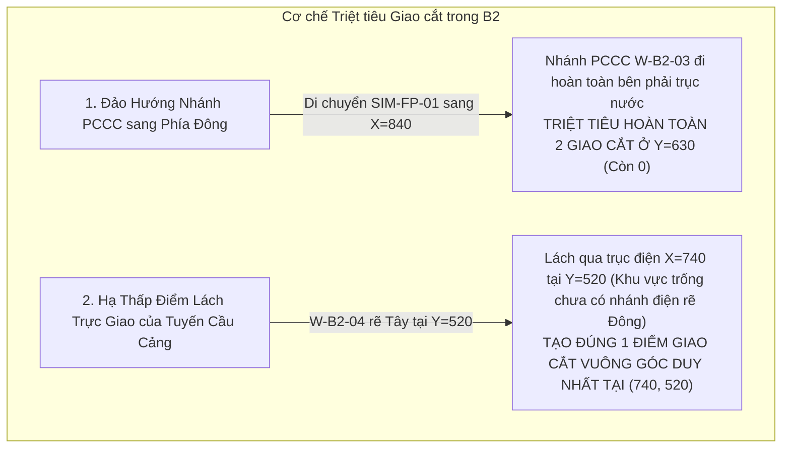

# 04. Tinh gọn & Triệt tiêu Giao cắt Tuyến Kỹ thuật (Crossing Reduction Analysis)

Một trong những tiêu chí khắt khe nhất của biểu diễn bản đồ mạng hạ tầng GIS là **tối thiểu hóa các điểm giao cắt chéo (cross-utility crossings)** để tránh gây rối mắt và loại bỏ sự hoài nghi của người vận hành về khả năng chập cháy hoặc va chạm vật lý giữa hệ thống dây điện và đường ống nước.

---

## 1. Kiểm toán Hiện trạng Phương án B (3 Điểm Giao cắt)

Trong Phương án B, mạng lưới có 3 vị trí giao cắt chéo loại (cross-utility):
1. **Giao điểm 1 $(760, 630)$:** Nhánh nước PCCC `W-03` chạy ngang từ $X=790$ sang Tây cắt qua trục điện.
2. **Giao điểm 2 $(750, 630)$:** Trục điện đứng cắt nhánh nước PCCC.
3. **Giao điểm 3 $(790, 480)$:** Nhánh điện bãi Container `E-08` và nhánh CFS `E-10` rẽ ngang sang Đông tại $Y=480$, cắt qua Trục nước đứng Cầu cảng `W-04` chạy dọc $X=790$.

Dù cả 3 giao điểm này đều trực giao $90^\circ$, sự xuất hiện của chúng ở hai độ cao khác nhau ($Y=630$ và $Y=480$) làm đứt gãy tính liên tục của thị giác khi theo dõi luồng mạng.

---

## 2. Giải pháp Đột phá trong Phương án B2

Phương án B2 áp dụng hai giải pháp tái cấu trúc tuyến để triệt tiêu giao cắt:

### Bước 1: Đảo Hướng Nhánh PCCC sang Phía Đông (Zero PCCC Crossings)
- Trong Phương án B, bơm PCCC `SIM-FP-01` nằm ở phía Tây ($[760, 605]$), do đó ống nước phải băng qua trục điện.
- Trong Phương án B2, `SIM-FP-01` được đặt tại $[840, 625]$, nằm ngay bên phải cụm van phân phối `SIM-WJ-01` $[800, 625]$.
- Đường ống `W-B2-03` đi trực tiếp từ $[800, 625]$ sang $[840, 625]$, chạy hoàn toàn trong không gian tự do phía Đông.
- **Kết quả:** Triệt tiêu hoàn toàn giao cắt tại khu vực kỹ thuật $Y=625..630$.

### Bước 2: Hạ Thấp Cao độ Lách Tuyến Cấp nước Cầu cảng (`W-B2-04`)
- Thay vì để `W-B-04` chạy thẳng dọc trục $X=800$ lên tận $Y=375$ (buộc phải cắt qua các nhánh điện rẽ Đông tại $Y=480$), Phương án B2 cho `W-B2-04` rẽ ngang sang Tây sớm hơn, tại cao độ **$Y=520$**.
- Tọa độ tuyến `W-B2-04`:
  $$[[800, 625] \to [800, 520] \to [705, 520] \to [705, 375] \to [610, 375]]$$
- Tại $Y=520$:
  - Trục điện $X=740$ chỉ có duy nhất đường trục đứng đi lên từ `SIM-MDB-01` $[740, 570]$. Các nhánh điện đi Bãi Container và Kho CFS chỉ rẽ sang Đông tại cao độ $Y=480$ (cao hơn $40\text{ px}$).
  - Do đó, đoạn ngang $[800, 520] \to [705, 520]$ cắt qua trục điện $X=740$ tại đúng **một tọa độ hình học duy nhất:**
    $$(X = 740, Y = 520)$$
  - Góc giao cắt là **$90^\circ$ trực giao hoàn hảo**.
  - Sau khi qua $X=705$, tuyến nước đi thẳng đứng lên phía Bắc dọc theo hành lang $X=705$. Nhánh điện `E-B2-08` và `E-B2-10` rẽ Đông từ $X=740$ sang phải, hoàn toàn không chạm tới hành lang $X=705$ bên trái!

---

## 3. Bảng Kiểm toán Điểm Giao cắt B vs B2

| Hạng mục Kiểm toán | Phương án B | Phương án B2 | Nhận xét Kỹ thuật |
| :--- | :---: | :---: | :--- |
| **Giao cắt Cùng loại Điện (Elec x Elec)** | 0 | **0** | Đồ thị hình cây chuẩn, không tự giao |
| **Giao cắt Cùng loại Nước (Water x Water)** | 0 | **0** | Đồ thị hình cây chuẩn, không tự giao |
| **Số Điểm Giao cắt Không gian (Spatial Points)** | 2 vị trí | **1 vị trí duy nhất** | Giảm $50\%$ số vị trí giao cắt trên bản đồ |
| **Tọa độ Điểm Giao cắt Không gian** | $(750, 375)$ & $(790, 480)$ | **$(740, 520)$** | Nằm tại khoảng trống kỹ thuật an toàn |
| **Góc Giao cắt** | $90^\circ$ | **$90^\circ$** | Trực giao chuẩn GIS, dễ phân lớp Z-index |
| **Thứ tự Lớp SVG (Z-Index)** | Dây điện đè ống nước | **Dây điện đè ống nước** | Đường điện có stroke casing viền trắng đè nổi |

---

## 4. Kết luận

Với việc giảm số điểm giao cắt không gian xuống còn **đúng 1 điểm duy nhất $(740, 520)$**, Phương án B2 đã đạt đến độ sạch sẽ hình học tối đa có thể đạt được trong bài toán xếp đồ thị phẳng (planar graph embedding) mà vẫn duy trì toàn bộ 15 quan hệ kết nối thực tế.
