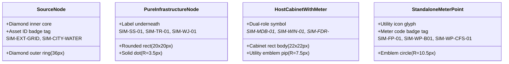

# 05. Hệ thống Biểu tượng Phân cấp Thiết bị & Đồng hồ (Meter & Host Visual Hierarchy)

Trong hạ tầng kỹ thuật cảng biển thực địa, đồng hồ đo đếm không phải lúc nào cũng là một trụ độc lập ngoài trời. Nhiều đồng hồ được lắp đặt tích hợp bên trong các tủ phân phối chính, trạm biến áp hoặc hố van kỹ thuật.

Phương án B2 chuẩn hóa mô hình thị giác để phản ánh chính xác cấu trúc kép này.

---

## 1. Phân loại Vai trò Nút Mạng trong Đồ thị

Mạng lưới hạ tầng kỹ thuật gồm 4 nhóm phần tử thị giác phân biệt rõ ràng:

---

## 2. Thiết kế Tổ hợp Biểu tượng Tủ ngậm Đồng hồ (Unified Cabinet + Meter Emblem)

Đối với các tủ phân phối điện chính hoặc cụm van ngậm đồng hồ (`SIM-MDB-01` ngậm `SIM-EM-001`, `SIM-WIN-01` ngậm `SIM-WM-001`, `SIM-FDR-WEST` ngậm `SIM-EM-002`, v.v.):

### Thông số Hình học SVG:
1. **Khối vỏ Tủ phân phối (Cabinet Outer Body):**
   - Hình chữ nhật bo góc: $22 \times 22\text{ px}$ (`x={-11}, y={-11}, width={22}, height={22}, rx={4}`).
   - Màu nền (`fill`): `#FFFFFF` (chế độ Chuẩn Kỹ thuật) hoặc `#06132b` (chế độ Neon).
   - Màu viền (`stroke`): `#003875` (Điện) hoặc `#0077b6` (Nước), độ dày $2.2\text{ px}$.
2. **Huy hiệu Đồng hồ Lồng bên trong (Nested Meter Emblem):**
   - Hình tròn đồng tâm: Bán kính $R = 7.5\text{ px}$ (`r={7.5}`).
   - Màu nền: `#d97706` (Hổ phách Điện) hoặc `#0284c7` (Xanh biếc Nước).
   - Viền trắng tương phản cao: Độ dày $1.2\text{ px}$.
   - Biểu tượng trung tâm: Chấm nhân trung tâm màu trắng sáng ($R = 2.2\text{ px}$).
3. **Thẻ Định danh Kép (Dual Identity Labeling):**
   - Tên tủ phân phối (`SIM-MDB-01`, `SIM-WIN-01`): Hiển thị ngay bên dưới khối tủ ($Y = +20\text{ px}$), font chữ $8.5\text{ pt}$, bán đậm (semi-bold).
   - Mã đồng hồ (`SIM-EM-001`, `SIM-WM-001`): Hiển thị dưới dạng thẻ huy hiệu chuyên dụng khi được kích hoạt hoặc khi xem chế độ đơn lẻ.

---

## 3. Lợi ích Thị giác Đạt được

1. **Loại bỏ Sự nhầm lẫn:** Người vận hành nhìn vào khối vuông bo góc sẽ nhận ra ngay đây là một "Tủ phân phối/Trạm thiết bị", và nhìn thấy chấm tròn màu bên trong sẽ biết ngay bên trong tủ có chứa "Đồng hồ đo đếm hoạt động".
2. **Không gian Cô đọng:** Thay vì phải vẽ 2 node chồng lấn nhau (1 node tủ, 1 node đồng hồ với 2 đường cáp ngắn nối nhau vô nghĩa), biểu tượng lồng ghép thu gọn diện tích chiếm dụng trên bản đồ xuống chỉ còn một khối $22\times 22\text{ px}$.
3. **Độ sắc nét Cao trên mọi Mật độ Điểm ảnh:** Kích thước $22\text{ px}$ tương thích hoàn hảo với lưới đồ họa của màn hình máy trạm $1366 \times 768$ cũng như màn hình 4K $2560 \times 1440$.
