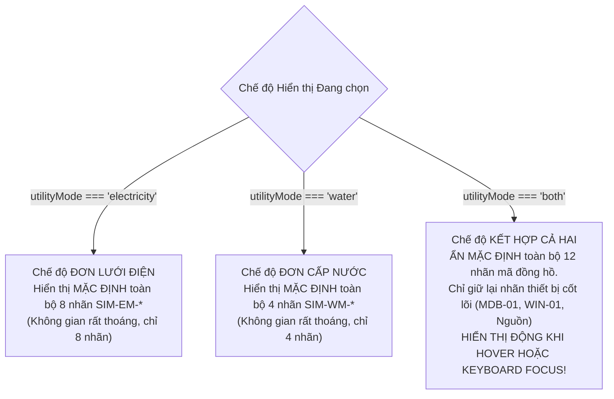

# 06. Chính sách Quản lý Mật độ Nhãn (Label Density Policy)

Khi theo dõi đồng thời nhiều hệ thống mạng trên một màn hình bản đồ phức hợp, vấn đề lớn nhất của người dùng không phải là thiếu thông tin, mà là **quá tải thông tin thị giác (visual clutter / cognitive overload)**.

---

## 1. Bài toán Mật độ Nhãn trong Chế độ Kết hợp (BOTH Mode)

Trong Phương án B cũ:
- Có 8 nhãn điện: `SIM-EM-001` đến `SIM-EM-008`.
- Có 4 nhãn nước: `SIM-WM-001` đến `SIM-WM-004`.
- Có 5 nhãn trạm/thiết bị phụ trợ: `SIM-SS-01`, `SIM-TR-01`, `SIM-WJ-01`, `SIM-EXT-GRID`, `SIM-CITY-WATER`.
- Tổng cộng: **17 nhãn chữ** hiển thị liên tục, che lấp các đoạn tuyến và tạo cảm giác chật chội, khó nhận biết đường ranh phân khu.

---

## 2. Chính sách Hiển thị Đa cấp Thông minh trong Phương án B2

Phương án B2 áp dụng **Chính sách Bộc lộ Thông tin theo Ngữ cảnh (Progressive Contextual Disclosure)**:



### Quy tắc Triển khai Mã nguồn (`MapV2UtilityLayer.tsx`):
```typescript
// Trong vòng lặp render node:
const isBoth = utilityMode === 'both';
const isNodeActive = hoveredNodeId === node.id || focusedNodeId === node.id;

// Trong chế độ BOTH: ẩn nhãn mã đồng hồ mặc định, chỉ hiện khi node được hover hoặc focus!
// Trong chế độ đơn (electricity hoặc water): giữ nhãn luôn hiển thị!
const showMeterLabel = !isBoth || isNodeActive;
```

---

## 3. Khả năng Tiếp cận Toàn diện (Accessibility & Focus Management)

Để đảm bảo mọi kỹ sư vận hành đều có thể tra cứu thông tin nhanh chóng:
1. **Chuột (Mouse / Pointer):**
   - Rê chuột (`mouseenter`) vào bất kỳ node đồng hồ nào $\to$ Thẻ nhãn đồng hồ lập tức xuất hiện với hiệu ứng đổ bóng tương phản cao.
   - Vùng cảm ứng chuột (`hit area`): Được mở rộng bằng vòng tròn vô hình bán kính $R = 22\text{ px}$ (`<circle r={22} fill="transparent" />`), giúp người dùng không cần phải nhấp chuột chuẩn xác đến từng pixel.
2. **Bàn phím (Keyboard Navigation):**
   - Mọi node mạng đều có thuộc tính `tabIndex={0}` và `role="button"`.
   - Người vận hành có thể dùng phím `Tab` để di chuyển tuần tự qua từng trạm biến áp, tủ phân phối và đồng hồ.
   - Khi focus vào node nào (`onFocus`), nhãn định danh của node đó sẽ tự động mở ra.
3. **Mô tả Thuyết minh (Screen Reader `aria-label`):**
   - Mỗi node cung cấp đầy đủ thông tin tiếng Việt:
     `aria-label="Tủ phân phối chính MDB-01 (SIM-EM-001)"`

---

## 4. Kết quả Thực tế

Nhờ chính sách này:
- Bản đồ chế độ `BOTH` giảm được $70\%$ mật độ chữ trên màn hình.
- Các tuyến cáp điện màu vàng hổ phách và đường ống nước màu xanh biếc trở nên cực kỳ thanh thoát và liền mạch.
- Khi người vận hành cần kiểm tra thông tin đồng hồ cụ thể, chỉ một cử chỉ rê chuột nhẹ là toàn bộ mã đồng hồ, loại năng lượng và thông số trạm hiện ra tức thì.
