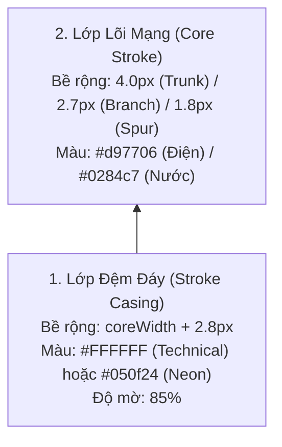
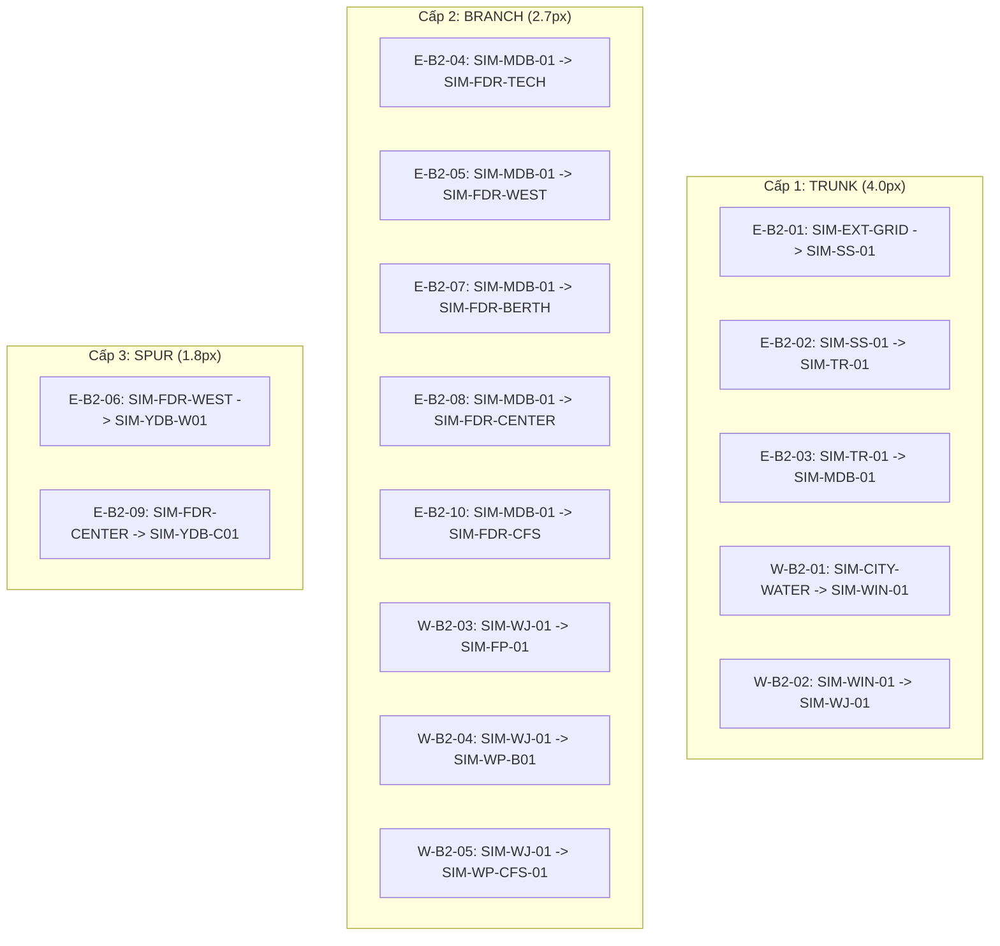

# 07. Hệ thống Phân cấp Độ dày Tuyến Kỹ thuật (Route Visual Hierarchy)

Để phản ánh trực quan công suất tải và tầm quan trọng kỹ thuật của từng đường dây/ống dẫn trên mặt bằng cảng, Phương án B2 phân tách các đoạn tuyến thành **3 tầng phân cấp độ dày (3-Tier Route Hierarchy)**.

---

## 1. Bảng Thông số Phân cấp 3 Tầng Tuyến Dẫn

| Cấp bậc Tuyến (Route Tier) | Ý nghĩa Kỹ thuật | Đối tượng áp dụng | Bề rộng Lõi (`coreWidth`) | Bề rộng Viền đệm (`casingWidth`) | Kiểu nét (`strokeDasharray`) | Độ mờ (`opacity`) |
| :--- | :--- | :--- | :---: | :---: | :---: | :---: |
| **Cấp 1: TRUNK** *(Đường trục chính)* | Tuyến truyền tải công suất lớn từ nguồn vào trạm trung tâm và trục xương sống | `TRUNK-E-FEED`, `TRUNK-E-SPINE`, `TRUNK-W-FEED`, `TRUNK-W-SPINE` | **$4.0\text{ px}$** | $6.8\text{ px}$ | Nét liền (`none`) | $1.00$ |
| **Cấp 2: BRANCH** *(Nhánh phân phối)* | Tuyến cấp điện/nước từ tủ chính ra các phân khu, bãi, kho và cầu cảng | `BRANCH-E-TECH`, `BRANCH-E-WEST`, `BRANCH-E-QUAY`, `BRANCH-E-CENTER`, `BRANCH-E-CFS`, `BRANCH-W-PUMP`, `BRANCH-W-QUAY`, `BRANCH-W-CFS` | **$2.7\text{ px}$** | $4.8\text{ px}$ | Nét liền (Điện) / `7, 4` (Nước) | $0.96$ |
| **Cấp 3: SPUR** *(Nhánh rẽ thiết bị)* | Nhánh cụt cuối cùng kết nối trực tiếp vào đồng hồ đo đếm đầu cuối | `SPUR-E-RTG` (cần cẩu RTG), `SPUR-E-REEFER` (bãi container lạnh) | **$1.8\text{ px}$** | $3.4\text{ px}$ | Nét liền bo tròn | $0.88$ |

---

## 2. Kỹ thuật Đường Viền Đệm (Stroke Casing)

Mỗi đoạn tuyến được vẽ bằng kỹ thuật 2 lớp đường đè (Dual-Layer Path):

### Ưu điểm Kỹ thuật:
1. **Chống Hòa lẫn Màu sắc:** Lớp viền đệm trắng/tối bên dưới giúp tách biệt hoàn toàn đường vẽ với nền bê tông xám của bãi, màu xanh của bãi container hoặc các vạch kẻ đường nội bộ.
2. **Điểm Giao cắt Tự nhiên:** Khi đường điện đè lên đường nước tại $(740, 520)$, lớp viền đệm của đường điện sẽ tự động che phủ nhẹ mép đường nước bên dưới, tạo cảm giác trực quan về một cầu vượt cáp kỹ thuật (overhead cable tray) đi phía trên đường ống ngầm.

---

## 3. Bản đồ Phân bổ Cấp bậc Tuyến trong Phương án B2

