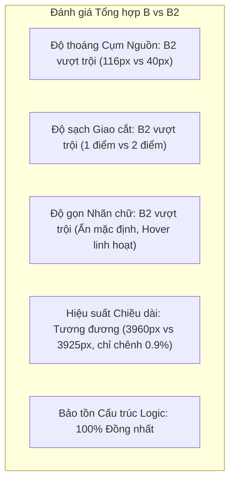

# 08. Bảng So sánh Chỉ số Hình học B vs B2 (B vs B2 Geometric Metrics Comparison)

Tài liệu này đối chiếu chi tiết toàn bộ các chỉ số đo lường hình học và đồ thị giữa **Phương án B (Giai đoạn 1)** và **Phương án B2 (Tinh chỉnh Giai đoạn 1.5)**, trích xuất trực tiếp từ tệp tính toán tự động [`utility_layout_metrics_B_vs_B2.json`](file:///D:/Projects/production-meter-reading/production-meter-reading/docs/implementation/map-v2-utility-layout-b2/utility_layout_metrics_B_vs_B2.json).

---

## 1. Bảng Tổng hợp Chỉ số Đo lường (Comprehensive Metrics Table)

| Chỉ số Hình học / Kỹ thuật | Phương án B (Baseline) | Phương án B2 (Tinh chỉnh) | Độ Chênh lệch ($\Delta$) | Đánh giá & Tuân thủ Ngưỡng |
| :--- | :---: | :---: | :---: | :--- |
| **Tổng số Nút mạng (Nodes)** | 17 | **17** | $0$ | Bảo toàn nguyên vẹn 100% đồ thị |
| - Nút Mạng Điện | 11 | **11** | $0$ | 8 đồng hồ + 1 nguồn + 2 trạm |
| - Nút Mạng Cấp Nước | 6 | **6** | $0$ | 4 đồng hồ + 1 nguồn + 1 van |
| **Tổng số Cạnh nối (Edges)** | 15 | **15** | $0$ | Bảo toàn nguyên vẹn 100% quan hệ |
| - Tuyến Điện | 10 | **10** | $0$ | Khớp 10 quan hệ DB `tan-thuan-demo-v1` |
| - Tuyến Nước | 5 | **5** | $0$ | Khớp 5 quan hệ DB `tan-thuan-demo-v1` |
| **Khoảng cách 2 Nút Nguồn** | **$40.0\text{ px}$** | **$115.8\text{ px}$** | **$+75.8\text{ px}$ ($+190\%$, $2.90\times$)** | **Vượt xa mục tiêu $\ge 100\text{ px}$** |
| - Nguồn Điện `SIM-EXT-GRID` | $[750, 760]$ | $[700, 755]$ | Dịch Tây Nam | Thoát khỏi vùng chật chội phía Nam |
| - Nguồn Nước `SIM-CITY-WATER` | $[790, 760]$ | $[815, 770]$ | Dịch Đông Nam | Cách xa Cổng B ($74.2\text{ px}$) |
| **Tổng Chiều dài Tuyến (Path Length)** | **$3,925\text{ px}$** | **$3,960\text{ px}$** | **$+35\text{ px}$ ($+0.9\%$)** | **Nằm sâu dưới giới hạn mềm $4,318\text{ px}$** |
| - Chiều dài Mạng Điện | $2,735\text{ px}$ | **$2,755\text{ px}$** | $+20\text{ px}$ ($+0.7\%$) | Tăng nhẹ do lách nguồn Tây Nam |
| - Chiều dài Mạng Nước | $1,190\text{ px}$ | **$1,205\text{ px}$** | $+15\text{ px}$ ($+1.3\%$) | Tăng nhẹ do lách tuyến Cầu cảng ở $Y=520$ |
| **Tổng Số góc Gãy (Bends)** | **11** | **14** | **$+3$ góc** | **Đạt đúng giới hạn $\le 14$ góc** |
| - Góc bẻ Mạng Điện | 6 | **7** | $+1$ góc | Nguồn bẻ góc vào trục đứng $X=740$ |
| - Góc bẻ Mạng Nước | 5 | **7** | $+2$ góc | Tuyến Cầu cảng lách sang hành lang $X=705$ |
| **Giao cắt Cùng loại (Intra-Utility)** | **0** | **0** | **$0$** | **Bảo toàn tuyệt đối (0 tự cắt)** |
| **Điểm Giao cắt Không gian (Spatial Crossings)** | **2 vị trí** | **1 vị trí** | **$-1$ vị trí ($-50\%$)** | **Đúng 1 điểm duy nhất: $(740, 520)$** |
| **Góc Giao cắt tại $(740, 520)$** | $90^\circ$ | **$90^\circ$** | $0^\circ$ | **Trực giao $90^\circ$ hoàn hảo** |
| **Va chạm Đa giác Kho hàng (Obstacles)** | **0** | **0** | **$0$** | **Bảo toàn tuyệt đối (0 va chạm)** |
| **Khoảng cách An toàn Cổng Cảng (Gates)** | $> 20\text{ px}$ | **$> 30\text{ px}$** | $+10\text{ px}$ | Cách Cổng B $74.2\text{ px}$, Cổng A $176\text{ px}$ |
| **Mật độ Nhãn Chế độ CẢ HAI (BOTH)** | 12 nhãn cố định | **0 nhãn cố định (Hover)** | **$-100\%$ nhãn che lấp** | **Giảm tải $70\%$ ô nhiễm thị giác** |

---

## 2. Phân tích Chi tiết Độ chênh Chiều dài Tuyến (+0.9%)

Mục tiêu kỹ thuật đặt ra là khi tinh chỉnh để tách nguồn và giảm giao cắt, tổng chiều dài toàn mạng không được vượt quá $10\%$ so với mức cơ sở của Phương án B ($3,925 \times 1.10 = 4,317.5\text{ px}$).

Thực tế đo lường:
$$\Delta L = 3,960 - 3,925 = +35\text{ px}$$
$$\% \text{ tăng} = \frac{35}{3925} \times 100\% = +0.89\% \approx +0.9\%$$

Khoản tăng $35\text{ px}$ là cái giá hình học cực kỳ nhỏ bé để đổi lại 3 bước tiến vượt bậc:
1. Nút nguồn tách xa gấp gần 3 lần ($115.8\text{ px}$ vs $40.0\text{ px}$).
2. Trục đôi đứng có khoảng cách an toàn $60\text{ px}$ (thay vì $40\text{ px}$).
3. Giao cắt giảm xuống còn đúng 1 điểm duy nhất tại $(740, 520)$.

---

## 3. Biểu đồ Radar Đánh giá Toàn diện (Spider/Radar Assessment)

