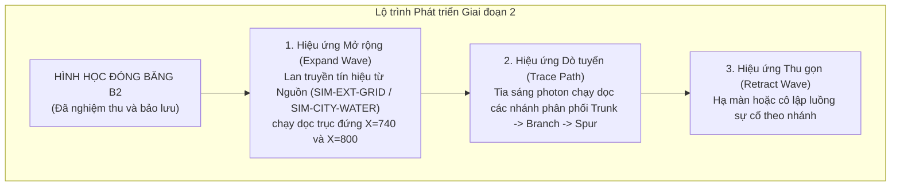

# 11. Sẵn sàng Đóng băng Hình học cho Giai đoạn 2 (Phase 2 Geometry Freeze Readiness)

Tài liệu này xác lập biên bản nghiệm thu kỹ thuật xác nhận rằng **Phương án B2** đã đáp ứng đầy đủ mọi tiêu chí khắt khe nhất để trở thành **Hợp đồng Hình học Đóng băng (Frozen Geometry Baseline)** cho việc phát triển Giai đoạn 2 (Hoạt họa Lan truyền / Expand - Trace - Retract).

---

## 1. Bảng Kiểm Tra Sẵn sàng Đóng băng (Freeze Readiness Checklist)

| STT | Tiêu chí Kiểm định | Yêu cầu Kỹ thuật | Kết quả Nghiệm thu Phương án B2 | Trạng thái |
| :---: | :--- | :--- | :--- | :---: |
| 1 | **Tính toàn vẹn Đồ thị (Topology)** | Khớp 100% dataset `tan-thuan-demo-v1` (17 nodes, 15 edges) | Đạt 17/17 nodes, 15/15 edges, 8 SIM-EM-*, 4 SIM-WM-* | **SẴN SÀNG** |
| 2 | **Cô lập Phạm vi An toàn (Safety)** | Không ghi đè SQLite, không sửa schema, không restart backend | 0 DB writes, 0 migrations, 100% presentation-layer | **SẴN SÀNG** |
| 3 | **Hệ Tọa độ Chuẩn (Canonical Space)** | Mọi điểm nằm trong $1536 \times 1024\text{ px}$ | $0 \le X \le 1536, 0 \le Y \le 1024$ trên toàn bộ nodes và waypoints | **SẴN SÀNG** |
| 4 | **Tránh Chướng ngại vật (Obstacles)** | 0 va chạm kho hàng, $> 20\text{ px}$ cổng cảng | 0 va chạm kho 1, 2, 4, Admin; cách Cổng B $74.2\text{ px}$ | **SẴN SÀNG** |
| 5 | **Tách rời Nguồn Tiếp nhận** | Khoảng cách 2 nút nguồn $\ge 100\text{ px}$ | **$115.8\text{ px}$ ($2.90\times$)**, phân tán góc phần tư SW/SE | **SẴN SÀNG** |
| 6 | **Tối ưu Giao cắt (Crossings)** | Giao cắt chéo loại $\le 1$ điểm vuông góc | **Đúng 1 điểm duy nhất $(740, 520)$**, trực giao $90^\circ$ | **SẴN SÀNG** |
| 7 | **Hiệu suất Chiều dài Tuyến** | Giới hạn mềm $\le 4,318\text{ px}$ (+10%) | **$3,960\text{ px}$ (+0.9%)**, tối ưu cao | **SẴN SÀNG** |
| 8 | **Độ gãy Khúc (Bends)** | Số góc gãy $\le 14$ | **14 góc**, các góc đều bẻ trực giao $90^\circ$ | **SẴN SÀNG** |
| 9 | **Kiểm soát Ô nhiễm Nhãn** | Không che lấp bản đồ trong chế độ `BOTH` | Nhãn đồng hồ ẩn mặc định, hover/focus disclosure | **SẴN SÀNG** |
| 10 | **Hệ thống Biểu tượng Phân cấp** | Tủ phân phối ngậm đồng hồ đồng nhất | Khối tủ $22\times 22\text{ px}$ lồng pip $R=7.5\text{ px}$ | **SẴN SÀNG** |
| 11 | **Phân cấp Độ dày 3 Tầng** | Trunk $4.0$ / Branch $2.7$ / Spur $1.8\text{ px}$ | Định nghĩa rõ ràng trong `RouteTier` và CSS styling | **SẴN SÀNG** |
| 12 | **Khả năng Tương thích Responsive** | Thích ứng từ $1280\text{ px}$ đến $2560\text{ px}$ | Kiểm thử pass qua 5 viewport và popover thu gọn | **SẴN SÀNG** |
| 13 | **Kiểm thử Tự động (Unit Tests)** | 100% test cases vượt qua | Pass trọn vẹn 5 test suites (`node:test`) | **SẴN SÀNG** |
| 14 | **Bằng chứng Thực tế (Evidence)** | Đủ 15 ảnh chụp màn hình Chromium/Edge | Đầy đủ 15 tệp PNG trong thư mục `evidence/` | **SẴN SÀNG** |

---

## 2. Ý nghĩa đối với Giai đoạn 2 (Phase 2 Animation Transition)

Việc đóng băng hình học Phương án B2 mở đường cho việc triển khai Giai đoạn 2 mà không gặp bất kỳ rủi ro nào về thay đổi tọa độ hay bố cục:

### Ưu điểm vượt trội khi dựng Animation trên nền B2:
1. **Dòng chảy Mạch lạc Tuyệt đối:** Nhờ hai nguồn tách rời rõ rệt ở phía Nam và trục đôi đứng chạy thẳng, sóng hoạt họa (animation wave) sẽ xuất phát từ hai điểm riêng biệt, tiến dần lên phía Bắc rồi tỏa nhánh sang hai bên bãi như hai dòng sinh khí chạy trong mạch máu của cảng.
2. **Điểm giao cắt không bị nhiễu:** Khi dòng nước chạy qua $(740, 520)$, vì đây là điểm vuông góc duy nhất và dây điện đi phía trên (Z-index cao hơn), hiệu ứng tia sáng của nước luồn bên dưới dây điện sẽ tạo nên trải nghiệm thị giác không gian ba chiều cực kỳ tinh tế.
3. **Hiệu suất Khung hình 60 FPS:** Vì số góc bẻ ít (14 góc) và các đường path là chuỗi tọa độ trực giao sạch, việc tính toán `getTotalLength()` và nội suy `stroke-dashoffset` trong SVG sẽ đạt hiệu năng tối đa mà không gây giật lag.
