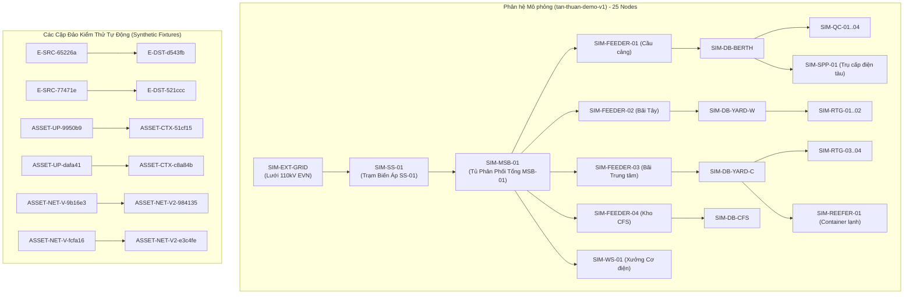
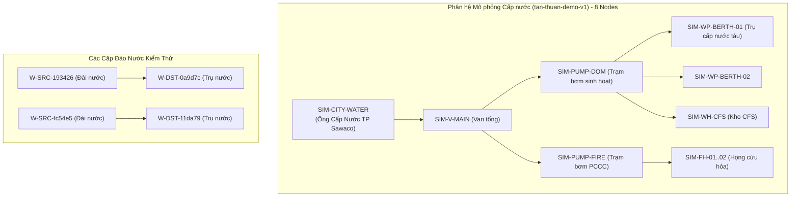

# 08. Kiểm toán Đồ thị Mạng lưới Hạ tầng (Utility Graph Audit)

## 1. Phương pháp Xây dựng và Tách biệt Đồ thị

Kiểm toán phân tích cấu trúc kết nối thiết bị từ bảng `asset_connections` và xây dựng thành **HAI ĐỒ THỊ ĐỘC LẬP**:
1. **ELECTRICITY_GRAPH** (Mạng lưới Điện năng)
2. **WATER_GRAPH** (Mạng lưới Cấp thoát nước)

Mỗi liên kết đại diện cho quan hệ có hướng: `source_asset_id` $\rightarrow$ `target_asset_id` (chiều cung cấp năng lượng / lưu chất).

---

## 2. Bảng Chỉ số Lý thuyết Đồ thị (Graph Metrics)

| Chỉ số Lý thuyết Đồ thị | Mạng lưới Điện (`ELECTRICITY`) | Mạng lưới Nước (`WATER`) | Đánh giá Kỹ thuật |
| :--- | :---: | :---: | :--- |
| **Tổng số Nút (Nodes)** | **39** | **12** | Độc lập hoàn toàn, không đan xen |
| **Tổng số Cạnh (Edges)** | **32** | **9** | |
| - Cạnh Mô phỏng (`SIMULATED`) | 24 | 7 | Thuộc kịch bản `tan-thuan-demo-v1` |
| - Cạnh Gắn nhãn Thực tế (`REAL`) | 8 | 2 | Thuộc các cặp test fixtures |
| **Thành phần Liên thông Yếu (Components)** | **7** | **3** | **Đồ thị bị phân mảnh thành nhiều đảo cô lập** |
| Kích thước các thành phần liên thông | `[25, 2, 2, 2, 2, 2, 4]` | `[8, 2, 2]` | 1 thành phần chính demo + các cặp test rời |
| **Nút Gốc Ứng viên (Candidate Roots - in-degree = 0)** | **9** | **3** | Không có 1 nguồn duy nhất |
| **Nút Lá Ứng viên (Candidate Leaves - out-degree = 0)** | **28** | **7** | Thiết bị phụ tải cuối tuyến |
| **Chu trình (Directed Cycles)** | **0 (Không)** | **0 (Không)** | Cả 2 đồ thị đều là Rừng Cây Định hướng (DAG Forest) |
| Cạnh Tự lặp (Self-loops) | 0 | 0 | Không có thiết bị tự cấp cho chính nó |
| Cạnh Trùng lặp (Duplicate edges) | 0 | 0 | Mỗi cặp nút có tối đa 1 liên kết |
| Thiết bị Cô lập (Isolated Assets) | 0 | 2 (`ASSET-NO-XY-*`) | 2 máy bơm cứu hỏa test không có liên kết nào |
| Liên kết Mồ côi (Dangling references) | 0 | 0 | 100% đầu mút đều tồn tại trong `assets` |

---

## 3. Phân tích Chi tiết Mạng lưới Điện (`ELECTRICITY_GRAPH`)

### Các Nút Gốc Ứng viên Điện (`in-degree = 0`):
1. `SIM-EXT-GRID`: Nguồn mô phỏng lưới điện ngoài EVN (Demo).
2. `E-SRC-65226a` & `E-SRC-77471e`: Hai nút test "Trạm Cắt 22kV".
3. `ASSET-UP-9950b9` & `ASSET-UP-dafa41`: Hai nút test "Đường Dây 110kV EVN".
4. `ASSET-NET-V-9b16e3` & `ASSET-NET-V-fcfa16`: Hai trạm biến áp test đã xác minh.
5. `ASSET-NET-UV-6253fb` & `ASSET-NET-UV-daec7d`: Hai trạm biến áp test chưa xác minh.

---

## 4. Phân tích Chi tiết Mạng lưới Nước (`WATER_GRAPH`)

### Các Nút Gốc Ứng viên Nước (`in-degree = 0`):
1. `SIM-CITY-WATER`: Đầu mối nhận nước Thành phố Sawaco (Mô phỏng demo).
2. `W-SRC-193426` & `W-SRC-fc54e5`: Hai đài nước test fixture.
3. Thiết bị cô lập: `ASSET-NO-XY-136475` và `ASSET-NO-XY-c7270a` (Máy bơm cứu hỏa dự phòng không kết nối vào mạng lưới).

*File dữ liệu xuất máy: `docs/implementation/map-v2-utility-network-audit/data/electricity_graph.json` và `water_graph.json`.*
