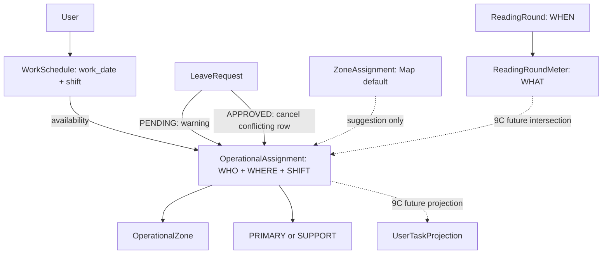

# ADR — Separate operational assignment from Map zone ownership

**Status:** Accepted. **Decision:** `NEW_OPERATIONAL_ASSIGNMENT` (Option B).

## Context and evidence

Map operations query `ZoneAssignment.is_active` by zone, reassigning a current/default operator without work_date or shift. `WorkSchedule` is per user/date. ReadingRound and ReadingRoundMeter are immutable 9A WHEN/WHAT evidence. A single shift/date may contain several rounds, so assignment belongs to date+shift+zone rather than a round.

## Options

Option A would extend ZoneAssignment with date and shift, changing the meaning of existing Map reads and deactivation history. Option B keeps legacy/default ownership for Map and adds an independent OperationalAssignment with role, status, provenance, and cancellation history. Option B was selected from the source usage above. Historical ZoneAssignment rows are not backfilled as exact operational assignments.

## Final domain graph

## Consequences

The assignment table uses RESTRICT links to staff and zone, SQLite partial unique indexes for active duplicate/PRIMARY protection, and retained CANCELLED rows. Leave approval and roster changes cancel incompatible rows transactionally. `MeterReading.user_id` remains the actual executor. Map and reporting consumers remain unchanged pending later threads.
