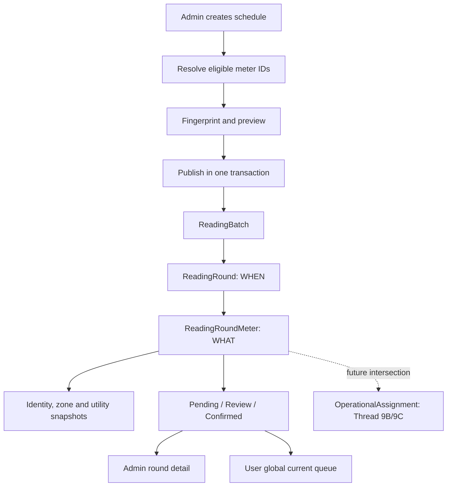

# 03 — Reading schedule domain model

Lịch ghi owns **WHEN + WHAT**. A `ReadingRound` is the scheduled time. Its `ReadingRoundMeter` rows are the exact meter tasks due in that round. Assignment and employee ownership remain outside this thread.

Published scope rows are operational evidence. Current inventory state can show availability, but it does not add or remove scheduled tasks.
