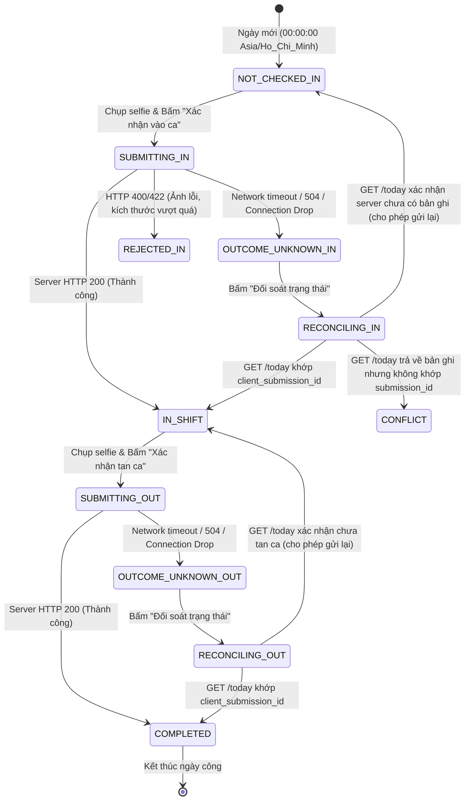

# 02. Ma Trận Nghiệp Vụ Chấm Công & Phân Tích Kịch Bản Ngoại Lệ
**Phân hệ:** User Attendance (Chấm công Vào ca & Tan ca)  
**Dự án:** Production Meter Reading — Cảng Sài Gòn  
**Ngày lập:** 21/09/2026  

---

## 1. Ma Trận 5 Trạng Thái Nghiệp Vụ Cốt Lõi (Core States)

Giao diện Home Hub và Attendance Screen tuân thủ phân định 5 trạng thái độc lập, đảm bảo không có trạng thái nào bị hiển thị nhầm lẫn thành trạng thái khác:

| Trạng Thái | Điều Kiện Server (`GET /today`) | Trạng Thái UI Home Hub | Hành Động Cho Phép | Thông Điệp / Chỉ Dẫn |
| :--- | :--- | :--- | :--- | :--- |
| **`LOADING`** | Request trạng thái đang thực thi | Skeleton Card / Maritime Spinner | Vô hiệu hóa nút tác nghiệp | "Đang tải dữ liệu ca làm việc..." |
| **`ERROR`** | `GET /today` trả về 5xx hoặc Network Error | Alert Card viền hổ phách/đỏ; nút "Tải lại" | Nút "Thử lại kết nối", không mở form chấm công | "Không thể kết nối máy chủ chấm công. Vui lòng thử lại." (Không conflate với "Chưa vào ca") |
| **`NOT_CHECKED_IN`** | `check_in: null`, `check_out: null`, `allowed_action: 'CHECK_IN'` | Priority Hero Card (Vào ca); Nút chính nổi bật | Bấm mở màn hình chụp ảnh Vào ca | "Hôm nay bạn chưa vào ca. Hãy chấm công để bắt đầu ngày làm việc." |
| **`IN_SHIFT`** | `check_in: object`, `check_out: null`, `allowed_action: 'CHECK_OUT'` | Shift Status Card (Đang trong ca); Giờ vào ca; Nút Tan ca | Bấm mở màn hình chụp ảnh Tan ca; Xem lịch sử | "Đang trong ca làm việc. Đã vào ca lúc HH:mm." |
| **`COMPLETED`** | `check_in: object`, `check_out: object`, `allowed_action: null` | Shift Summary Card (Hoàn thành ca); Biểu tượng tick xanh | Xem lại lịch sử; Không còn nút chấm công | "Bạn đã hoàn tất ca làm việc hôm nay. Đầy đủ vào ca & tan ca." |

---

## 2. Ma Trận Chuyển Đổi & Xử Lý Ngoại Lệ (Exception Matrix)

---

## 3. Phân Tích Các Tình Huống Đặc Thù & Quyết Định Nghiệp Vụ

### 3.1. Ca làm việc đêm / Qua ngày (Cross-day / Midnight Shift)
- **Tình huống:** Công nhân ca đêm cảng vào ca lúc 22:00 ngày 21/09 và tan ca lúc 06:00 ngày 22/09.
- **Hiện trạng hệ thống:** Khóa ngày nghiệp vụ gắn cứng theo `date = now(Asia/Ho_Chi_Minh).strftime("%Y-%m-%d")`. Nếu nhân viên vào ca lúc 22:00 ngày 21/09, sau 00:00 ngày 22/09, `GET /today` sẽ chuyển sang ngày mới 22/09 với `check_in: null`, khiến nhân viên không thể bấm "Tan ca" cho ca hôm trước theo luồng thông thường.
- **Giải pháp xử lý ngắn hạn:** Nhân viên tan ca trước 23:59 hoặc báo cáo quản trị viên điều chỉnh qua màn hình Lịch sử Chấm công / Admin Adjustment.
- **Khuyến nghị kiến trúc:** Xem chi tiết tại tài liệu `06_REMAINING_RISKS_AND_OPEN_DECISIONS.md`.

### 3.2. Phiên làm việc hết hạn (Session Expiry / 401 Unauthorized)
- **Hành vi khi đang chụp ảnh hoặc gửi:** Nếu JWT token hết hạn trong lúc nhân viên đang thao tác:
  1. Yêu cầu gửi ảnh nhận HTTP 401 Unauthorized.
  2. State machine chuyển sang `REJECTED` với thông báo: *"Phiên đăng nhập đã hết hạn. Vui lòng đăng nhập lại để tiếp tục."*
  3. Form không tự động xóa ảnh hoặc tạo gửi lại vô tận, giữ nguyên an toàn cho người dùng trước khi chuyển hướng về màn hình đăng nhập.

### 3.3. Xung đột ghi đồng thời (Race Condition / Multi-tab)
- **Tình huống:** Nhân viên mở 2 tab trình duyệt hoặc bấm liên tiếp 2 lần rất nhanh.
- **Cơ chế phòng vệ:**
  1. Frontend vô hiệu hóa nút submit ngay khi vào phase `SUBMITTING`.
  2. Database kích hoạt `UniqueConstraint('user_id', 'date', 'event_type')`.
  3. Transaction thứ hai gặp `IntegrityError` lập tức bị Backend rollback, xóa file ảnh mồ côi và trả về HTTP 409 Conflict với thông điệp: *"Bạn đã thực hiện thao tác này hôm nay rồi."*
  4. Frontend tiếp nhận 409 và hiển thị thời điểm đã ghi nhận trên hệ thống.
