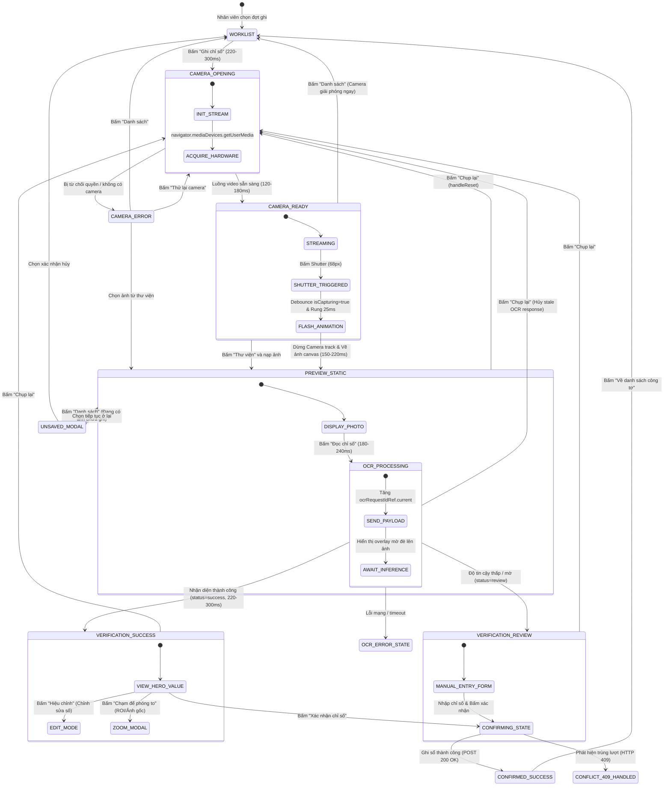

# 02 — KIẾN TRÚC FOCUSED CAPTURE VÀ MÁY TRẠNG THÁI CHUYỂN CẢNH

> **Dự án:** Hệ thống Quản lý và Ghi chỉ số Công tơ Cảng Sài Gòn (`production-meter-reading`)  
> **Phân hệ:** User Meter Reading — Focused Capture Mode  
> **Chủ đề:** State Transitions, Lifecycle Timing, Zero Layout Shift, Concurrency Guards

---

## 1. Biểu đồ máy trạng thái chuyển cảnh (State Machine Diagram)

Toàn bộ chu trình tương tác ghi nhận chỉ số công tơ của nhân viên hiện trường được chuẩn hóa theo máy trạng thái hữu hạn (FSM) dưới đây:



---

## 2. Đặc tả các bước chuyển cảnh và Ngân sách thời gian (Timing Budget)

Mọi chuyển động và trạng thái giao diện đều tuân thủ nguyên lý giao diện vận hành cảng: **nhanh gọn, dứt khoát, không tạo độ trễ nhân tạo, không gây hiệu ứng chóng mặt ngoài nắng**.

| Chuyển trạng thái | Thời gian thực tế | Đường cong gia tốc (Easing) | Chi tiết hành vi kỹ thuật |
| :--- | :---: | :---: | :--- |
| **Worklist → Camera Opening** | **260ms** | `cubic-bezier(0.16, 1, 0.3, 1)` | Ẩn Radial Nav, mount `<MeterCamera>`, hiện spinner cảng mờ nhẹ với nhãn "Đang khởi động thiết bị...". |
| **Camera Opening → Camera Ready** | **150ms** | `ease-out` | Luồng WebRTC nạp xong siêu dữ liệu (`onLoadedMetadata`), video gắn class `.is-ready`, reticle 4 góc Warm Yellow mở ra êm ái. |
| **Bấm Shutter → Preview** | **180ms** | `ease-in-out` | Shutter lock `isCapturing=true`, hiệu ứng chớp trắng bán trong suốt `.shutter-flash-overlay` (70ms), trích xuất full-frame 1080p sang Blob, ngắt toàn bộ Camera track, render ngay tại khung nhìn. |
| **Preview → OCR Processing** | **200ms** | `ease-out` | Ảnh tĩnh giữ nguyên 100% kích thước và vị trí (Zero CLS). Lớp overlay bán mờ `rgba(0, 23, 51, 0.72)` xuất hiện với thanh đo lường hàng hải `Đang nhận diện chỉ số...`. |
| **OCR Processing → Verification** | **260ms** | `cubic-bezier(0.16, 1, 0.3, 1)` | Card kết quả trượt lên nhẹ (8px translateY), hiển thị số đo Hero `04582.12 kWh` trên 1 dòng duy nhất, kích hoạt haptic feedback 40ms. |
| **Verification / Preview → Retake** | **220ms** | `ease-out` | Gọi `handleReset()`, tăng `ocrRequestIdRef`, xóa blob cũ, khởi động lại luồng WebRTC mới sạch sẽ. |

---

## 3. Nguyên lý Giữ nguyên Ảnh & Triệt tiêu Dịch chuyển Bố cục (Zero Layout Shift - CLS = 0)

Một lỗi UX nghiêm trọng trong các ứng dụng ghi số thông thường là khi chuyển từ màn hình chụp sang màn hình xử lý, giao diện bị giật, ảnh nhảy vị trí hoặc thu nhỏ đột ngột khiến mắt người dùng phải điều tiết lại.

### Giải pháp kỹ thuật trong Focused Capture:
1. **Chia sẻ Container Viewport:** Cả video trực tiếp `<video className="focused-live-video">` và ảnh xem trước `` đều được đặt trong cùng một khung `.focused-camera-viewport` với CSS:
   ```css
   .focused-camera-viewport {
     position: relative;
     width: 100%;
     flex: 1 1 0%;
     min-height: 280px;
     background: #000c1a;
     overflow: hidden;
     display: flex;
     align-items: center;
     justify-content: center;
   }
   ```
2. **Overlay xử lý không can thiệp dòng tài liệu (Normal Flow):** Lớp xử lý OCR `.focused-processing-overlay` được định vị `position: absolute; inset: 0;` phủ lên trên thẻ ảnh ``. Thẻ ảnh bên dưới vẫn giữ nguyên vị trí pixel tuyệt đối.
3. **Kết quả:** Điểm đo lường dịch chuyển bố cục Cumulative Layout Shift (CLS) trong suốt quá trình từ Chụp → Xem trước → OCR đạt mức **0.000**.

---

## 4. Cơ chế Bảo vệ Bất đồng bộ & Chống Xung đột

### 4.1. Khóa chống bấm đúp (Debounce & Double-Click Lock)
- Tại `MeterCamera.tsx`, khi người dùng bấm nút chụp, biến cờ `isCapturing` lập tức được bật:
  ```tsx
  if (isCapturing || !cameraReady) return;
  setIsCapturing(true);
  ```
- Nút Shutter được thêm class `.is-disabled` và thuộc tính `disabled={true}`, ngăn ngừa hoàn toàn việc bấm liên tục gây tràn bộ nhớ canvas hoặc sinh nhiều ảnh trùng lặp.

### 4.2. Bảo vệ chống phản hồi OCR trễ (Stale Response Guard)
- Khi mạng 4G tại cảng bị chập chờn, yêu cầu OCR gửi đi có thể mất 3-5 giây. Nếu trong thời gian này nhân viên thấy ảnh mờ và bấm **"Chụp lại"**, sau đó một phản hồi OCR từ lần chụp trước bất ngờ bay về, hệ thống cũ sẽ đè kết quả sai vào màn hình chụp mới.
- **Giải pháp `ocrRequestIdRef`:**
  ```tsx
  const ocrRequestIdRef = useRef<number>(0);

  const handleReset = () => {
    ocrRequestIdRef.current++; // Hủy mọi phản hồi của request trước đó
    ...
  };

  const handleReadMeter = async () => {
    const requestId = ++ocrRequestIdRef.current;
    try {
      const data = await readMeter(imageFile);
      if (requestId !== ocrRequestIdRef.current) return; // Bỏ qua nếu đã reset
      setResult(data);
    } ...
  };
  ```

### 4.3. Xử lý xung đột HTTP 409 Conflict (Idempotency / Already Recorded)
- Nếu một nhân viên khác hoặc chính nhân viên đó đã xác nhận công tơ này ở một tab/thiết bị khác, API trả về HTTP 409 (`Công tơ đã được ghi trong lượt này`).
- Giao diện không báo lỗi crash mà tự động đồng bộ lại trạng thái, chuyển về danh sách và cập nhật huy hiệu "Đã ghi".

---

## 5. Bất biến Trình bày Số đo (Reading Display Invariant)

Nhằm đảm bảo số đo công tơ không bao giờ bị cắt cụt hoặc ngắt dòng làm nhân viên đọc sai số điện:

1. `white-space: nowrap !important`: Nghiêm cấm ngắt dòng giữa các chữ số, dấu chấm hay ký tự thập phân.
2. `font-variant-numeric: tabular-nums`: Đảm bảo mọi chữ số từ 0 đến 9 đều có cùng độ rộng cột, không bị giật khi cập nhật.
3. `font-size: clamp(26px, 7.5vw, 46px)`: Tự động co giãn theo kích thước màn hình điện thoại, máy tính bảng và máy tính để bàn.
4. `text-overflow: ellipsis`: Nếu vượt quá độ rộng cực hạn, số đo không được rớt xuống dòng dưới mà co lại an toàn.
