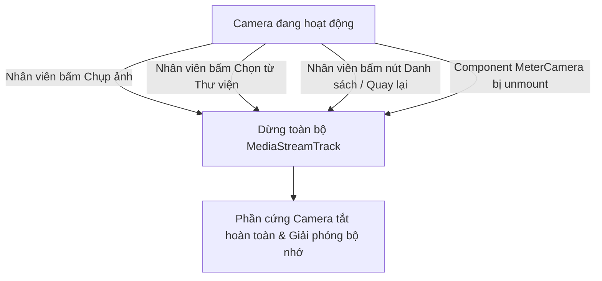

# 03 — VÒNG ĐỜI VÀ QUẢN TRỊ PHẦN CỨNG CAMERA (CAMERA LIFECYCLE)

> **Dự án:** Hệ thống Quản lý và Ghi chỉ số Công tơ Cảng Sài Gòn (`production-meter-reading`)  
> **Phân hệ:** User Meter Reading — Focused Capture Mode  
> **Chủ đề:** WebRTC Hardware Management, Stream Cleanup, Full-Frame Invariant, Error Recovery

---

## 1. Nguyên lý Khởi tạo Luồng Camera (WebRTC Stream Initialization)

Để đảm bảo hiệu năng tối ưu trên các thiết bị di động công nghiệp và điện thoại thông minh của nhân viên hiện trường, quy trình kích hoạt phần cứng camera tuân thủ các nguyên tắc sau:

### 1.1. Ràng buộc thiết bị (MediaStream Constraints)
Mục tiêu là ưu tiên camera sau (Rear / Environment camera) với độ phân giải Full HD (1080p), phục vụ tốt nhất cho mô hình nhận diện chữ số PP-OCRv6:

```typescript
const constraints: MediaStreamConstraints = {
  audio: false,
  video: {
    facingMode: { ideal: 'environment' },
    width: { ideal: 1920, min: 1280 },
    height: { ideal: 1080, min: 720 },
  },
};
```

Nếu thiết bị không hỗ trợ phân giải Full HD, trình duyệt tự động fallback về độ phân giải khả dụng tốt nhất (`min: 1280x720`). Trong trường hợp chạy trên máy tính bàn hoặc laptop phòng điều độ không có camera sau, WebRTC tự động fallback về camera trước khả dụng mà không gây crash ứng dụng.

---

## 2. Bất biến Ảnh Toàn Khung (Full-Frame Uncropped Invariant)

Một yêu cầu cốt lõi trong tài liệu thiết kế và kiến trúc AI của hệ thống:
> **Khung ngắm căn chỉnh (Reticle) chỉ là chỉ dẫn thị giác cho nhân viên. Tuyệt đối không được cắt ảnh (crop) ở phía máy khách.**

### Kỹ thuật trích xuất ảnh trên Canvas:
Khi nhân viên bấm nút Chụp (Shutter Button), hàm `handleCapturePhoto` lấy trực tiếp kích thước thực của luồng video (`video.videoWidth` và `video.videoHeight`) thay vì kích thước phần tử DOM trên màn hình:

```typescript
const canvas = document.createElement('canvas');
const naturalW = video.videoWidth || 1920;
const naturalH = video.videoHeight || 1080;
canvas.width = naturalW;
canvas.height = naturalH;

const ctx = canvas.getContext('2d');
if (ctx) {
  // Vẽ toàn bộ khung hình cảm biến 100% không cắt gọt
  ctx.drawImage(video, 0, 0, naturalW, naturalH);
  
  canvas.toBlob((blob) => {
    if (blob) {
      const file = new File([blob], `meter_${Date.now()}.jpg`, { type: 'image/jpeg' });
      // Giải phóng ngay camera phần cứng
      stopCamera();
      onCapture(file);
    }
  }, 'image/jpeg', 0.92);
}
```

### Lý do kỹ thuật:
- **Độ chính xác của AI:** Mô hình PP-OCRv6 trên máy chủ sử dụng thuật toán dò tìm vùng quan tâm (Bbox ROI Detection) thông minh. Cung cấp toàn cảnh mặt công tơ giúp AI nhận diện đúng nhãn hiệu công tơ, tỷ lệ khung hình và loại bỏ phản xạ ánh sáng mặt trời tốt hơn là một ảnh bị cắt cứng ở client.

---

## 3. Cơ chế Thu hồi & Giải phóng Luồng Phần cứng (Stream Release & Cleanup)

Việc duy trì luồng camera chạy ngầm khi không sử dụng gây nóng máy, hao pin nhanh tại hiện trường cảng và vi phạm quyền riêng tư của nhân viên. 

Hệ thống đảm bảo **camera phần cứng được giải phóng ngay lập tức** trong tất cả các trường hợp sau:



### Triển khai trong mã nguồn [MeterCamera.tsx](file:///D:/Projects/production-meter-reading/production-meter-reading/frontend/src/components/MeterCamera.tsx):
```typescript
const stopCamera = useCallback(() => {
  if (streamRef.current) {
    streamRef.current.getTracks().forEach((track) => {
      try {
        track.stop(); // Ngắt luồng phần cứng ở mức driver/OS
      } catch (err) {
        console.warn('Track stop error:', err);
      }
    });
    streamRef.current = null;
  }
  if (videoRef.current) {
    videoRef.current.srcObject = null;
  }
  setCameraReady(false);
}, []);

// Giải phóng triệt để khi component unmount
useEffect(() => {
  mountedRef.current = true;
  startCamera();

  return () => {
    mountedRef.current = false;
    stopCamera();
  };
}, [startCamera, stopCamera]);
```

---

## 4. Xử lý Lỗi & Cơ chế Phục hồi Sự cố (Error Handling & Fallback)

Khi việc khởi động camera gặp trục trặc, hệ thống phân loại chính xác mã lỗi DOMException để hiển thị thông báo nghiệp vụ thân thiện thay vì để màn hình đen:

| Mã lỗi DOMException | Nguyên nhân thực tế | Giao diện hiển thị & Hướng xử lý cho nhân viên |
| :--- | :--- | :--- |
| `NotAllowedError` / `PermissionDeniedError` | Nhân viên vô tình bấm "Chặn" quyền camera trên trình duyệt. | Hiện thông báo: *"Không có quyền truy cập máy ảnh. Vui lòng cấp quyền trong cài đặt trình duyệt hoặc chọn ảnh từ thư viện."* Kèm nút **"Thử lại camera"** và **"Chọn từ thư viện"**. |
| `NotFoundError` / `DevicesNotFoundError` | Thiết bị không có camera khả dụng hoặc bị hỏng phần cứng. | Hiện thông báo: *"Không tìm thấy thiết bị camera hợp lệ. Vui lòng sử dụng tính năng tải ảnh từ thư viện."* |
| `NotReadableError` / `TrackStartError` | Camera đang bị ứng dụng khác (Zalo, Teams, Camera gốc) chiếm dụng độc quyền. | Hiện thông báo: *"Máy ảnh đang được sử dụng bởi ứng dụng khác. Vui lòng đóng các ứng dụng khác và thử lại."* |
| `OverconstrainedError` | Cấu hình phân giải 1080p không được phần cứng hỗ trợ. | Tự động hạ cấu hình về tiêu chuẩn mặc định không ràng buộc và thử lại luồng. |

---

## 5. Quản lý Bộ nhớ (Memory Leak Mitigation)

- **Canvas Disposal:** Canvas sử dụng để chuyển đổi khung hình chỉ tạo tạm thời trong bộ nhớ của hàm và được thu gom rác (Garbage Collected) ngay sau khi xuất Blob.
- **URL Revocation:** Mọi đối tượng URL dạng `blob:...` tạo từ `URL.createObjectURL` được thu hồi tường minh qua `URL.revokeObjectURL(previewUrl)` khi người dùng bấm "Chụp lại", khi đổi ảnh, hoặc khi thoát màn hình ghi chỉ số.
