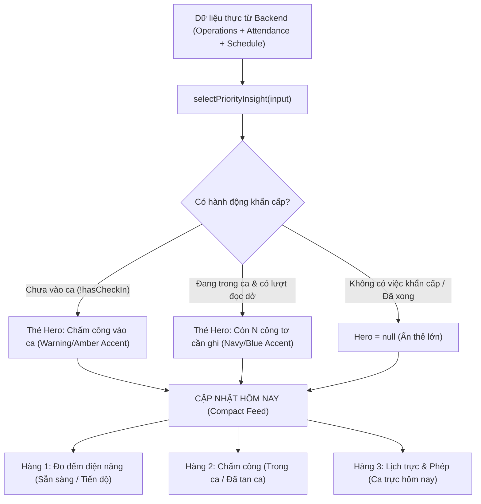

# Kiến trúc Feed & Ma trận Phân định Việc Ưu tiên (Priority Rules)
## User Home Hub UX Refinement

---

## 1. Vấn đề của mô hình cũ (3 Thẻ Card Lớn Độc Lập)

Trong phiên bản ban đầu, màn hình User Home Hub hiển thị ba thẻ card lớn có diện tích tương đương nhau:
1. Card Đo đếm điện năng
2. Card Chấm công ca làm
3. Card Lịch trực & Phép

Mô hình này gặp phải 3 nhược điểm lớn khi nhân viên hiện trường tác nghiệp:
- **Nhiễu thị giác và thiếu trọng tâm:** Khi mở ứng dụng tại hiện trường cảng, nhân viên bị phân tâm vì không rõ công việc cấp bách nào cần xử lý ngay lập tức (Chấm công hay Đọc công tơ?).
- **Lãng phí diện tích màn hình:** Khi không có lượt đọc nào đang diễn ra, thẻ đọc công tơ vẫn chiếm 1/3 diện tích với trạng thái trống rỗng.
- **Cuộn trang không cần thiết:** 3 thẻ lớn đẩy các thông tin khác ra ngoài màn hình đầu tiên (above the fold) trên các thiết bị di động có chiều cao giới hạn.

---

## 2. Mô hình mới: 1 Dynamic Priority Action + Compact Operational Feed

Kiến trúc mới được chuẩn hóa theo mô hình phân cấp thị giác hiện đại:

### Ưu điểm vượt trội:
1. **Chỉ tối đa 1 thẻ Hero:** Khi có việc cần làm khẩn cấp, thẻ Hero xuất hiện nổi bật với tiêu đề to rõ, ngữ cảnh ngắn gọn và **nút CTA trực diện một chạm (1-tap Action)**.
2. **Không trùng lặp (No Duplicate):** Mục đã được đưa lên làm Hero Card sẽ tự động bị loại bỏ khỏi Compact Feed bên dưới.
3. **Truy cập 1 chạm cho cả 2 tác vụ cùng lúc:** Nếu nhân viên chưa vào ca (`Hero = Chấm công`), nhưng cảng đang có lượt đọc mở, lượt đọc đó sẽ được xếp ngay ở vị trí #1 của Compact Feed kèm mũi tên điều hướng nhanh. Nhân viên có thể chấm công ngay hoặc vào thẳng đo đếm chỉ với 1 chạm.
4. **Không gian nhàn rỗi yên bình:** Nếu nhân viên đã hoàn thành ca làm việc hoặc không có lượt ghi nào đang diễn ra, thẻ Hero tự động ẩn đi (`priority = null`), chỉ để lại danh sách cập nhật thu gọn thanh lịch, không gây áp lực giả tạo.

---

## 3. Ma trận Phân định Việc Ưu tiên (`selectPriorityInsight`)

Toàn bộ logic được tách biệt thành **hàm thuần túy (Pure Function)** trong [`frontend/src/components/home/priorityInsightLogic.ts`](file:///D:/Projects/production-meter-reading/production-meter-reading/frontend/src/components/home/priorityInsightLogic.ts), không phụ thuộc vào React Hook, trạng thái component hay DOM, giúp việc kiểm thử tự động đạt độ tin cậy tuyệt đối.

### Quy tắc phân định (Priority Decision Rules):

| Điều kiện nghiệp vụ | Hành động Hero (Priority) | Nội dung Thẻ Hero | Vị trí trong Compact Feed |
| :--- | :--- | :--- | :--- |
| **Quy tắc A:** Nhân viên chưa chấm công vào ca (`!attendance.check_in`) | **Chấm công vào ca** (`isUrgentAction: true`) | Tiêu đề: *Chấm công vào ca* Ngữ cảnh: Thông tin ca trực hôm nay Badge: `Chưa vào ca` (Warning) CTA: `Chấm công vào ca >` | Đo đếm điện năng & Lịch trực |
| **Quy tắc B:** Đang trong ca + Lượt đọc hiện tại còn công tơ chưa ghi (`remaining > 0`) | **Đo đếm điện năng** (`isUrgentAction: true`) | Tiêu đề: *Còn N công tơ cần ghi* Ngữ cảnh: Lượt HH:mm • Toàn cảng đã ghi X/Y Badge: `Lượt HH:mm` (Info) CTA: `Tiếp tục đo đếm >` | Chấm công (Trong ca) & Lịch trực |
| **Quy tắc B2:** Đang trong ca + Có công tơ tồn đọng từ các lượt trước (`pastIncompleteMeters > 0`) | **Xử lý tồn đọng** (`isUrgentAction: true`) | Tiêu đề: *Tồn đọng N công tơ cần ghi* Ngữ cảnh: Chưa hoàn tất trong các lượt đọc trước Badge: `N tồn` (Warning) CTA: `Xử lý tồn đọng >` | Chấm công (Trong ca) & Lịch trực |
| **Quy tắc C:** Đã trong ca / Đã tan ca + Không có lượt ghi mở hoặc lượt ghi đã hoàn tất 100% | **null** (Ẩn thẻ Hero) | *Không hiển thị thẻ Hero* | Toàn bộ 3 mục hiển thị dưới dạng hàng thu gọn với trạng thái trung thực: *Sẵn sàng*, *Đã tan ca*, v.v. |

---

## 4. Thiết kế Giao diện Compact Feed

Khối Cập nhật hôm nay (`.sgp-compact-feed`) được gom thành một khung thẻ bo góc thống nhất (`.sgp-compact-group`):
- Bo góc `16px`, đường viền `1px solid var(--sgp-border-derived)`, đổ bóng nhẹ.
- Mỗi hàng tác vụ (`.sgp-compact-row`) sở hữu:
  - **Biểu tượng nhận diện phân loại:** Khung tròn/vuông bo nhẹ 36x36px với màu nền subtle tương ứng (Điện năng: Blue subtle, Chấm công: Amber subtle, Lịch trực: Porcelain neutral).
  - **Thông tin tiêu đề & Huy hiệu trạng thái:** Căn lề rõ ràng, kiểu chữ vừa vặn 14px 600.
  - **Dòng mô tả ngữ cảnh:** 12.5px màu xám `var(--sgp-corporate-gray)`.
  - **Mũi tên điều hướng (`ChevronRight`):** Báo hiệu rõ ràng khả năng nhấn chuyển trang (Clickable).
  - **Tương tác bàn phím:** Hỗ trợ `tabIndex={0}`, kích hoạt bằng phím `Enter` và `Space`, hiệu ứng hover êm ái trên nền `rgba(0, 56, 117, 0.03)`.
